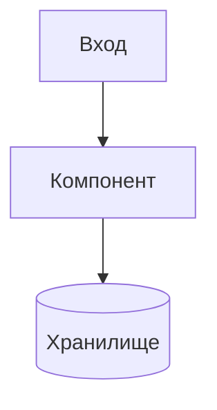

# AIS: [Название Модуля/Подсистемы]

> **Спецификации (AIS)** пишутся на **русском языке** и служат макро-документацией для людей и агентов. Микро-правила должны быть вынесены в английские скиллы (`is/skills/`).

## 1. Концепция (High-Level Concept)
Краткое описание: зачем нужен этот модуль, какую бизнес-задачу он решает и как вписывается в общую No-Build Vue архитектуру проекта.

## 2. Инфраструктура и Потоки данных (Infrastructure & Data Flow)
- Как данные попадают в модуль и как уходят.
- Взаимодействие с внешними API, Cloudflare Workers, D1 или локальными хранилищами.
- **Схема (обязательно):** встраивать Mermaid-диаграмму в fenced code block. Референс: `docs/ais/ais-yandex-cloud.md`.

## 3. Локальные Политики (Module Policies)
Жесткие бизнес-правила и ограничения конкретно для этого модуля.
Например:
- "Модуль X не имеет права напрямую обращаться к D1, только через Worker Y".
- "Ошибки сети в этом модуле всегда подавляются и возвращают пустой массив".

## 4. Компоненты и Контракты (Components & Contracts)
Список ключевых файлов/директорий, реализующих эту спецификацию.
- `app/components/example.js` — UI слой.
- `core/api/example-service.js` — API клиент.
