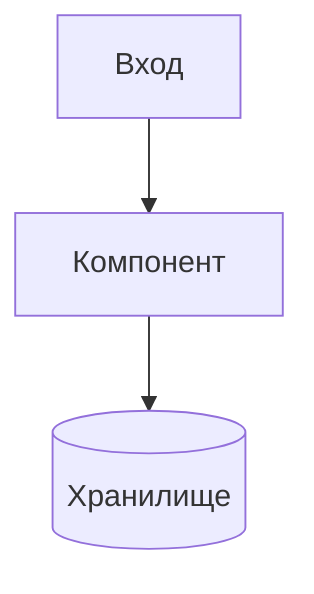

# AIS: [Название Модуля/Подсистемы]

<!-- Спецификации (AIS) пишутся на русском языке и служат макро-документацией. Микро-правила вынесены в английские скиллы. Скрыто в preview. -->

## Концепция (High-Level Concept)
Краткое описание: зачем нужен этот модуль, какую бизнес-задачу он решает и как вписывается в общую No-Build Vue архитектуру проекта.

## Инфраструктура и Потоки данных (Infrastructure & Data Flow)
- Как данные попадают в модуль и как уходят.
- Взаимодействие с внешними API, Cloudflare Workers, D1 или локальными хранилищами.
- **Схема (обязательно):** встраивать Mermaid-диаграмму в fenced code block. Референс: `docs/ais/ais-yandex-cloud.md`.

## Локальные Политики (Module Policies)
Жесткие бизнес-правила и ограничения конкретно для этого модуля.
Например:
- "Модуль X не имеет права напрямую обращаться к D1, только через Worker Y".
- "Ошибки сети в этом модуле всегда подавляются и возвращают пустой массив".

## Компоненты и Контракты (Components & Contracts)
Список ключевых файлов/директорий, реализующих эту спецификацию.
- app/components/ — UI слой (пример пути).
- core/api/ — API клиент (пример пути).
