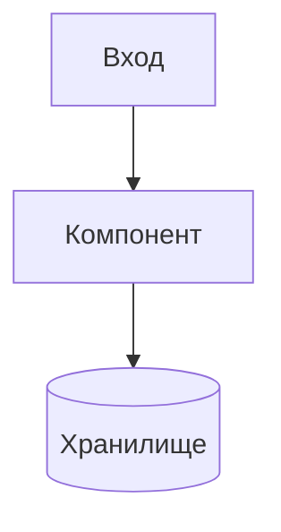

<!-- Важно: оставлять пустую строку перед "---" ! -->

# AIS: [Название Модуля/Подсистемы]

<!-- Спецификации (AIS) пишутся на русском языке и служат макро-документацией. Микро-правила вынесены в английские скиллы. Скрыто в preview. -->

## Идентификация и жизненный цикл

```yml
id: ais-xxxxxx
status: draft | incomplete | complete
last_updated: "YYYY-MM-DD"
related_skills:
  - [sk-id-1]
related_ais:
  - [ais-id-1]
```

Правила:

- `id` — единственный устойчивый идентификатор для ссылок и связей.
- `status`:
  - `draft` — начальный черновик с гипотезами и незавершенными секциями,
  - `incomplete` — функционально полезен, но не покрывает весь контур,
  - `complete` — полная спецификация по согласованному чек-листу.
- `related_skills` / `related_ais` — обязательны, даже если список минимален.
- Прямые legacy-пути разрешены только в блоке `Path Rewrite Log`/инвентаря с явно обозначенным статусом.

## Концепция (High-Level Concept)
Краткое описание: зачем нужен этот модуль, какую бизнес-задачу он решает и как вписывается в общую No-Build Vue архитектуру проекта.

## Инфраструктура и Потоки данных (Infrastructure & Data Flow)
- Как данные попадают в модуль и как уходят.
- Взаимодействие с внешними API, Cloudflare Workers, D1 или локальными хранилищами.
- **Схема (обязательно):** встраивать Mermaid-диаграмму в fenced code block. Референс: `docs/ais/ais-yandex-cloud.md`.



## Локальные Политики (Module Policies)
Жесткие бизнес-правила и ограничения конкретно для этого модуля.
Например:
- "Модуль X не имеет права напрямую обращаться к D1, только через Worker Y".
- "Ошибки сети в этом модуле всегда подавляются и возвращают пустой массив".

## Компоненты и Контракты (Components & Contracts)
Список ключевых файлов/директорий, реализующих эту спецификацию.
- app/components/ — UI слой (пример пути).
- core/api/ — API клиент (пример пути).

## Контракты и гейты

- `validate-docs-ids` — обязательная проверка `id` и связей `related_skills/related_ais`.
- `validate-skill-anchors` — если формулируются привязки к `@skill-anchor`/`@causality` в тексте.
- `validate-causality` — обязательна для всех решений с `@causality #for-*`.
- `validate-causality-invariant` — при удалении hash-обоснований через исключения или явное завершение.

## Лог перепривязки путей (Path Rewrite Log)

Таблица обязательна для миграционных AIS или тех, где есть legacy-ссылки:

| Legacy path | Риск | New path / rationale |
|-------------|------|----------------------|
| `legacy/path` | `NEEDS_REWRITE` | `docs/...` или `MAPPED`/`REQUIRES_ARCH_CHANGE` |

## Завершение / completeness

- Добавить `@causality` rationale в план/реестр и при необходимости в код/доки.
- Добавить явную пометку `status` после закрытия пилота.
