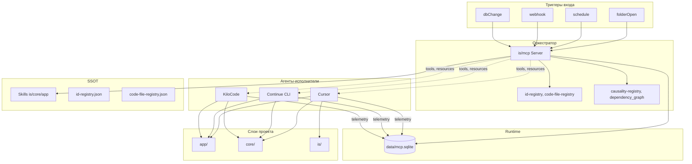

<!-- Важно: оставлять пустую строку перед "---" ! -->

# AIS: Контур оркестрации агентов (Agent Orchestration Contour)

<!-- Спецификация замкнутого контура взаимодействия MCP + Continue + KiloCode + триггеры. Замена и превосходство над n8n в едином поле скиллов, казуальностей и воркфлоу. -->

## Идентификация и жизненный цикл

```yml
id: ais-e9a5c2
status: draft
last_updated: "2026-03-07"
related_skills:
  - sk-3225b2  # arch-mcp-ecosystem
  - sk-d7a2cc  # arch-control-plane
  - sk-802f3b  # process-causality-harvesting
  - sk-3b1519  # causality-registry
  - sk-cecbcc  # process-ai-collaboration
related_ais:
  - ais-b7a9ba  # control-plane-llmops
  - ais-8d3c2a  # mcp-data-flow
  - ais-bfd150  # architecture-foundation
  - ais-c4e9b2  # rrg-contour
```

## Концепция (High-Level Concept)

**Agent Orchestration Contour** — замкнутый контур (Contour) управления взаимодействием ИИ-агентов (Cursor, Continue, KiloCode) в едином поле скиллов, казуальностей и воркфлоу. Цель: тотальная интеграция с архитектурой проекта (слои, контуры, жизненные циклы) и замена n8n как оркестратора агентных взаимодействий.

**Ключевое отличие от n8n:** n8n — node-based, визуальный, execution-priced. Наш контур — **skill-native**, **causality-driven**, **MCP-first**: скиллы и казуальность уже существуют как SSOT; агенты потребляют их через MCP. Оркестрация строится поверх существующей Control Plane, а не параллельно.

**Принципы:**
1. **Единое поле скиллов** — is/skills, core/skills, app/skills + id-registry как SSOT; MCP resources `skill://` — единственная точка входа для агентов.
2. **Казуальность как граф решений** — dependency_graph в mcp.sqlite связывает код с правилами; агенты не могут нарушить инварианты (#for-X).
3. **Один оркестратор** — Supervisor/Coordinator pattern: один центральный координатор (MCP + триггеры), специалисты (Continue, KiloCode) делегируют задачи.
4. **Замкнутый цикл** — вход (триггер) → контекст (MCP read) → действие (agent execute) → телеметрия (mcp.sqlite) → аудит.

## Инфраструктура и потоки данных (Infrastructure & Data Flow)



### Сравнение с n8n

| Аспект | n8n | Agent Orchestration Contour |
|--------|-----|----------------------------|
| **Триггеры** | Webhook, Schedule, Manual, DB poll | folderOpen (tasks/launchConfig), Schedule, Webhook, MCP tool call |
| **Оркестрация** | Визуальные ноды, линейные/ветвящиеся | MCP tools + Supervisor pattern, skill-native |
| **Состояние** | Внутренняя БД n8n, execution history | data/mcp.sqlite (events, dependency_graph, raw_causalities) |
| **Скиллы** | Отдельные документы или RAG | SSOT в git, skill:// resource, telemetry-injected |
| **Казуальность** | Нет | dependency_graph, #for-X инварианты, harvest_causalities |
| **Интеграция со слоями** | HTTP/API вызовы | Прямой доступ к app/core/is через агентов |
| **Стоимость** | Execution-based (€20/2500) | Локальный MCP, агенты — по их тарифам |

## Компоненты контура

### 1. Триггерная плоскость (Trigger Plane)

| Триггер | Механизм | Агент | Конфиг |
|---------|----------|-------|--------|
| **folderOpen** | VSCode tasks `runOn: folderOpen` или KiloCode `launchConfig.json` | KiloCode / Continue | `.vscode/tasks.json`, `.kilocode/launchConfig.json` |
| **schedule** | cron / GitHub Actions | Continue `cn`, KiloCode `kilo run --auto` | `.github/workflows/agent-schedule.yml` |
| **webhook** | HTTP endpoint → spawn agent | cursor-api, cn, kilo | `is/mcp/` webhook handler (future) |
| **MCP tool call** | Агент вызывает `run_orchestrated_task` | Cursor/Continue/KiloCode | MCP tool schema |

**Must-have для «без рук»:** KiloCode `launchConfig.json` — единственный нативный «при открытии проекта» без дополнительных настроек VSCode tasks.

### 2. MCP как оркестратор (не как пассивный tool provider)

Текущий id:ais-8d3c2a (MCP Data Flow) описывает MCP как read-only провайдер. Контур расширяет роль:

- **Orchestrator tools (новые):**
  - `run_orchestrated_task({ task_id, prompt, agent_hint })` — делегирует задачу агенту по hint (cursor|continue|kilocode).
  - `get_skill_context(skill_ids[])` — агрегирует skill:// + telemetry + dependency_graph для контекста.
  - `propose_workflow({ trigger, steps })` — регистрирует предложенный воркфлоу в SKILL_CANDIDATES (как в id:bskill-2cab14 n8n flow, но без n8n).

- **Существующие tools остаются:** run_preflight, harvest_causalities, query_telemetry, skill://, causality_graph://.

### 3. Единое поле скиллов (Unified Skill Plane)

Скиллы — SSOT. Агенты не «имеют свои скиллы» — они **читают** общие:

- `is/skills/` — архитектура, процессы, gates
- `core/skills/` — домены, API, провайдеры
- `app/skills/` — UI, компоненты, UX

MCP resource `skill://[id]` инжектирует telemetry (использование, anchors). Агенты (Continue, KiloCode) подключаются к одному MCP — единый контекст.

### 4. Казуальность и инварианты (Causality Plane)

- **dependency_graph** — source_hash → target_file. Заполняется #JS-eG4BUXaS (validate-causality-invariant.js).
- **raw_causalities** — backlog для harvest. Агент не может удалить #for-X в одном месте без обновления графа.
- **causality_graph://** — MCP resource для «какие файлы завязаны на этот hash».

Контур гарантирует: любой агентский рефакторинг проходит через preflight → invariant check.

### 5. Интеграция со слоями (Layer Integration)

| Слой | Как контур взаимодействует |
|------|----------------------------|
| **app/** | Агенты редактируют компоненты; RRG contour (id:ais-c4e9b2) гейтит нарушения |
| **core/** | Агенты вызывают DataProviderManager, API; контракты в core/skills |
| **is/** | MCP, preflight, scripts — агенты вызывают tools, не трогают напрямую без gate |

**Lifecycle:** AIS lifecycle (draft→incomplete→complete) — агенты могут предлагать переходы через `propose_workflow`; человеческий approve обязателен для complete.

### 6. Телеметрия и аудит (Telemetry Plane)

`data/mcp.sqlite`:
- `events` — кто, когда, какой tool
- `fragility_stats` — preflight failures по файлам
- `dependency_graph` — causality anchors
- `raw_causalities` — harvest backlog
- `confidence_audits` — skill confidence history

Контур добавляет (опционально):
- `orchestration_runs` — task_id, trigger, agent, started_at, completed_at, status

### 7. n8n Community: Реестр эквивалентов + генерация заготовок

**Стратегия:** Без Docker/n8n как backend — совместимость через реестр SSOT и генератор MCP-заготовок из метаданных n8n Community nodes. Позволяет находить и применять готовые решения из npm без запуска n8n.

#### 7.1. Реестр эквивалентов (SSOT)

**Путь:** `is/contracts/docs/n8n-equivalents-registry.json`

**Структура записи:**

```json
{
  "n8n-nodes-slack": {
    "npm": "n8n-nodes-slack",
    "description": "Slack API integration",
    "mcp_tool": "slack_post_message",
    "mcp_tool_path": "is/mcp/tools/slack.js",
    "skill_ref": "sk-xxx",
    "status": "implemented"
  },
  "n8n-nodes-gmail": {
    "npm": "n8n-nodes-gmail",
    "description": "Gmail API",
    "mcp_tool": null,
    "mcp_tool_path": null,
    "skill_ref": null,
    "status": "candidate"
  }
}
```

**Поля:**

| Поле | Обязательно | Описание |
|------|--------------|----------|
| `npm` | да | Имя npm-пакета (n8n-nodes-* или @org/n8n-nodes-*) |
| `description` | да | Краткое описание из package/README |
| `mcp_tool` | при implemented | Имя MCP tool в is/mcp/ |
| `mcp_tool_path` | при implemented | Путь к файлу реализации |
| `skill_ref` | нет | id скилла, документирующего использование |
| `status` | да | `implemented` \| `candidate` \| `pending` |

**status:** `implemented` — MCP tool есть и работает; `candidate` — нода отобрана, эквивалент не реализован; `pending` — в очереди на разбор.

#### 7.2. Генератор заготовок MCP из codex

**Скрипт:** `is/scripts/architecture/generate-mcp-from-n8n-node.js`

**Вызов:** `node is/scripts/architecture/generate-mcp-from-n8n-node.js <npm-package> [--output dir]`

**Логика:**

1. Загрузка пакета: `npm pack <package> --dry-run` или чтение из `node_modules` при наличии.
2. Парсинг codex: обход `nodes/**/*.node.json` в пакете, извлечение `properties`, `displayName`, `operations`.
3. Генерация заготовки:
   - Zod-схема из `properties` (типы: string, number, boolean, options → enum).
   - MCP tool handler с заглушкой `// TODO: implement API call; reference .node.ts`.
   - Описание из codex в JSDoc.
4. Вывод: файл в `is/mcp/tools/<generated-name>.js` или в `--output`.

**Ограничения:** Генератор не реализует HTTP/OAuth — только структуру. Реальную логику добавляет разработчик по образцу `.node.ts`.

#### 7.3. Workflow: поиск и применение

| Шаг | Действие |
|-----|----------|
| 1. Поиск | npm: `keywords:n8n-community-node-package`; [n8n Community nodes](https://docs.n8n.io/integrations/community-nodes/). |
| 2. Добавление в реестр | Новая запись в `n8n-equivalents-registry.json`, `status: "candidate"`. |
| 3. Генерация | `node is/scripts/architecture/generate-mcp-from-n8n-node.js n8n-nodes-X`. |
| 4. Реализация | Дописать HTTP/OAuth в handler; credentials через .env. |
| 5. Обновление реестра | `status: "implemented"`, `mcp_tool`, `mcp_tool_path`. |
| 6. Документация | Скилл или AIS, ссылка на эквивалент. |

#### 7.4. Интеграция с архитектурой

- **path-contracts:** Реестр в `is/contracts/docs/` — тот же слой, что id-registry, code-file-registry.
- **Preflight (опционально):** Валидация `mcp_tool_path` существует при `status: implemented`; `skill_ref` резолвится через id-registry.
- **Prefix:** Скиллы для n8n-эквивалентов — префикс `n8n-` (#JS-Q6dEzQ3S (prefixes.js) SKILL_TECH).

#### 7.5. Контракты

- Реестр — SSOT; изменения только через PR.
- `mcp_tool` при `implemented` обязан указывать на существующий файл.
- Credentials — только через .env; не хардкодить в MCP tools.

## Локальные политики (Module Policies)

1. **Один оркестратор:** Не создавать конкурирующие оркестраторы (например, n8n + MCP с дублирующей логикой). MCP — единая точка оркестрации.
2. **Skill-first:** Новые воркфлоу оформляются как скиллы или AIS; не как ad-hoc скрипты.
3. **Causality guard:** Агенты не могут обходить preflight. `run_preflight` — обязательный gate перед merge.
4. **No secret in config:** launchConfig, tasks.json — без API keys; только ссылки на .env.
5. **Traceability:** Каждый orchestrated run логирует agent_id, task_id, trigger в events.
6. **n8n equivalents:** Новые интеграции из n8n Community — через реестр `n8n-equivalents-registry.json`; генератор заготовок обязателен перед ручной реализацией.

## Контракты и гейты

- #JS-NrBeANnz (is/scripts/preflight.js) — оркестрированные изменения должны проходить preflight.
- #JS-eG4BUXaS — dependency_graph синхронизирован с кодом.
- id:sk-3225b2 (arch-mcp-ecosystem) — Tool Priority: если MCP tool есть, агент использует его, не shell.
- id:sk-d7a2cc (arch-control-plane) — Strict Git Policy: агенты не коммитят без команды пользователя.

## Roadmap (фазы)

| Фаза | Содержание | Зависимости |
|------|------------|-------------|
| **1. Trigger foundation** | launchConfig.json + tasks.json runOn:folderOpen; документировать | KiloCode/Continue установлены |
| **2. Orchestrator tools** | run_orchestrated_task, get_skill_context в is/mcp/ | Phase 1 MCP roadmap (id:backlog-69de5d) |
| **3. Telemetry extension** | orchestration_runs table, logging | mcp.sqlite schema |
| **4. n8n equivalents** | n8n-equivalents-registry.json, generate-mcp-from-n8n-node.js, preflight validation | Phase 2 |
| **5. n8n deprecation path** | Миграция id:bskill-2cab14 flows в MCP-orchestrated | Phase 2–4 |

## Ссылки

- id:ais-b7a9ba (docs/ais/ais-control-plane-llmops.md)
- id:ais-8d3c2a (docs/ais/ais-mcp-data-flow.md)
- id:ais-bfd150 (docs/ais/ais-architecture-foundation.md)
- id:backlog-69de5d (docs/backlog/mcp-ecosystem-roadmap.md)
- id:bskill-2cab14 (docs/backlog/skills/n8n-infrastructure.md)
- docs/glossary.md — Layer, Contour, Orchestrator, SSOT
