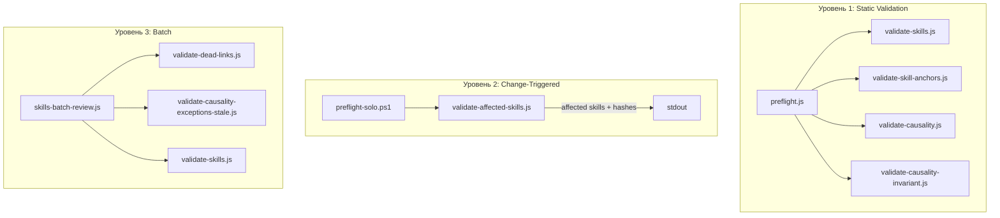

# AIS: Антиустареватель скиллов и казуальностей (Skill & Causality Anti-Staleness)

<!-- Спецификации (AIS) пишутся на русском языке и служат макро-документацией. Микро-правила вынесены в английские скиллы. -->
<!-- Этот AIS — образец полноты покрытия: детальное описание всего контура и каждого аспекта. -->

## Концепция (High-Level Concept)

Антиустареватель — трёхуровневая система обнаружения и предотвращения рассинхрона между кодом, скиллами и казуальностями. Когда код меняется, а скилл или formulation хеша остаётся старым, агент действует по неверным правилам — тихий ущерб. Три уровня: (1) Static validation в preflight — path existence, @skill resolution; (2) Change-triggered — git diff → affected skills/hashes; (3) Periodic batch — dead links, stale exceptions.

**Параллельный контур казуальностей:** Один реестр вместо многих скиллов; хеши вместо путей; ghost/stale exception вместо path missing.

## Инфраструктура и Потоки данных (Infrastructure & Data Flow)

### Общая схема контура

### Триггеры и точки входа

| Триггер | Команда / событие | Что выполняется |
|---------|-------------------|-----------------|
| Preflight | `npm run preflight` | validate-skills, validate-skill-anchors, validate-causality, validate-causality-invariant |
| Pre-commit flow | `scripts/git/preflight-solo.ps1` | skills:check, skills:affected |
| Batch review | `npm run skills:batch-review` | validate-skills, validate-dead-links, validate-causality-exceptions-stale |

## Локальные Политики (Module Policies)

- **Обязательное документирование в AIS:** После завершения каждой фазы внедрения — добавить в этот документ раздел «Фаза N — как работает» с точным описанием, казуальностью и схемой.
- **Не блокировать change-triggered:** skills:affected выводит список, но не прерывает preflight; решение о коммите — за человеком.
- **Stale exceptions — housekeeping:** validate-causality-exceptions-stale не блокирует preflight; отчёт в batch для ручной очистки.

## Компоненты и Контракты (Components & Contracts)

| Компонент | Путь | Назначение |
|-----------|------|------------|
| validate-skills.js | is/scripts/architecture/ | Path existence в Implementation Status, format, prefix, stale, orphan |
| validate-skill-anchors.js | is/scripts/architecture/ | @skill resolution — каждый @skill ведёт на существующий скилл |
| validate-affected-skills.js | is/scripts/architecture/ | git diff → affected skills и affected hashes |
| validate-dead-links.js | is/scripts/architecture/ | Битые ссылки в skills и docs |
| validate-causality-exceptions-stale.js | is/scripts/architecture/ | Stale exceptions в causality-exceptions.jsonl |
| skills-batch-review.js | is/scripts/architecture/ | Оркестратор batch-проверок |
| preflight-solo.ps1 | scripts/git/ | Pre-commit flow: secrets, skills:check, skills:affected |
| causality-registry.md | is/skills/ | SSOT хешей; ghost/unknown проверяются validate-causality |
| causality-exceptions.jsonl | docs/audits/ | Исключения при частичном удалении хеша (#for-audits-path-contract) |

---

## Фаза 1: Static Validation — как работает

> **Статус:** Заполняется после завершения фазы 1. Шаблон: точное описание + казуальность + схема.
> **Рекурсия:** При документировании фаз 2 и 3 — проверить, не изменилась ли функциональность фазы 1; при необходимости обновить этот раздел.

### Точное описание

*(После фазы 1: пошагово описать порядок вызовов, условия fail, формат ошибок.)*

### Казуальность

*(После фазы 1: #for-fail-fast, #for-gate-enforcement, #for-validate-skills-single и др.)*

### Схема

*(После фазы 1: Mermaid-диаграмма preflight → validate-skills → validate-skill-anchors → pass/fail.)*

---

## Фаза 2: Change-Triggered Review — как работает

> **Статус:** Заполняется после завершения фазы 2.
> **Рекурсия:** При документировании фазы 3 — проверить, не изменилась ли функциональность фазы 2; при необходимости обновить этот раздел и раздел фазы 1.

### Точное описание

*(После фазы 2: git diff --cached, парсинг @skill/@causality/@skill-anchor, вывод, preflight-solo flow.)*

### Казуальность

*(После фазы 2: #for-confidence-by-agent, почему не блокирует, arch-testing-ci.)*

### Схема

*(После фазы 2: Mermaid — git add → preflight-solo → skills:affected → решение человека.)*

---

## Фаза 3: Batch Review — как работает

> **Статус:** Заполняется после завершения фазы 3.
> **Рекурсия:** При последующих изменениях контура (фаза 4 и др.) — проверить, не затронули ли они фазы 1–3; при необходимости обновить предыдущие разделы.

### Точное описание

*(После фазы 3: оркестрация, validate-dead-links, validate-causality-exceptions-stale, формат отчёта.)*

### Казуальность

*(После фазы 3: #for-token-efficiency, почему batch не в preflight, housekeeping для stale exceptions.)*

### Схема

*(После фазы 3: Mermaid — skills:batch-review → подскрипты → агрегация → отчёт.)*

---

## Контур казуальностей (отличия от скиллов)

| Аспект | Скиллы | Казуальности |
|--------|--------|--------------|
| Хранилище | is/skills, core/skills, app/skills | causality-registry.md (один файл) |
| Связь с кодом | @skill, Implementation Status | @causality, @skill-anchor |
| Устаревание | Path missing, dead links | Ghost hash, stale exception, formulation outdated |
| Гейты | validate-skills, validate-skill-anchors | validate-causality, validate-causality-invariant |

---

## Ссылки

- План внедрения: `docs/plans/plan-skill-anti-staleness.md`
- arch-skills-mcp, process-skill-governance, process-code-anchors, arch-causality
