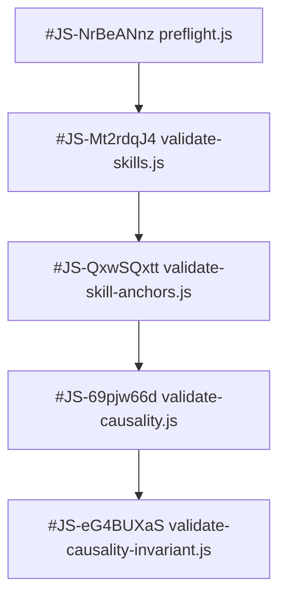
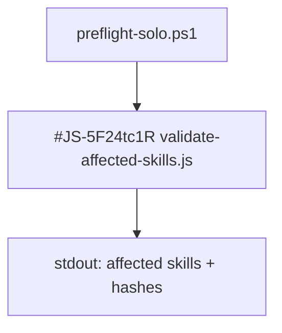
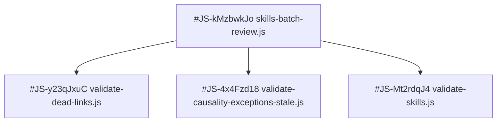
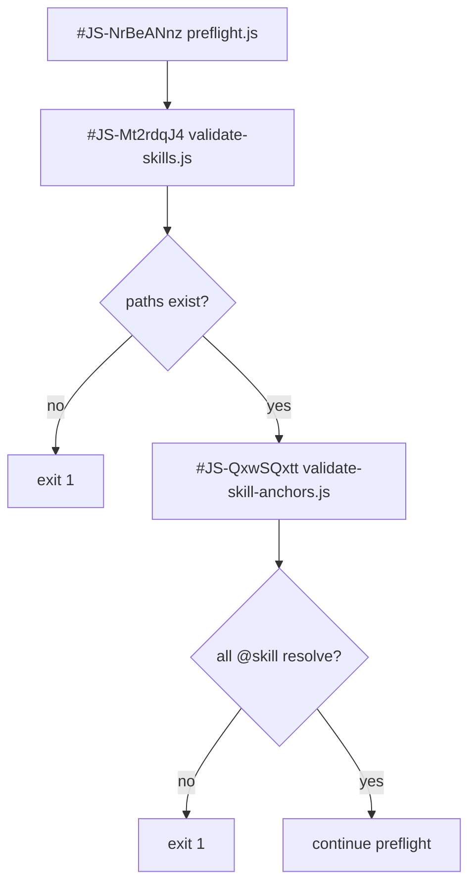
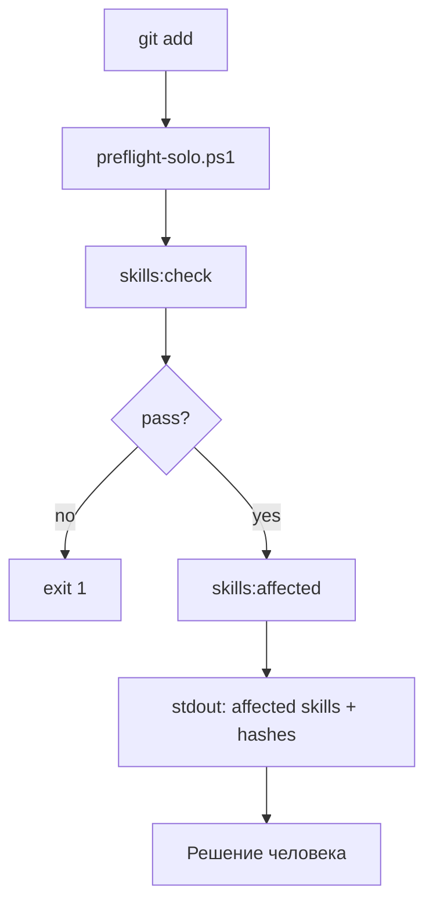
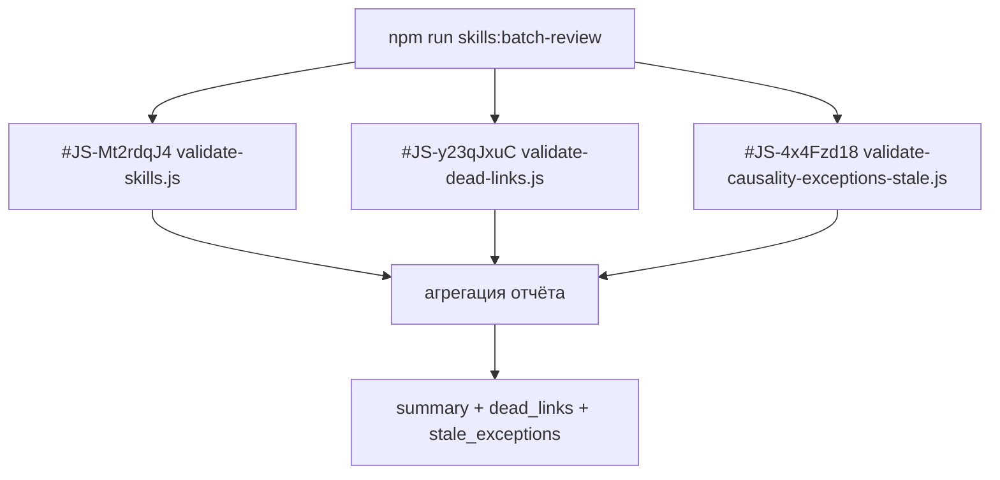

# AIS: Антиустареватель скиллов и казуальностей (Skill & Causality Anti-Staleness)

<!-- Спецификации (AIS) пишутся на русском языке и служат макро-документацией. Микро-правила вынесены в английские скиллы. -->
<!-- Этот AIS — образец полноты покрытия: детальное описание всего конвейера и каждого аспекта. -->
<!-- Схемы Mermaid: вертикальная ориентация (flowchart TD), узлы сверху вниз — читабельность при дефиците ширины экрана. -->

## Концепция (High-Level Concept)

Антиустареватель — трёхуровневая система обнаружения и предотвращения рассинхрона между кодом, скиллами и казуальностями. Когда код меняется, а скилл или formulation хеша остаётся старым, агент действует по неверным правилам — тихий ущерб. Три уровня: (1) Static validation в preflight — path existence, @skill resolution; (2) Change-triggered — git diff → affected skills/hashes; (3) Periodic batch — dead links, stale exceptions.

**Параллельный конвейер казуальностей (Causality Pipeline):** Один реестр вместо многих скиллов; хеши вместо путей; ghost/stale exception вместо path missing.

## Инфраструктура и Потоки данных (Infrastructure & Data Flow)

### Общая схема конвейера

Три блока схем расположены вертикально — каждый на всю ширину.

**Уровень 1: Static Validation**

**Уровень 2: Change-Triggered**

**Уровень 3: Batch**

### Триггеры и точки входа

| Триггер | Команда / событие | Что выполняется |
|---------|-------------------|-----------------|
| Preflight | `npm run preflight` | #JS-Mt2rdqJ4, #JS-QxwSQxtt, #JS-69pjw66d, #JS-eG4BUXaS |
| Pre-commit flow | `scripts/git/preflight-solo.ps1` | skills:check, skills:affected |
| Batch review | `npm run skills:batch-review` | #JS-Mt2rdqJ4, #JS-y23qJxuC, #JS-4x4Fzd18 |

## Локальные Политики (Module Policies)

- **Обновление спецификации:** При изменении конвейера (новые скрипты, смена триггеров) — обновить соответствующий раздел «Уровень N — как работает».
- **Не блокировать change-triggered:** skills:affected выводит список, но не прерывает preflight; решение о коммите — за человеком.
- **Stale exceptions — housekeeping:** #JS-4x4Fzd18 (validate-causality-exceptions-stale.js) не блокирует preflight; отчёт в batch для ручной очистки.

## Компоненты и Контракты (Components & Contracts)

| ID | Компонент | Путь | Назначение |
|------|-----------|------|------------|
| #JS-cMCNbcJ1 | path-contracts.js | is/contracts/ | SSOT: EXCLUDE_SOURCE_REL, SKIP_LINK_PATTERNS, SEARCH_DIRS, resolvePath; используют validate-skills и validate-dead-links |
| #JS-Mt2rdqJ4 | validate-skills.js | is/scripts/architecture/ | Path existence в Implementation Status, format, prefix, stale, orphan |
| #JS-Ua2mCTQk | validate-reasoning.js | is/scripts/architecture/ | Reasoning gate: checksum, confidence; last_change recommended (id:sk-d7bf67) |
| #JS-QxwSQxtt | validate-skill-anchors.js | is/scripts/architecture/ | @skill resolution — каждый @skill ведёт на существующий скилл |
| #JS-5F24tc1R | validate-affected-skills.js | is/scripts/architecture/ | git diff → affected skills и affected hashes |
| #JS-y23qJxuC | validate-dead-links.js | is/scripts/architecture/ | Битые ссылки; --all — полный скан без фильтров |
| #JS-4x4Fzd18 | validate-causality-exceptions-stale.js | is/scripts/architecture/ | Stale exceptions в causality-exceptions.jsonl |
| #JS-kMzbwkJo | skills-batch-review.js | is/scripts/architecture/ | Оркестратор batch-проверок |
| — | preflight-solo.ps1 | scripts/git/ | Pre-commit flow: secrets, skills:check, skills:affected |
| id:sk-3b1519 | is/skills/causality-registry.md | is/skills/ | SSOT хешей; ghost/unknown проверяются #JS-69pjw66d (validate-causality.js) |
| — | causality-exceptions.jsonl | docs/audits/ | Исключения при частичном удалении хеша (#for-audits-path-contract) |

### Исключения и особые случаи

| Объект | Правило |
|--------|---------|
| `docs/backlog/skills/*` | Не сканируются validate-skills, validate-skill-anchors (backlog вне active skills). Ссылки на backlog из active skills могут указывать на несуществующие пути. |
| id:sk-3b1519 (is/skills/causality-registry.md) | Path existence не парсит (нет Implementation Status). SSOT для хешей. |
| `README.md` | Path existence не требует путей из README; dead links проверяются. |
| `PREFLIGHT_SKIP_CAUSALITY=1` | #JS-69pjw66d и #JS-eG4BUXaS (validate-causality-invariant.js) не выполняются (внутри #JS-NrBeANnz is/scripts/preflight.js). |

## Уровень 1: Static Validation — как работает

### Описание

1. **#JS-NrBeANnz (is/scripts/preflight.js)** при запуске вызывает (в порядке): #JS-Mt2rdqJ4 (validate-skills.js), #JS-QxwSQxtt (validate-skill-anchors.js); при отсутствии `PREFLIGHT_SKIP_CAUSALITY=1` также #JS-69pjw66d и #JS-eG4BUXaS.
2. **#JS-Mt2rdqJ4** — парсит секции `## Implementation Status in PF` / `## Implementation Status` во всех скиллах (is/skills, core/skills, app/skills). Извлекает пути из bullet-списков, таблиц и inline backticks. Проверяет существование каждого пути (относительно ROOT; для коротких имён — поиск в is/scripts/architecture, core, app и др.). При отсутствии пути — error (preflight fail). Для путей в docs/, is/skills/ — warning.
3. **#JS-QxwSQxtt** — сканирует core/, app/, is/, shared/, .cursor/rules/ (первые 50 строк каждого .js, .ts, .mdc). Извлекает `@skill <path>`. Проверяет: файл скилла существует (is/skills/, core/skills/, app/skills/). При битой ссылке — error, exit 1.
4. **Условие fail:** Любая ошибка в #JS-Mt2rdqJ4, #JS-QxwSQxtt, #JS-69pjw66d или #JS-eG4BUXaS прерывает preflight.

### Казуальность

- **#for-fail-fast** — preflight падает при первом нарушении; не деградирует в рантайме.
- **#for-gate-enforcement** — path existence и @skill resolution — блокирующие гейты; без них контракт «скилл описывает существующий код» рассыпается.
- **#for-validate-skills-single** — @skill resolution вынесен в отдельный скрипт #JS-QxwSQxtt, а не в #JS-Mt2rdqJ4; допустимо по arch-testing-ci.

### Схема

---

## Уровень 2: Change-Triggered Review — как работает

### Описание

1. **preflight-solo.ps1** вызывается вручную перед коммитом (SSOT: arch-testing-ci). Выполняет: проверка, что `.env` не в staged; `npm run skills:check` (блокирует при ошибке); `npm run skills:affected` (информационно, не блокирует).
2. **#JS-5F24tc1R (validate-affected-skills.js)** — читает `git diff --cached --name-only`; для каждого staged-файла: `@skill` — первые 50 строк (header), `@causality`/`@skill-anchor` — полный файл. Собирает affected_skills и affected_hashes. Выводит в stdout или `--json`. Всегда exit 0 (не блокирует).
3. **Условие блокировки:** Только skills:check блокирует; skills:affected — только информирует. Решение о коммите — за человеком.

### Казуальность

- **#for-confidence-by-agent** — skills:affected не блокирует preflight; только человек решает, коммитить сразу или обновить скилл/formulation и затем коммитить.
- **#for-preflight-solo-not-hook** — preflight-solo.ps1 вызывается вручную, а не как git hook; контроль над flow (arch-testing-ci), возможность пропустить при срочных фиксах.

### Схема

---

## Уровень 3: Batch Review — как работает

### Описание

1. **#JS-kMzbwkJo (skills-batch-review.js)** оркестрирует три проверки: #JS-Mt2rdqJ4 (--json), #JS-y23qJxuC (--json), #JS-4x4Fzd18 (--json).
2. **#JS-y23qJxuC (validate-dead-links.js)** — сканирует is/skills, core/skills, app/skills, docs (исключая docs/plans, docs/backlog, docs/done); ищет markdown-ссылки и inline-пути в backticks; пропускает API-пути, donor-пути, placeholder; проверяет существование; выводит dead_links. Флаг `--all` — полный скан без исключений (для аудита 400+ ссылок). Подтверждение «исправлено» — только через повторный запуск (агент).
3. **#JS-4x4Fzd18** — загружает docs/audits/causality-exceptions.jsonl; строит usedHashes из кода и skills; exception считается stale, если hash полностью удалён из кода.
4. **Формат отчёта:** JSON (--json) или текстовый summary. Ни одна проверка не блокирует preflight; batch — периодический аудит.

### Казуальность

- **#for-token-efficiency** — batch-отчёт не в preflight; объёмный вывод только по запросу (npm run skills:batch-review).
- **#for-housekeeping** — stale exceptions не блокируют; исключение уже применено при partial removal; удаление строки — ручная очистка.

### Схема

---

## Конвейер казуальностей (отличия от скиллов)

| Аспект | Скиллы | Казуальности |
|--------|--------|--------------|
| Хранилище | is/skills, core/skills, app/skills | id:sk-3b1519 (один файл) |
| Связь с кодом | @skill, Implementation Status | @causality, @skill-anchor |
| Устаревание | Path missing, dead links | Ghost hash, stale exception, formulation outdated |
| Гейты | #JS-Mt2rdqJ4, #JS-QxwSQxtt | #JS-69pjw66d, #JS-eG4BUXaS |

---

## Протокол верификации

| Проверка | Команда |
|--------|---------|
| Path existence, @skill resolution | `npm run skills:check`, `npm run skills:anchors:check` |
| Affected skills/hashes | `npm run skills:affected` (после git add) |
| Dead links, stale exceptions | `npm run skills:batch-review` |
| Все гейты | `npm run preflight` |

**Порядок:** skills:check → skills:anchors:check → preflight. При ошибке — исправить и повторить.

---

## Антипаттерны

| Антипаттерн | Правильно |
|-------------|-----------|
| Коммитить без проверки affected-skills | Перед коммитом прочитать вывод skills:affected; обновить скилл или отложить осознанно |
| Переименовать файл без обновления Implementation Status | Обновить пути в скилле |
| Добавить @skill без проверки существования файла | Убедиться, что скилл существует |
| Оставить stale exception в causality-exceptions.jsonl | Запустить #JS-4x4Fzd18; удалить stale строки |
| Менять код с @causality без ревью formulation | Прочитать affected hashes; обновить formulation или удалить хеш |

### Известные pending (dead links)

По `npm run skills:batch-review`: 5 dead links в id:ais-e9a5c2 (docs/ais/ais-agent-orchestration-contour.md) — планируемые артефакты (триггеры, n8n registry, генератор MCP). Варианты: добавить в SKIP_LINK_PATTERNS (#JS-cMCNbcJ1), создать заглушки или переписать AIS на «будущий артефакт».

---

## Ссылки

- План внедрения: дистиллирован в этот AIS (завершён)
- Скиллы: id:sk-7d810a arch-skills-mcp, id:sk-d763e7 process-skill-governance, id:sk-8991cd process-code-anchors, id:sk-d6777d arch-testing-ci, id:sk-d599bd arch-causality
