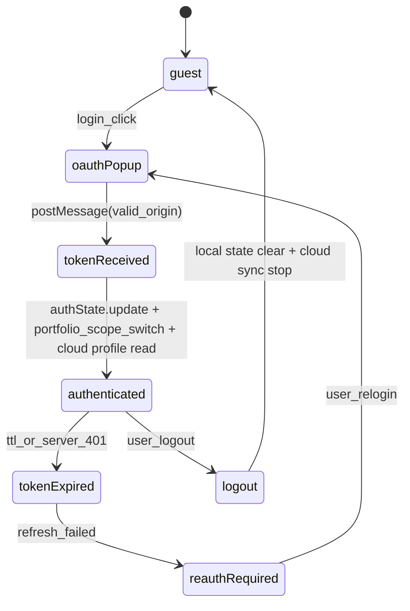

# AIS: Жизненный цикл аутентификации (Authentication Lifecycle)

## Концепция (High-Level Concept)

Auth Flow — это **Lifecycle**, а не отдельный Layer/Contour: он описывает последовательность состояний OAuth handshake и переходы между ними до logout/recovery.

## Инфраструктура и поток данных (Infrastructure & Data Flow)

- Transport: `window.postMessage` + Cloudflare auth endpoints.
- Boundary: Browser auth state - Cloudflare auth client.
- Orchestrator: `app-ui-root` mounted flow coordinates auth -> portfolio scope switch -> workspace sync -> cloud hydrate.

После успешного login `app-ui-root` выполняет не только workspace recovery, но и переключение portfolio local storage на auth scope, затем запускает `hydratePortfoliosFromCloud()`. Этот hydrate теперь обязан не только догружать отсутствующие cloud copies, но и разрешать multi-device divergence: remote-bound version остаётся основной, а локальная divergent copy fork-ится в detached conflict-portfolio. На logout lifecycle возвращает both guest workspace snapshot и guest portfolio scope. Детальный portfolio sync-flow вынесен в id:ais-6f2b1d.

## Политики модулей (Module Policies)

- `#for-oauth-postmessage`: origin validation mandatory.
- `#for-client-ssot-with-cloud-sync`: client workspace remains live SSOT; cloud is replica/recovery source.
- Auth failure must be explicit in UI, no silent authenticated state.
- Auth lifecycle не должен смешивать guest portfolio storage и auth-scoped portfolio storage в одном localStorage key.

## Компоненты и контракты (Components & Contracts)

- `core/state/auth-state.js`
- `core/api/cloudflare/auth-client.js`
- `core/config/auth-config.js`
- `app/components/auth-button.js`
- `app/components/auth-modal-body.js`
- `app/app-ui-root.js`

## Казуальность и ссылки

- #JS-Hx2xaHE8 — docs ids and references
- #JS-69pjw66d — causality hash integrity

## Покрытие / completeness

- Status `incomplete`: pending formal token refresh matrix by provider-specific auth policies.
