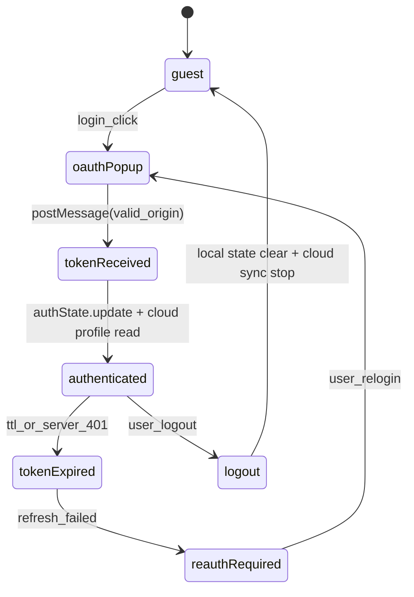

# AIS: Жизненный цикл аутентификации (Authentication Lifecycle)

## Концепция (High-Level Concept)

Auth Flow — это **Lifecycle**, а не отдельный Layer/Contour: он описывает последовательность состояний OAuth handshake и переходы между ними до logout/recovery.

## Инфраструктура и поток данных (Infrastructure & Data Flow)

- Transport: `window.postMessage` + Cloudflare auth endpoints.
- Boundary: Browser auth state - Cloudflare auth client.
- Orchestrator: `app-ui-root` mounted flow coordinates auth -> workspace sync.

## Политики модулей (Module Policies)

- `#for-oauth-postmessage`: origin validation mandatory.
- `#for-client-ssot-with-cloud-sync`: client workspace remains live SSOT; cloud is replica/recovery source.
- Auth failure must be explicit in UI, no silent authenticated state.

## Компоненты и контракты (Components & Contracts)

- `core/state/auth-state.js`
- `core/api/cloudflare/auth-client.js`
- `core/config/auth-config.js`
- `app/components/auth-button.js`
- `app/components/auth-modal-body.js`

## Казуальность и ссылки

- #JS-Hx2xaHE8 — docs ids and references
- #JS-69pjw66d — causality hash integrity

## Покрытие / completeness

- Status `incomplete`: pending formal token refresh matrix by provider-specific auth policies.
