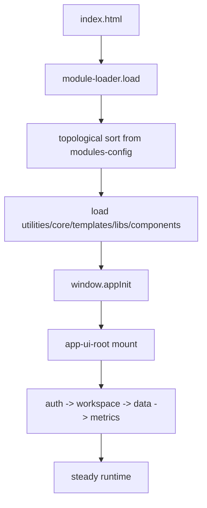

# AIS: Жизненный цикл bootstrap модулей (Bootstrap Lifecycle)

## Концепция (High-Level Concept)

Bootstrap — это отдельный **Orchestrator Lifecycle**: загрузка модулей, инициализация зависимостей, монтирование Vue root, запуск startup flows и graceful abort при критических ошибках.

## Инфраструктура и поток данных (Infrastructure & Data Flow)

- Critical path failure (Vue/templates/core critical modules) -> bootstrap abort.
- Non-critical module failure -> warning + continue.
- File protocol mode (`file://`) uses proxy path strategy for external API calls.

## Политики модулей (Module Policies)

- `#for-composition-root`: one composition root (`app-ui-root`) controls startup ordering.
- `#for-layer-separation`: bootstrap loads by dependency graph, not ad-hoc imports.
- `#for-bootstrap-nexttick-init`: DOM-dependent bootstrap steps run after render.

## Компоненты и контракты (Components & Contracts)

- #JS-os34Gxk3 (`core/modules-config.js`)
- #JS-xj43kftu (`core/module-loader.js`)
- `app/app-ui-root.js`

## Казуальность и ссылки

- #JS-Hx2xaHE8 — docs ids and references
- #JS-69pjw66d — causality hash integrity

## Покрытие / completeness

- Status `incomplete`: pending strict machine-readable classification for critical vs non-critical module list.
