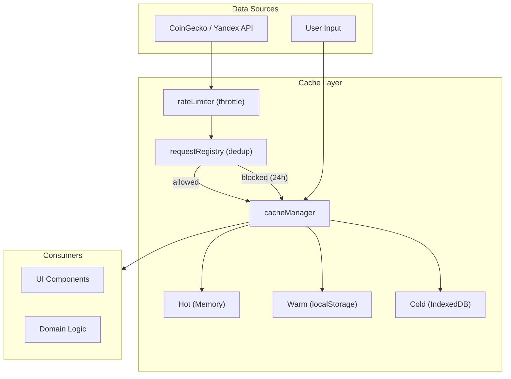

# AIS: Архитектура кэша и реестров (Cache Architecture & Registries)

## Концепция (High-Level Concept)

**Кэш (Cache)** — временное хранилище для ускорения повторного доступа к данным. Кэш содержит копию с ограниченным временем жизни (TTL).

**Реестр (Registry)** — централизованный, доверенный список ключей или путей. Реестр — каноничный первоисточник (SSOT); кэш — временная копия.

Приложение реализует **многослойный кэш** с версионированием и миграциями, а также несколько специализированных реестров для управления идентичностью артефактов.

## Инфраструктура и Потоки данных (Infrastructure & Data Flow)

### Архитектура кэша

#### Слои хранения (Storage Layers)

| Слой | Имплементация | Скорость | Объём | TTL |
|------|--------------|----------|-------|-----|
| **Hot** | Memory (переменные) | Мгновенно | Ограничен | Session |
| **Warm** | localStorage | Быстро | ~5–10 MB | Configurable |
| **Cold** | IndexedDB | Медленнее | ~50+ MB | Configurable |

Модуль `storageLayers` (`core/cache/storage-layers.js`) абстрагирует доступ к конкретному хранилищу; `cacheManager` выбирает слой в зависимости от размера и типа данных.

#### Версионирование ключей

Кэш использует versioned keys формата `v:{hash}:{key}`, где `hash` вычисляется из версии приложения (`appConfig.CONFIG.version`). При обновлении версии — автоматическая инвалидация старых записей через `clearOldVersions()`.

Ключи с версионированием:
- `icons-cache` — кэш иконок монет
- `coins-list` — список монет
- `api-cache` — ответы API
- `market-metrics` — рыночные метрики
- `stablecoins-list` — список стейблкоинов (CoinGecko supplement). Selection uses curated default in coinsConfig — no network on click; loader fetches stablecoins + tokenized-gold + tokenized-silver + commodity-backed on "Update metadata"
- `crypto-news-state` — состояние новостей

#### Cache Manager API

`cacheManager` (`core/cache/cache-manager.js`) → `window.cacheManager`:

| Метод | Назначение |
|-------|-----------|
| `get(key, options)` | Чтение с учётом versioning и TTL |
| `set(key, value, options)` | Запись с TTL и versioning |
| `has(key)` | Проверка наличия |
| `delete(key)` | Удаление |
| `clearOldVersions()` | Очистка устаревших версионированных записей |

**Options:** `{ useVersioning: boolean, ttl: number }`

#### Миграции кэша

`cacheMigrations` (`core/cache/cache-migrations.js`) — выполняет структурные миграции кэша при обновлении формата данных (переименование ключей, изменение структуры). Запускается автоматически при инициализации `cacheManager`.

#### Индексы кэша

`cacheIndexes` (`core/cache/cache-indexes.js`) — поддержка secondary indexes для быстрого поиска по кэшированным данным без полного сканирования.

### Конвейер кэширования

### Реестры (Registries)

| Реестр | Файл | Тип | Назначение |
|--------|------|-----|-----------|
| **ID Registry** | `is/contracts/docs/id-registry.json` | Build-time SSOT | Маппинг `id:` → файл для всех markdown-артефактов |
| **Code File Registry** | `is/contracts/docs/code-file-registry.json` | Build-time SSOT | Маппинг `#JS-*` hash → файл для всех code-файлов |
| **Causality Registry** | `is/skills/causality-registry.md` | Build-time SSOT | Канонический список `#for-*` и `#not-*` хешей |
| **Request Registry** | `core/api/request-registry.js` | Runtime | Журнал API-запросов для дедупликации (24h window) |
| **Module Registry** | `core/modules-config.js` | Runtime | Реестр модулей с зависимостями |
| **Docs ID Manifest** | `docs/docs-id-manifest.json` | Derived | Агрегированный маппинг всех doc IDs |

**Инвариант Registry vs Cache:** реестр **всегда** является SSOT. Если данные есть и в реестре, и в кэше — реестр побеждает. Кэш содержит копии, реестр содержит истину.

### Request Registry (runtime дедупликация)

`requestRegistry` (`core/api/request-registry.js`) → `window.requestRegistry`:

- `isAllowed(provider, endpoint, params, minInterval)` — проверка, разрешён ли запрос (не было ли успешного запроса в пределах `minInterval`).
- `recordCall(provider, endpoint, params, status, success)` — запись результата запроса.

Используется для предотвращения лишних API-вызовов (stablecoins — 24h блокировка после успешного запроса).

## Локальные Политики (Module Policies)

1. **TTL is mandatory:** каждая запись в кэше **обязана** иметь TTL. Бессрочные записи запрещены (`#for-distinct-ttls`).
2. **Version key for volatile data:** данные, меняющиеся между версиями приложения (иконки, конфигурация), используют versioned keys.
3. **Cache ≠ truth:** кэш — fallback. При ошибке загрузки свежих данных кэш используется с warn-логом, но **не** выдаётся за актуальные данные.
4. **Registry immutability at runtime:** build-time реестры (id-registry, code-file-registry) **никогда** не модифицируются runtime-кодом. Обновление — только через генераторы в `is/scripts/`.
5. **Migration before use:** `cacheMigrations` выполняется **до** первого `cacheManager.get()` в app lifecycle.

## Компоненты и Контракты (Components & Contracts)

- `core/cache/cache-manager.js` — основной API кэша
- `core/cache/storage-layers.js` — абстракция хранилищ
- `core/cache/cache-config.js` — конфигурация кэша (TTL, limits)
- `core/cache/cache-migrations.js` — миграции формата данных
- `core/cache/cache-cleanup.js` — очистка просроченных/лишних записей
- `core/cache/cache-indexes.js` — secondary indexes
- `core/api/request-registry.js` — дедупликация запросов
- `is/contracts/docs/id-registry.json` — SSOT документных ID
- `is/contracts/docs/code-file-registry.json` — SSOT code hashes
- id:sk-3c832d (cache-layer) — контракт кэш-слоя
- id:sk-02d3ea (config-contracts) — контракты конфигурации

## Контракты и гейты

- #JS-Hx2xaHE8 (validate-docs-ids.js) — валидация id-registry
- Preflight gate (`is/scripts/preflight.js`) — прогон всех валидаторов

## Завершение / completeness

- `@causality #for-distinct-ttls` — каждый тип данных имеет свой TTL.
- `@causality #for-key-versioning` — версионированные ключи инвалидируются при апгрейде.
- `@causality #for-filesystem-cache` — localStorage как основной warm-слой.
- Status: `incomplete` — pending формализация cold-layer (IndexedDB) usage policy.
