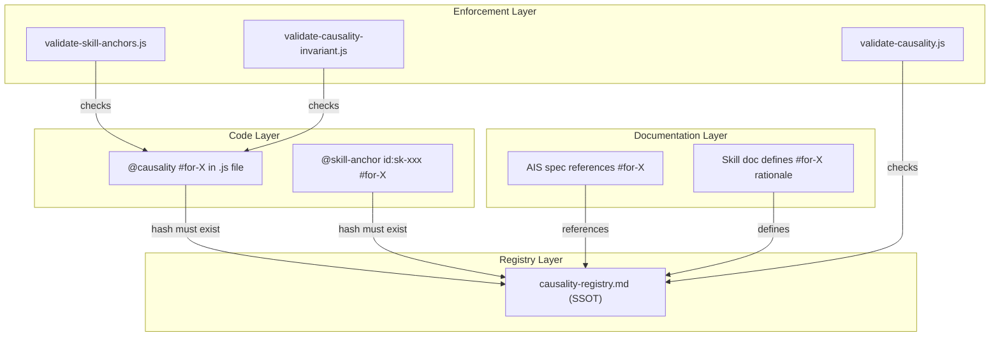

# AIS: Казуальность и якоря (Causality & Anchors)

## Концепция (High-Level Concept)

**Казуальность (Causality)** — зафиксированная причинно-следственная связь между архитектурным решением и его обоснованием. Каждая казуальность имеет уникальный хеш (`#for-*` или `#not-*`), связывающий код, документацию и навыки в единую сеть обоснований.

**Якорь (Anchor)** — точка привязки кода к смыслу или документации. Якоря бывают двух типов: `@causality` (причинно-следственная связь) и `@skill-anchor` (привязка к навыку).

Вместе они образуют **traceability layer** — систему, позволяющую для любого архитектурного решения проследить цепочку «почему так сделано?» от кода до обоснования.

## Инфраструктура и Потоки данных (Infrastructure & Data Flow)

### Модель казуальности



### Типы казуальностей

| Тип | Формат хеша | Семантика | Пример |
|-----|------------|-----------|--------|
| **Позитивная** | `#for-X` | «Выбрали/делаем X потому что...» — обоснование выбранного решения | `#for-rate-limiting` — адаптивный throttling предотвращает 429 |
| **Негативная** | `#not-X` | «Отвергли X потому что...» — при рассмотрении и отвержении альтернатив | `#not-bundler-ui` — No-Build архитектура; bundler отвергнут |
| **Вопросительная** | `QUESTION:` | Причина неизвестна, помечена для будущего анализа | `// @causality QUESTION: why setTimeout here?` |

**Критерий выбора:** Основная формулировка — «мы выбрали X» → `#for-X`. Основная формулировка — «мы отвергли Y» → `#not-Y`. Один и тот же выбор может иметь оба: `#for-A #not-B`. В Reasoning (id:sk-d7bf67): сначала все `#for-`, затем все `#not-`.

### Форматы якорей в коде

```javascript
// 1. Causality anchor — причинно-следственная связь
// @causality #for-file-protocol Because file:// blocks direct fetch, we proxy via Worker.

// 2. Chose A, rejected B — оба хеша
// @causality #for-file-protocol #not-bundler-ui

// 3. Skill anchor — привязка к навыку + обоснование
// @skill-anchor id:sk-224210 #for-data-provider-interface

// 4. File header anchors (in JSDoc block)
// @skill id:sk-bb7c8e
// @skill-anchor id:sk-bb7c8e #for-layer-separation

// 5. Question marker (unresolved causality)
// @causality QUESTION: Is this TTL optimal for stablecoins?
```

### Causality Registry (SSOT)

`is/skills/causality-registry.md` (id:sk-3b1519) — единственный канонический источник всех зарегистрированных хешей.

**Enforcement:** `gate` = гейт preflight проверяет соблюдение; нарушение блокирует. `advisory` = рекомендация, гейта нет; предпочитать соблюдать, можно отступить с явным обоснованием. При конфликте: gate побеждает advisory.

**Тип на уровне якоря:** id:sk-7f3e2b (process-anchor-causality-type) — опционально указывать `constraint` (из-за) или `goal` (для) после хеша.

**Текущие метрики реестра:**
- ~105 позитивных хешей (`#for-*`), ~9 негативных (`#not-*`)
- 7 gate, остальные advisory

### Процесс добавления новой казуальности

1. **Обнаружение:** агент или разработчик находит не-очевидное решение в коде.
2. **Проверка дубля:** `search_nodes` + grep по causality-registry на семантический дубль.
3. **Регистрация хеша:** добавление в `is/skills/causality-registry.md` с кратким обоснованием.
4. **Расстановка якорей:** `@causality #for-X` или `@causality #not-Y` (или оба) в коде; `#for-X` / `#not-Y` в AIS/skill документации.
5. **Валидация:** `npm run skills:causality:check` — все хеши в коде резолвятся в реестре.

### Процесс harvesting (сбор казуальностей)

Управляется id:sk-802f3b (process-causality-harvesting):

1. **Raw markers:** агент оставляет `// @causality Because X...` без хеша.
2. **Harvester scan:** `harvest_causalities` MCP tool сканирует кодовую базу.
3. **Formalization:** raw markers формализуются в хеши и вносятся в реестр.
4. **Skill distillation:** если паттерн повторяется ≥3 раз — создаётся/обновляется skill.

### Anti-Staleness контур

Управляется id:ais-9f4e2d (ais-anti-staleness):

- Казуальности и якоря **устаревают**, если код изменился, а обоснование не обновлено.
- Anti-staleness detector проверяет: хеш в реестре → якоря в коде → файлы не менялись с момента аудита.
- При обнаружении stale якоря — помечается для ре-аудита.

## Локальные Политики (Module Policies)

1. **Hash uniqueness:** каждый хеш в реестре уникален семантически. Перед добавлением нового — обязательная проверка на дубль.
2. **No orphan hashes:** хеш в реестре **обязан** иметь хотя бы один якорь в коде или документации. Orphan hashes подлежат cleanup.
3. **No naked @causality:** `@causality` без хеша и без `QUESTION:` — невалиден. Гейт блокирует.
4. **Causality deletion protocol:** удаление хеша из кода сначала требует проверки на supersession/rebinding: не был ли старый hash заменён более общей или переименованной казуальностью. Если да, остатки мигрируются на replacement hash и lineage фиксируется в alias-table id:sk-3b1519. Только если старый hash осознанно остаётся валиден в других местах, добавляется запись в `docs/audits/causality-exceptions.jsonl`. Без этого invariant gate (#JS-eG4BUXaS) блокирует.
5. **Skill-anchor bidirectionality:** `@skill-anchor` с указанием skill ID и hash означает, что target skill **обязан** содержать описание referenced hash. Гейт #JS-QxwSQxtt проверяет.

## Компоненты и Контракты (Components & Contracts)

- `is/skills/causality-registry.md` (id:sk-3b1519) — SSOT реестр хешей
- id:sk-d599bd (arch-causality) — архитектура казуальности
- id:sk-802f3b (process-causality-harvesting) — процесс сбора
- id:sk-8991cd (process-code-anchors) — правила расстановки якорей
- id:sk-3df9f9 (process-legacy-unknowns-causality) — обработка legacy unknowns
- `docs/audits/causality-exceptions.jsonl` — исключения для invariant gate
- `is/mcp/tools/harvester/` — MCP harvester tool

## Контракты и гейты

- #JS-69pjw66d (validate-causality.js) — все `#for-*` / `#not-*` в коде существуют в реестре
- #JS-QxwSQxtt (validate-skill-anchors.js) — `@skill-anchor` ссылается на существующий skill с корректным хешем
- #JS-eG4BUXaS (validate-causality-invariant.js) — при удалении хеша обязательна запись в exceptions или полная зачистка

## Завершение / completeness

- `@causality #for-causality-harvesting` — raw markers трансформируются в формальные хеши.
- `@causality #for-skill-anchors` — якоря связывают код с навыками bidirectionally.
- `@causality #for-gate-enforcement` — все казуальности проверяются гейтами.
- `@causality #for-explicit-unknowns` — `QUESTION:` markers для неразрешённых причин.
- Status: `incomplete` — pending визуализация causality graph (сейчас только text-based grep).
