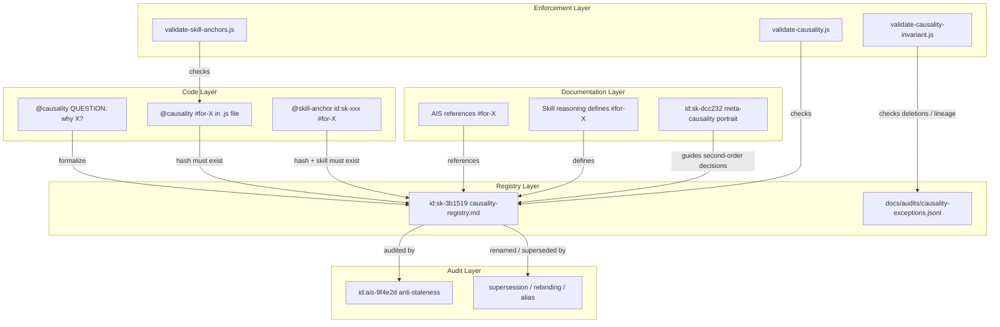
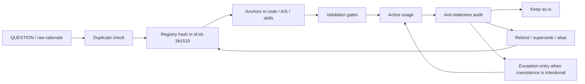

# AIS: Система казуальности и трассируемости (Causality Traceability System)

## Концепция (High-Level Concept)

**Казуальность (Causality)** — зафиксированная причинно-следственная связь между архитектурным решением и его обоснованием. Каждая казуальность имеет уникальный хеш (`#for-*` или `#not-*`), связывающий код, документацию и навыки в единую сеть обоснований.

**Якорь (Anchor)** — точка привязки кода к смыслу или документации. Якоря бывают двух типов: `@causality` (причинно-следственная связь) и `@skill-anchor` (привязка к навыку).

**Мета-казуальность (Meta-Causality)** — казуальность второго порядка. Ее объект не конкретное техническое решение, а способ принятия решений об automation, skill, gate, protocol step или структурном изменении.

Вместе registry, anchors, skills, AIS, exceptions и gates образуют **traceability layer**: систему, позволяющую для любого архитектурного решения проследить цепочку "почему так сделано?", а для любого изменения rationale понять, где именно нужно обновить обоснование.

## Инфраструктура и Потоки данных (Infrastructure & Data Flow)

### Модель системы



### Типы казуальностей

| Тип | Формат | Семантика | Пример |
|-----|--------|-----------|--------|
| **Позитивная** | `#for-X` | "Выбрали/делаем X потому что..." | `#for-rate-limiting` |
| **Негативная** | `#not-X` | "Отвергли X потому что..." | `#not-bundler-ui` |
| **Вопросительная** | `QUESTION:` | Причина еще не формализована | `@causality QUESTION: why setTimeout here?` |
| **Мета-казуальность** | `#for-X` | Второй порядок: как принимать решение о правилах и структуре | `#for-benefit-overhead-kpi` |

**Критерий выбора:** Основная формулировка "мы выбрали X" -> `#for-X`. Основная формулировка "мы отвергли Y" -> `#not-Y`. Один и тот же выбор может иметь оба: `#for-A #not-B`. Мета-казуальности живут в том же registry namespace, но описывают decision pattern, а не конкретное техническое решение.

### Метрики и состав реестра

- ~100 позитивных хешей (`#for-*`)
- ~9 негативных (`#not-*`)
- 8 gate, остальные advisory
- 7 зарегистрированных meta-causality hash

### Зарегистрированные meta-causality hash

| Hash | Роль |
|------|------|
| `#for-benefit-overhead-kpi` | Оценивает, стоит ли добавлять structural overhead |
| `#for-explicit-over-implicit` | Требует явных protocol / marker / checklist вместо подразумеваемых шагов |
| `#for-defer-over-incomplete` | Предпочитает backlog/Defer вместо half-done Inline change |
| `#for-conditional-trigger` | Запускает heavy protocol только при выполнении условий |
| `#for-flow-preservation` | Защищает основной developer/agent flow от лишней фрикции |
| `#for-weighted-explicit` | Требует явного multi-factor weighting вместо single-factor guess |
| `#for-document-the-choice` | Требует фиксировать rationale выбора A vs B |

Эти hash живут в том же registry namespace, что и обычные казуальности, но применяются только к second-order decisions: skill creation, protocol design, gate strictness, structural additions, Inline vs Defer choice.

### Жизненный цикл казуальности



### Форматы якорей в коде

```javascript
// 1. Causality anchor
// @causality #for-file-protocol Because file:// blocks direct fetch, we proxy via Worker.

// 2. Chose A, rejected B
// @causality #for-file-protocol #not-bundler-ui

// 3. Skill anchor
// @skill-anchor id:sk-224210 #for-data-provider-interface

// 4. File header anchors
// @skill id:sk-bb7c8e
// @skill-anchor id:sk-bb7c8e #for-layer-separation

// 5. Question marker
// @causality QUESTION: Is this TTL optimal for stablecoins?
```

## Локальные Политики (Module Policies)

1. **Hash uniqueness:** каждый hash в id:sk-3b1519 должен быть семантически уникален. Перед добавлением нового — обязательная проверка дубля.
2. **No orphan hashes:** hash в реестре должен иметь хотя бы один anchor в коде или документации. Orphan hash подлежит cleanup или явному rollout-gap объяснению.
3. **No naked `@causality`:** `@causality` без hash и без `QUESTION:` невалиден.
4. **Deletion protocol:** удаление hash требует проверки supersession / rebinding. Если hash был заменен более общим или переименованным, anchors мигрируются, а lineage фиксируется в alias table id:sk-3b1519.
5. **Intentional coexistence only:** `docs/audits/causality-exceptions.jsonl` используется только для осознанного сосуществования hash, не как shortcut для незавершенного rebinding.
6. **Skill-anchor bidirectionality:** `@skill-anchor` с skill ID и hash означает, что target skill обязан содержать описание referenced hash.
7. **Meta-causality application:** meta-causalities применяются только к second-order decisions. Если decision local and concrete, использовать обычную causality. Если decision касается правил, protocol overhead или creation criteria — meta-causality допустима.
8. **Self-limiting first:** meta-causalities с threshold или condition должны применяться только в своем scope. Например, `#for-benefit-overhead-kpi` — только когда structural addition действительно рассматривается.

## Компоненты и Контракты (Components & Contracts)

- `is/skills/causality-registry.md` (id:sk-3b1519) — SSOT реестр всех hash, включая meta-causalities.
- id:sk-d599bd (is/skills/arch-causality.md) — архитектурное summary текущей causality system.
- id:sk-802f3b (is/skills/process-causality-harvesting.md) — harvesting и promotion protocol.
- id:sk-8991cd (is/skills/process-code-anchors.md) — правила расстановки anchors.
- id:sk-3df9f9 (is/skills/process-legacy-unknowns-causality.md) — обработка unknown rationale в legacy.
- id:sk-7f3e2b (is/skills/process-anchor-causality-type.md) — optional anchor-level `constraint` / `goal`.
- id:sk-dcc232 (is/skills/process-meta-causality-discovery.md) — portrait и algorithm для новых meta-causalities.
- `docs/audits/causality-exceptions.jsonl` — exception ledger для invariant gate.

## Контракты и гейты

- #JS-69pjw66d (validate-causality.js) — все `#for-*` / `#not-*` в коде существуют в registry.
- #JS-QxwSQxtt (validate-skill-anchors.js) — `@skill-anchor` ссылается на существующий skill с корректным hash.
- #JS-eG4BUXaS (validate-causality-invariant.js) — удаление hash требует exceptions или полной зачистки.
- id:ais-9f4e2d (docs/ais/ais-anti-staleness.md) — stale rationale detection и re-audit loop.

## Завершение / completeness

- `Implemented`: registry-backed causality system, code/document anchors, harvesting, rebinding protocol, exception ledger, gates.
- `Implemented`: meta-causalities are now part of the same canonical registry namespace and have a dedicated agent portrait in id:sk-dcc232.
- `Rollout gap`: dedicated causality graph visualization/tooling is still pending; current navigation remains registry + grep + validators + indices.
- Status: `incomplete` until graph tooling from causality modernization plan is implemented.
