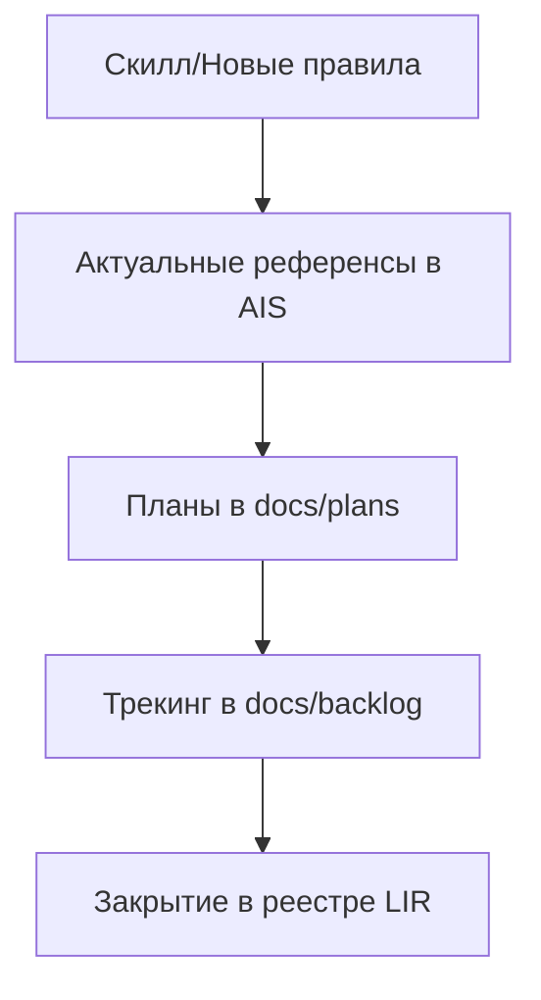

---
id: ais-9a5f3d
status: active
last_updated: "2026-03-04"
related_skills:
  - sk-cecbcc
  - sk-0e193a

---

# AIS: Документационная операционная модель (Docs Governance)

<!-- Спецификации (AIS) пишутся на русском языке и служат макро-документацией. Микро-правила вынесены в английские скиллы. Скрыто в preview. -->

## Концепция (High-Level Concept)

Документ описывает, как фиксировать и стабилизировать процесс управления документацией, чтобы ссылки на планы/чек-листы/бэклоги в скиллах оставались рабочими и соответствовали действующей архитектуре Target App.

## Инфраструктура и Потоки данных (Infrastructure & Data Flow)

## Локальные Политики (Module Policies)

- **Ссылки только на существующий статус-контрактный каркас:** Ссылки в скиллах на процедуры ведения договоров/операций должны вести в существующие каталоги и файлы `docs/backlog`, `docs/runbooks`, `docs/ais`.
- **Логичный канал фиксации вопросов:** Неопределенные вопросы и нефиксированные причины должны уходить в `docs/backlog/` как задачи или заметки с датой.
- **Без туманных относительных ссылок:** Не использовать отсутствующие базовые папки (`docs/drafts`, `drafts`) как целевые пути.

## Компоненты и Контракты (Components & Contracts)

- `docs/plans/` — источник живой задачи.
- `docs/backlog/` — зона отложенных/технических задач по договоренности.
- `docs/runbooks/` — операционные шаги.
- `docs/ais/` — устойчивые архитектурные правила и статусы.

## Лог перепривязки legacy-меток (Path Rewrite Log)

| Legacy path | Атомарный шаг | Риск | Статус | Новый путь / rationale |
|------------|--------------|------|--------|---------------------------|
| `docs/drafts/` | `LIR-009.A1` | Исторический источник для неопределенных вопросов | `DEFERRED` | `docs/backlog/` как зона уточнений |
| `drafts/` | `LIR-009.A2` | Нет общей active-папки `drafts` в текущей структуре | `REQUIRES_ARCH_CHANGE` | Пересохранить как backlog tasks после отдельной договоренности |
| `fixes-tracking.md` | `LIR-009.A3` | Неструктурированная ссылка на устаревший трекинг-файл | `MAPPED` | `docs/backlog/fixes-tracking.md` (обязательное создание при запуске процесса) |
| `handoff-note.md` / `session-report.md` | `LIR-009.A4` | Логи сессии не фиксируются в корневом `logs` | `REQUIRES_ARCH_CHANGE` | `docs/backlog/handoff-note.md`, `docs/backlog/session-report.md` по регламенту |
| `core/is/skills/` | `LIR-011.A1` | Ошибочная legacy-миграция пути папки `core/` | `MAPPED` | `core/skills/` |
| `app/is/skills/` | `LIR-011.A2` | Ошибочная legacy-миграция пути папки `app/` | `MAPPED` | `app/skills/` |
| `core/skills/everything.md` | `LIR-011.A3` | Указатель на несуществующий агрегирующий файл | `MAPPED` | `docs/plans/plan-skills-migration-registry.md` |
| `mojibake` tokens (`U+FFFD` replacement-char pattern) in AIS text | `LIR-021.A1` | Потеря читаемости и смысла спецификации из-за сбоя кодировки | `MAPPED` | UTF-8 rewrite + explicit language/encoding guard in `is/skills/process-language-policy.md` |
| Final validation checkpoint (`dead-links`, `docs-ids`, `skill-anchors`) | `LIR-021.A2` | Без закрывающего прогона возможен скрытый регресс после серии атомарных правок | `MAPPED` | All three gates passed in finalization pass |
| `ais-docs-governance.md` reopened with wrong decode on Windows | `LIR-022.A1` | Повторный риск неверного auto-detect кодировки в редакторе | `MAPPED` | File rewritten with explicit UTF-8 BOM |
| Missing automated encoding gate in preflight | `LIR-022.A2` | Повторное незаметное повреждение кириллицы до merge | `MAPPED` | `validate-docs-encoding.js` + preflight integration + npm script `docs:encoding:validate` |