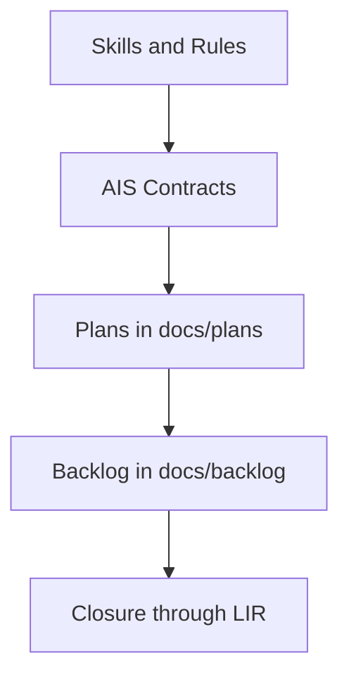

# AIS: Documentation Governance Model

## High-Level Concept

This specification defines how documentation stays stable during migrations:
id contracts are canonical, file paths are transport, and validation gates are mandatory.

## Infrastructure & Data Flow

## Module Policies

- Active markdown documents must use `id:` contracts resolved through `is/contracts/docs/id-registry.json`.
- Path links are temporary fallback only during migration.
- Encoding policy is strict: UTF-8 without BOM for markdown, and mojibake markers block preflight.

## Components & Contracts

- `id:plan-cd91e4` - global markdown id-contract rollout plan (complete).
- `id:plan-b9c2d4` - legacy link remediation registry (maintenance).
- `id:ais-9f4e2d` - anti-staleness architecture and validation gates.
- `is/contracts/docs/id-registry.json` - global SSOT: id -> path for all 104 project markdown files.

## Active Gates (preflight)

| Gate | Script | Scope |
|------|--------|-------|
| All markdown have `id` | `validate-global-md-ids.js` | 104 files |
| `id:` links resolve | `validate-id-contract-links.js` | all `.md` |
| No path links in active docs | `audit-path-centric-doc-links.js` | `docs/**` active |
| No path links in active skills | `audit-path-centric-skill-links.js` | `skills/**` active |
| UTF-8 no BOM, no mojibake | `validate-docs-encoding.js` | `docs/**` |

## Path Rewrite Log

| Legacy path | Atomic step | Risk | Status | New path / rationale |
|------------|--------------|------|--------|---------------------------|
| `docs/drafts/` | `LIR-009.A1` | Historical source for unresolved notes | `DEFERRED` | backlog-category docs in `docs/backlog/` |
| `drafts/` | `LIR-009.A2` | No active `drafts` directory in current structure | `REQUIRES_ARCH_CHANGE` | Convert into backlog tasks after separate architecture decision |
| `core/is/skills/` | `LIR-011.A1` | Wrong legacy migration path | `MAPPED` | `core/skills/` |
| `app/is/skills/` | `LIR-011.A2` | Wrong legacy migration path | `MAPPED` | `app/skills/` |
| `mojibake` tokens (`U+FFFD`) | `LIR-021.A1` | Loss of readability caused by broken decoding | `MAPPED` | UTF-8 rewrite + encoding gate |
| Missing encoding gate in preflight | `LIR-022.A2` | Silent encoding regression before merge | `MAPPED` | `docs:encoding:validate` in preflight |