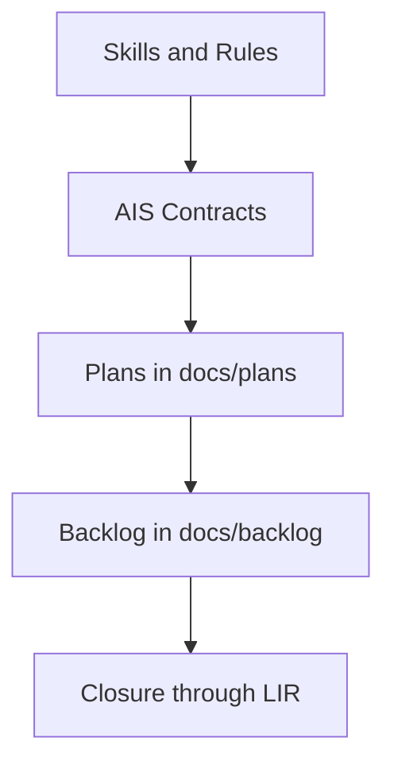

<!-- Важно: оставлять пустую строку перед "---" ! -->

# AIS: Documentation Governance Model

## High-Level Concept

This specification defines how documentation stays stable during migrations:
id contracts are canonical, file paths are local context only, and validation gates are mandatory.

## Infrastructure & Data Flow

## Module Policies

- Active markdown documents must use `id:` contracts resolved through `is/contracts/docs/id-registry.json`.
- Mixed reference mode is mandatory: first governance-grade mention may include `(path)`, repeated mentions in the same file should collapse to bare `id:`.
- For code-file references, use `#JS-... (basename.js)` when basename is unique in the registry; use a full repo-relative path only for ambiguous basenames.
- Encoding policy is strict: UTF-8 without BOM for markdown, and mojibake markers block preflight.

## Components & Contracts

- id-registry.json + validate-global-md-ids — id-contract rollout complete.
- LIR complete; #JS-cMCNbcJ1 (path-contracts.js) SSOT for skip patterns.
- id:ais-9f4e2d (docs/ais/ais-anti-staleness.md) — anti-staleness architecture and validation gates.
- is/contracts/docs/id-registry.json — global SSOT: id → path for all 104 project markdown files.

## Active Gates (preflight)

| ID | Gate | Script | Scope |
|------|------|--------|-------|
| #JS-Hx2xaHE8 | All markdown have `id` | validate-global-md-ids.js | 104 files |
| #JS-ht4FZQe4 | `id:` links resolve | validate-id-contract-links.js | all `.md` |
| #JS-3e2BNNyp | No raw path-only doc refs in active docs | audit-path-centric-doc-links.js | docs/** active |
| #JS-E4UcKE1H | No raw path-only doc refs in active skills | audit-path-centric-skill-links.js | skills/** active |
| #JS-BK2i557V | UTF-8 no BOM, no mojibake | validate-docs-encoding.js | docs/** |
