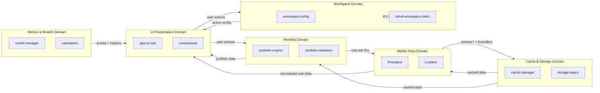

# AIS: Карта доменов и ограниченных контекстов (Domains & Bounded Contexts)

## Концепция (High-Level Concept)

Домен (Domain / Bounded Context) — область знаний с собственным языком и правилами. Приложение разбито на несколько доменов, каждый из которых инкапсулирует свою бизнес-логику и может общаться с другими доменами только через границы (Boundaries) и контракты.

Эта спецификация фиксирует карту доменов, их ответственности, внутренний язык и правила межсоставного взаимодействия.

## Инфраструктура и Потоки данных (Infrastructure & Data Flow)

### Домены приложения

| Домен | Ключевые модули | Ubiquitous Language | Ответственность |
|-------|----------------|---------------------|-----------------|
| **Market Data** | `dataProviderManager`, `CoinGeckoProvider`, `YandexCacheProvider`, `coingeckoStablecoinsLoader`, `coinsMetadataLoader`, `marketMetrics` | coin, market_cap, volume, price, stablecoin, provider, top-N | Получение, нормализация и кэширование рыночных данных из внешних API |
| **Portfolio** | `portfolioEngine`, `portfolioValidation`, `portfolioAdapters`, `portfoliosClient` | portfolio, holding, allocation, rebalance, coin-set, draft-set, ban-set | Управление портфелями пользователя, валидация, адаптация форматов |
| **Metrics & Models** | `modelManager`, `MedianAir260101Calculator`, `MedianAir260115Calculator` | model, metric, AIR, median, score, percentile | Расчёт метрик и моделей оценки монет |
| **Authentication** | `authState`, `authClient`, `authConfig` | user, token, session, OAuth, provider | Аутентификация и управление сессиями через Cloudflare Worker |
| **Workspace** | `workspaceConfig`, `cloudWorkspaceClient` | workspace, active-model, active-coin-set, cloud-sync | Персистентное хранение пользовательских настроек (локально + облако) |
| **Cache & Storage** | `cacheManager`, `storageLayers`, `cacheConfig`, `cacheMigrations`, `cacheCleanup` | cache, TTL, version, hot/warm/cold layer, migration | Многослойное кэширование данных с версионированием |
| **UI Presentation** | `appRoot`, `appHeader`, `appFooter`, компоненты `cmp*` | tab, modal, dropdown, theme, locale, column | Отображение данных, пользовательские взаимодействия |
| **Infrastructure Control** | `is/scripts/*`, `is/mcp/*`, preflight gates | gate, preflight, snapshot, deploy, causality, skill | Проверки, деплой, MCP-интеграция с AI-агентами |

### Межсоставное взаимодействие

### Правила межсоставного взаимодействия

1. **Домен Market Data** не знает о Portfolio — он поставляет нормализованные данные через `window.dataProviderManager`, а Portfolio сам решает, какие монеты запрашивать.
2. **Домен Portfolio** не знает о Models — метрики рассчитываются на уровне UI (`app-ui-root`) из результатов обоих доменов.
3. **Домен Cache** — utility-домен, используемый другими доменами через единый `cacheManager` API. Он не содержит бизнес-логики.
4. **Домен Workspace** — персональный контекст пользователя. Все остальные домены читают workspace-конфигурацию, но не пишут в неё напрямую (только через `workspaceConfig` API).

## Локальные Политики (Module Policies)

1. **Ubiquitous Language enforcement:** каждый домен оперирует своими терминами (см. таблицу). Смешение языков доменов в одном модуле — признак нарушения границы.
2. **No circular domain dependencies:** Market Data → Cache (OK); Cache → Market Data (запрещено). Направление зависимостей — от бизнес-доменов к utility-доменам.
3. **EventBus — единственный механизм loose coupling** между доменами, не имеющими прямой зависимости (`#for-layer-separation`).
4. **Cloudflare Worker** — граница между Browser и Server домены; все серверные операции (auth, portfolios, datasets) проходят через Worker API.

## Компоненты и Контракты (Components & Contracts)

- id:sk-c3d639 (domain-portfolio) — контракты портфельного домена
- id:sk-224210 (data-providers-architecture) — контракты провайдеров данных
- id:sk-22dc19 (metrics-air-model) — контракты метрик и моделей
- id:sk-bb7c8e (api-layer) — контракты API-слоя
- `core/contracts/market-contracts.js` — рыночные контракты данных
- `core/contracts/ui-contracts.js` — UI контракты

## Контракты и гейты

- #JS-Hx2xaHE8 (validate-docs-ids.js) — проверка id и связей
- #JS-QxwSQxtt (validate-skill-anchors.js) — проверка skill-anchor привязок

## Завершение / completeness

- `@causality #for-layer-separation` — домены общаются только через контрактные границы.
- Status: `incomplete` — pending формализация контрактов между доменами Market Data ↔ Portfolio (сейчас coupling через `window.coinsConfig`).
