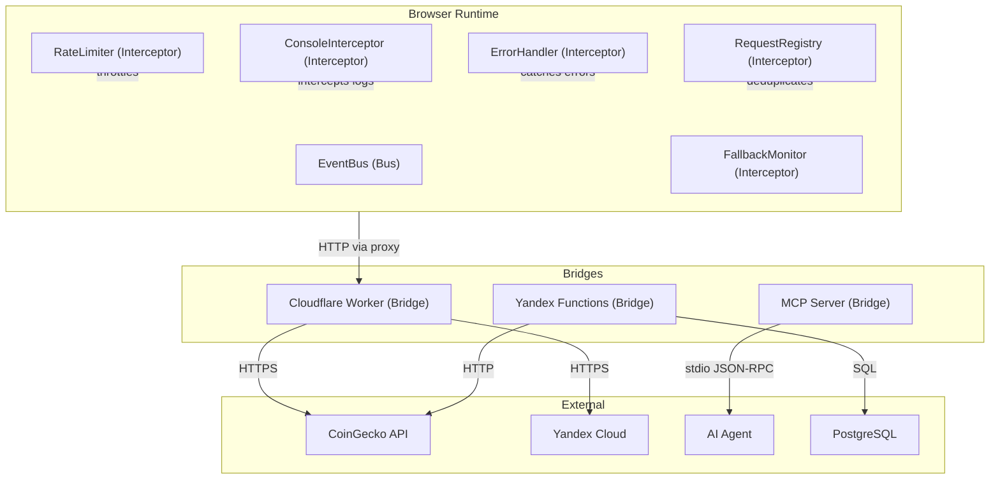

# AIS: Шина событий, транспорт, мосты и перехватчики (Event Bus, Transport, Bridge, Middleware)

## Концепция (High-Level Concept)

Коммуникация между компонентами приложения реализована через четыре механизма:
- **Шина (Bus)** — глобальный EventBus для loose coupling между несвязанными модулями.
- **Транспорт (Transport)** — канал передачи данных между средами (HTTP, file://, Workers).
- **Мост (Bridge)** — компонент, связывающий принципиально разные среды выполнения.
- **Перехватчик (Middleware / Interceptor)** — код в разрыве между вызовом и исполнением для сквозной функциональности.

## Инфраструктура и Потоки данных (Infrastructure & Data Flow)

### 1. Шина событий (Event Bus)

**Реализация:** `core/events/event-bus.js` → `window.eventBus`

**API:**
- `on(eventName, callback, once)` — подписка (возвращает subscription ID)
- `off(eventName, idOrCallback)` — отписка
- `emit(eventName, data)` — публикация

**Зарегистрированные события:**

| Событие | Источник | Потребители | Данные |
|---------|----------|-------------|--------|
| `auth-state-changed` | authState | favorites-manager, coin-set-save-modal-body, coin-set-load-modal-body | `{ isAuthenticated, user, timestamp }` |
| `cache-reset` | storage-reset-modal-body | app-ui-root | `void` |
| `coins-added-from-search` | app-ui-root (search) | app-ui-root (table) | `string[]` (coin IDs) |
| `draft-set-updated` | draft-coin-set | app-ui-root | draft set data |
| `ban-set-updated` | ban-coin-set | app-ui-root | ban set data |
| `favorites-updated` | favorites-manager | app-ui-root | favorites array |
| `coin-set-saved` | coin-set-save-modal-body | app-ui-root | saved set data |
| `portfolios-imported` | portfolios-import-modal-body / app-ui-root | app-ui-root | `{ count, mode, scope, explicitCloudSyncRequired }` |
| `portfolio-observed` | portfolio-observability | optional observers | typed portfolio observability envelope incl. conflict/fork counters |
| `metrics-recalculated` | app-ui-root | (internal) | metrics data |
| `db-coins-upserted` | postgres-sync-manager | app-ui-root | `{ count }` |
| `session-log` | console-interceptor | session-log-modal-body | log entry |
| `fallback:used` | fallback-monitor | (observers) | fallback info |
| `fallback:cleared` | fallback-monitor | (observers) | cleared info |
| `error-occurred` | error-handler | system-messages | error data |
| `loading-state-changed` | loading-state | (observers) | `{ key, value }` |

**Инварианты:**
- EventBus — единственный механизм loose coupling. Прямые callback-цепочки между несвязанными модулями запрещены.
- Подписки, созданные в `mounted()`, **обязаны** отписаться в `beforeUnmount()` (leak prevention).
- EventBus **не** гарантирует порядок доставки; подписчики не должны полагаться на sequence.
- Primary portfolio flow не обязан публиковать обязательное EventBus-событие на каждое сохранение. В active runtime orchestration `portfolio-form/view-modal-body` взаимодействуют с `app-ui-root` через props/callback contracts; подробности см. id:ais-6f2b1d.
- Optional diagnostics may publish additional typed observability events (`portfolio-observed`) without becoming the owner-channel of the business flow. This channel is where multi-device conflict resolution reports `conflicted`, `refreshed`, and `forked` counts.

### 2. Транспорт (Transport)

| Транспорт | Протокол | Использование | Ограничения |
|-----------|----------|---------------|-------------|
| **HTTP fetch** | HTTPS | API запросы к CoinGecko, Yandex Cloud, Cloudflare Workers | Rate limits, CORS |
| **file:// protocol** | Local filesystem | Локальная разработка (index.html открыт как файл) | Нет fetch/XHR (CORS), нет cookies |
| **Cloudflare Worker proxy** | HTTPS | CORS bypass при file:// — проксирование внешних API | Worker-level rate limits |
| **window.postMessage** | Browser API | OAuth callback (popup → parent window) | Origin validation required `#for-oauth-postmessage` |
| **MCP stdio** | JSON-RPC over stdin/stdout | AI agent ↔ MCP server | Synchronous, single-threaded `#for-mcp-stdio-protocol` |

**Инвариант file:// протокола:** при `file://` все HTTP-запросы к внешним API **обязаны** проходить через Cloudflare Worker proxy. Прямой `fetch()` к `api.coingecko.com` заблокирован CORS. Логика выбора пути — в `buildUrl()` каждого провайдера (`#for-file-protocol`).

### 3. Мосты (Bridge)

Мост связывает две принципиально разные среды выполнения:

| Мост | Среда A | Среда B | Механизм |
|------|---------|---------|----------|
| **MCP Server** | Файловая система + SQLite | AI-агент (Cursor/Codex) | stdio JSON-RPC, `is/mcp/index.js` |
| **Cloudflare Worker** | Browser (client-side) | CoinGecko / Yandex API (server-side) | HTTPS proxy, `is/cloudflare/edge-api/` |
| **Yandex Functions** | Cron trigger (облако) | PostgreSQL + CoinGecko API | HTTP invocation, `is/yandex/functions/` |
| **OAuth popup** | Parent window | Auth provider popup | `window.postMessage` + origin check |

**Инварианты мостов:**
- Мост **не** содержит бизнес-логики — только transport adaptation и security validation.
- Каждый мост имеет fallback-стратегию при недоступности remote-стороны (`#for-integration-fallbacks`).
- MCP мост использует WAL mode для concurrent reads (`#for-mcp-wal-concurrency`).

### 4. Перехватчики (Middleware / Interceptor)

| Перехватчик | Файл | Точка вставки | Назначение |
|-------------|------|---------------|-----------|
| **Console Interceptor** | `core/utils/console-interceptor.js` | `console.*` methods | Перехват логов → sessionLogStore |
| **Rate Limiter** | `core/api/rate-limiter.js` | Перед каждым API-запросом | Адаптивный throttling (300ms–10s) |
| **Error Handler** | `core/errors/error-handler.js` | Глобальный обработчик | Нормализация и маршрутизация ошибок |
| **CORS Proxy** | `is/cloudflare/edge-api/src/api-proxy.js` | Cloudflare Worker | CORS bypass + кэширование |
| **Fallback Monitor** | `core/observability/fallback-monitor.js` | Provider fallback events | Отслеживание переключений на fallback |
| **Portfolio Observability** | `core/observability/portfolio-observability.js` | Portfolio runtime save/import/sync/hydrate | Typed optional envelope for support/debug |
| **Request Registry** | `core/api/request-registry.js` | Перед повторным API-запросом | Дедупликация и 24h-блокировка по журналу |

**Инварианты:**
- Перехватчик **не** меняет бизнес-семантику данных — только обогащает (логи, метрики) или ограничивает (rate limit, dedup).
- Console Interceptor сохраняет оригинальные методы для восстановления (`disable()`).
- Rate Limiter использует `increaseTimeout()` при 429 и `decreaseTimeout()` при успехе — адаптивная стратегия.

### Коммуникационная архитектура

## Локальные Политики (Module Policies)

1. **EventBus event naming:** события именуются в kebab-case, отражающем действие (`cache-reset`, `auth-state-changed`). Namespace-коллизии предотвращаются уникальностью имён.
2. **No direct cross-module callbacks:** модули из разных доменов общаются только через EventBus или `window.*` globals. Прямая передача callback-функций запрещена.
3. **Transport fallback chain:** `file://` → Worker proxy → direct (если http://). Порядок жёстко зафиксирован в `buildUrl()`.
4. **Bridge security:** OAuth postMessage валидирует origin. Worker proxy валидирует allowed API paths.
5. **Optional observability envelope:** если событие создаётся для support/debug, а не для business orchestration, оно должно публиковаться в typed envelope вместо ad-hoc payload.

## Компоненты и Контракты (Components & Contracts)

- `core/events/event-bus.js` — реализация шины
- `core/api/rate-limiter.js` — адаптивный rate limiter
- `core/utils/console-interceptor.js` — перехватчик консоли
- `core/errors/error-handler.js` — глобальный обработчик ошибок
- `core/api/request-registry.js` — дедупликация запросов
- `core/observability/portfolio-observability.js` — typed optional observability envelope for portfolio runtime
- `is/cloudflare/edge-api/src/api-proxy.js` — CORS proxy bridge
- `is/mcp/index.js` — MCP bridge entry point
- id:sk-a17d41 (state-events) — контракт событийной модели
- id:sk-7cf3f7 (file-protocol-cors-guard) — гарантии file:// протокола

## Контракты и гейты

- #JS-Hx2xaHE8 (validate-docs-ids.js) — валидация id
- #JS-69pjw66d (validate-causality.js) — проверка causality-хешей коммуникационных модулей

## Завершение / completeness

- `@causality #for-file-protocol` — file:// transport через proxy.
- `@causality #for-oauth-postmessage` — origin validation для OAuth.
- `@causality #for-mcp-stdio-protocol` — stdio-транспорт для MCP.
- `@causality #for-rate-limiting` — адаптивный interceptor.
- Status: `incomplete` — portfolio observability envelope уже typed, но широкий EventBus всё ещё содержит много untyped payloads вне этого канала.
