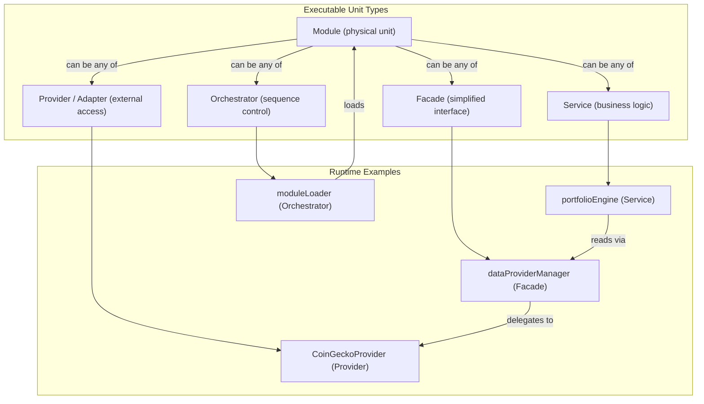

# AIS: Исполняемые единицы — модуль, сервис, провайдер, фасад, оркестратор (Executable Units)

## Концепция (High-Level Concept)

В No-Build Vue архитектуре проекта код организован в **исполняемые единицы** пяти типов, каждый из которых несёт строго определённую роль. Смешение ролей (например, сервис, притворяющийся провайдером) ведёт к архитектурной деградации. Эта спецификация фиксирует формальные определения, инварианты и паттерны для каждого типа.

## Инфраструктура и Потоки данных (Infrastructure & Data Flow)

### 1. Модуль (Module)

Физическая единица упаковки кода — конкретный `.js`-файл, инкапсулирующий логику в IIFE и регистрирующий результат на `window.*`.

**Инварианты:**
- Один файл = один `window.*` глобал (с редкими исключениями для связанных пар, например `RateLimiter` + `rateLimiter`).
- Загрузка управляется #JS-os34Gxk3 (modules-config.js): каждый модуль декларирует `id`, `src`, `deps`, `global`, `category`.
- Порядок загрузки определяется топологической сортировкой в #JS-xj43kftu (module-loader.js).
- Модуль может иметь `condition` (feature flag) для условной загрузки.

**Категории модулей** (порядок загрузки):
1. `utilities` — leaf-модули без зависимостей (`hashGenerator`, `autoMarkup`, `pluralize`)
2. `core` — бизнес-логика, конфигурация, кэш, провайдеры
3. `templates` — HTML-шаблоны компонентов
4. `libraries` — внешние библиотеки (Vue CDN)
5. `components` — Vue-компоненты
6. `app` — корневой `app-ui-root`

### 2. Сервис (Service)

Функциональная единица бизнес-логики, оркеструющая другие модули для решения конкретной бизнес-задачи.

**Примеры:**
- `portfolioEngine` (`core/domain/portfolio-engine.js`) — расчёт, валидация и управление портфелями
- `marketMetrics` (`core/api/market-metrics.js`) — агрегация рыночных индикаторов (VIX, FGI, BTC Dom, OI, FR, LSR)

**Инварианты:**
- Сервис содержит бизнес-логику (расчёты, правила, трансформации).
- Сервис **не** обращается к внешним API напрямую — только через провайдеры.
- Сервис может использовать кэш (`cacheManager`) и EventBus для side effects.

### 3. Провайдер / Адаптер (Provider / Adapter)

Модуль, инкапсулирующий взаимодействие с внешним миром (API, БД) и адаптирующий чужие форматы к внутренним контрактам.

**Примеры:**
- `CoinGeckoProvider` (`core/api/data-providers/coingecko-provider.js`) — адаптер CoinGecko API
- `YandexCacheProvider` (`core/api/data-providers/yandex-cache-provider.js`) — адаптер Yandex Cloud кэша
- `BaseDataProvider` (`core/api/data-providers/base-provider.js`) — абстрактный базовый провайдер (контракт интерфейса)
- `authClient` (`core/api/cloudflare/auth-client.js`) — адаптер Cloudflare auth API
- `portfoliosClient`, `coinSetsClient`, `datasetsClient`, `cloudWorkspaceClient` — адаптеры Cloudflare KV/D1

**Инварианты:**
- Провайдер **не** содержит бизнес-логику — только transport + format adaptation.
- Все провайдеры одного семейства наследуют один базовый контракт (например, `BaseDataProvider` задаёт `getTopCoins(limit, sortBy)`).
- Ошибки сети обрабатываются внутри провайдера: caller получает нормализованный результат или throws с типизированной ошибкой из `errorTypes`.
- `@causality #for-data-provider-interface` — единый интерфейс для всех data-провайдеров.

### 4. Фасад (Facade)

Упрощённый интерфейс к сложной подсистеме, скрывающий детали выбора и координации.

**Примеры:**
- `dataProviderManager` (`core/api/data-provider-manager.js`) — выбирает между CoinGecko и Yandex, управляет fallback-логикой
- `cacheManager` (`core/cache/cache-manager.js`) — единый API поверх многослойного кэша (hot/warm/cold)
- `aiProviderManager` (`core/api/ai-provider-manager.js`) — управляет AI-провайдерами
- `modelManager` (`mm/model-manager.js`) — выбирает и запускает нужный калькулятор модели

**Инварианты:**
- Фасад **не** добавляет бизнес-логику — только маршрутизация + delegation.
- Фасад владеет стратегией выбора (fallback priority, feature flags), но не алгоритмом обработки.
- `@causality #for-dual-channel-fallback` — при недоступности primary-провайдера фасад прозрачно переключается на secondary.

### 5. Оркестратор (Orchestrator)

Сервис, управляющий последовательностью вызова других единиц. Отличие от фасада: оркестратор задаёт **порядок** и **условия** выполнения шагов.

**Примеры:**
- `moduleLoader` (`core/module-loader.js`) — управляет порядком загрузки всех модулей через топологическую сортировку
- `app-ui-root` mounted-хук — оркеструет инициализацию приложения: auth → workspace → coins → metrics → UI
- `preflight.js` (`is/scripts/preflight.js`) — оркеструет последовательный прогон всех гейтов

**Инварианты:**
- Оркестратор управляет **централизованно** (в отличие от хореографа, работающего через события без центра).
- Оркестратор знает о зависимостях между шагами и может abort при failure критического шага.
- `@causality #for-composition-root` — `app-ui-root` является единственной точкой сборки runtime-графа.

### Классификационная диаграмма

## Локальные Политики (Module Policies)

1. **Role purity:** каждый модуль выполняет ровно одну роль из пяти. Модуль, совмещающий Provider и Service логику, подлежит декомпозиции.
2. **Provider contract adherence:** все data-провайдеры реализуют интерфейс `BaseDataProvider` (`getTopCoins`, `getMarkets`). Добавление нового провайдера требует наследования.
3. **Facade delegation only:** фасад не содержит `if/else` бизнес-логики — только стратегию выбора делегата.
4. **Module registration:** каждый модуль обязан зарегистрировать себя в #JS-os34Gxk3 с корректными `deps` и `global`.

## Компоненты и Контракты (Components & Contracts)

- #JS-os34Gxk3 — SSOT реестр модулей
- #JS-xj43kftu — загрузчик с topological sort
- id:sk-224210 (data-providers-architecture) — контракт провайдеров
- id:sk-bb7c8e (api-layer) — контракт API-слоя
- id:sk-3c832d (cache-layer) — контракт кэш-фасада
- id:sk-a17d41 (state-events) — контракт событийной модели

## Контракты и гейты

- #JS-Hx2xaHE8 (validate-docs-ids.js) — валидация id и связей
- #JS-QxwSQxtt (validate-skill-anchors.js) — валидация skill-anchor привязок

## Завершение / completeness

- `@causality #for-layer-separation` — типы единиц привязаны к слоям.
- `@causality #for-data-provider-interface` — единый интерфейс провайдеров.
- `@causality #for-composition-root` — оркестрация через единую точку сборки.
- Status: `incomplete` — pending формализация BaseDataProvider как Zod-контракта (сейчас duck-typed).
