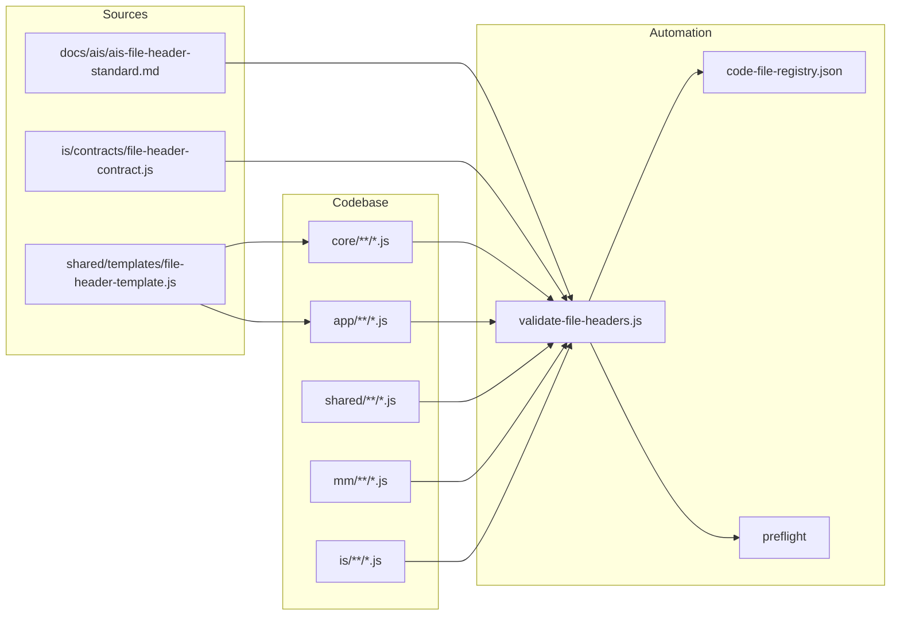

# AIS: Стандарт шапки комментариев кодовых файлов (File Header Standard)

<!-- Спецификации (AIS) пишутся на русском языке и служат макро-документацией. Микро-правила вынесены в английские скиллы. Скрыто в preview. -->

## Идентификация и жизненный цикл

- `id: ais-f7e2a1` — устойчивый идентификатор для ссылок из скиллов, планов и кода.
- `status: draft` → `incomplete` после внедрения гейта и реестра код-файлов; `complete` после покрытия всех целевых файлов.
- Связанные артефакты: `process-code-anchors`, `process-code-documentation`, `process-language-policy`, `path-contracts`; AIS документации и архитектуры.

## Концепция (High-Level Concept)

Единый структурированный шаблон шапки комментариев в каждом кодовом файле даёт ИИ-агентам и разработчикам: **понимание** (что за файл и зачем), **осознанность** (какие скиллы и казуальности к нему относятся), **связанность** (ссылки на SSOT, контракты, гейты), **семантичность** (однозначные теги и порядок полей), **адаптивность** (поиск файла по хэшу при смене пути), **гибкость** (пополняемый набор опциональных слотов), **скорость** (меньше перечитывания, копирование шаблона из SSOT).

Ключевые принципы:

- **Файловый идентификатор** — каждый файл помечается хэшем вида `#<EXT>-<short_hash>`, где EXT — тип (JS, TS, CSS, HTML и т.д.), hash — детерминированный короткий хэш от канонического относительного пути. Документация и скиллы ссылаются на файл по этому id; при перемещении файла обновляется реестр код-файлов, поиск по id остаётся валидным.
- **Единый порядок слотов** — обязательные и опциональные поля в фиксированной последовательности: file id → описание → @description → @skill → @skill-anchor → @causality → @ssot → @gate → @contract → @see → свободные блоки (PURPOSE, PRINCIPLES, USAGE, REFERENCES).
- **Пополняемость** — новые теги (например @protocol, @spec) вносятся в контракт и скилл; гейт проверяет только обязательные поля и разрешённый список тегов.
- **Язык** — все комментарии в коде только на английском (SSOT: process-language-policy); гейт `validate-code-comments-english` уже обеспечивает это.

## Инфраструктура и Потоки данных (Infrastructure & Data Flow)

- Агент или разработчик при создании/правке файла берёт шаблон из `shared/templates/file-header-template.js` и заполняет слоты.
- Скрипт `assign-file-ids.js` (или аналог) обходит целевые директории, вычисляет хэш от пути, подставляет или проверяет `#<EXT>-<hash>` в шапке.
- Гейт `validate-file-headers.js` проверяет наличие file id и @description, опционально — соответствие тегов контракту и актуальность реестра.
- Реестр `is/contracts/docs/code-file-registry.json` хранит соответствие `#JS-xxxx` → относительный путь; при перемещении файла реестр обновляется (скрипт или правило в плане).

## Локальные Политики (Module Policies)

- Все новые и затрагиваемые при рефакторинге кодовые файлы в `core`, `app`, `shared`, `mm`, `is` (кроме исключений из контракта) должны иметь шапку по данному стандарту.
- Ссылки на кодовый файл в скиллах, AIS и планах — по file id (`#JS-xxxx`), а не по пути; путь — в реестре.
- Шапка должна быть в начале файла (первые строки); для блоковых комментариев — один блок `/** ... */`, для построчных — последовательность `//` с тем же порядком слотов.
- Язык шапки — только английский (проверяется существующим гейтом `validate-code-comments-english`).
- **Единый вид (no visual clutter):** без декоративных баннеров (`====...====`), без дублирования: если есть `@skill`, строка `Skill: id:sk-xxx` не повторяется. Списки в формате `PRINCIPLES:` / `USAGE:` / `REFERENCES:` с маркерами `-` сохраняются; один короткий блок PURPOSE при необходимости, без повтора смысла из @description.

## Нюансы по типам файлов (File-type nuances)

- **Скрипты (is/scripts/**.js)**: допускается shebang на первой строке (`#!/usr/bin/env node`); шапка идёт сразу после. Первая строка блока комментария — file id (` * #JS-xxx`), затем @description и остальные слоты. Семантика из старой шапки (SSOT, gate, plan) сохраняется в сжатом виде в тегах @ssot или в свободном тексте.
- **Контракты (is/contracts/**.js)**: один блок `/** ... */` в начале; file id на первой строке содержимого; @skill может быть именем (process-skill-governance) или id (например id:sk-f7e2a1). Блоки вида AGENT OBLIGATION не удаляются — остаются под тегами.
- **Шаблоны (shared/templates/*.js)**: тот же формат блока; file id шаблона — собственный id файла (из реестра). Ниже блока допускается пояснительный комментарий `// FILE HEADER TEMPLATE — ...` без дублирования file id.
- **Паттерн file id в гейте**: в контракте FILE_ID_PATTERN ищет вхождение `#<EXT>-<hash>` в любом месте текста шапки (не только в начале строки), чтобы корректно учитывать формат ` * #JS-xxx` внутри блока.

## Компоненты и Контракты (Components & Contracts)

| Артефакт | Назначение |
|----------|------------|
| `shared/templates/file-header-template.js` | SSOT шаблона шапки; копировать при создании/обновлении файла. |
| `docs/ais/ais-file-header-standard.md` | Данная спецификация (макро-правила, политики, диаграмма). |
| `docs/plans/file-header-rollout.md` | План внедрения: фазы, чек-листы, порядок обхода. |
| `is/contracts/file-header-contract.js` | Разрешённые теги, обязательные поля, формат file id. |
| `is/skills/process-file-header-standard.md` | Скилл для агентов: правила заполнения, примеры, связь с causality. |
| `is/scripts/architecture/validate-file-headers.js` | Гейт: проверка шапок и при необходимости реестра. |
| `is/scripts/architecture/assign-file-ids.js` | Назначение/обновление file id в шапках по путям. |
| `is/contracts/docs/code-file-registry.json` | Реестр: file id → относительный путь (генерируется/обновляется скриптами). |

## Контракты и гейты

- **Контракт** `file-header-contract.js`: перечень разрешённых тегов (@description, @skill, @skill-anchor, @causality, @ssot, @gate, @contract, @see), формат file id (`#<EXT>-<hash>`, hash — Base58 или hex, длина по контракту), обязательность полей (file id, @description).
- **Гейт** `validate-file-headers.js`: для каждого целевого .js/.ts (и при необходимости .css) проверка: первая строка комментария содержит паттерн file id; присутствует @description; при включённой строгой проверке — все теги из разрешённого списка. Опционально: сверка с code-file-registry (все file id из реестра присутствуют в файлах, пути совпадают).
- **Preflight**: после гейта «code comments English» выполняется `validate-file-headers.js`; при падении preflight не проходит.
- Существующие гейты: `validate-code-comments-english`, `validate-skills`, `validate-causality` — остаются в силе; шапка дополняет их, не подменяет.

## Лог перепривязки путей (Path Rewrite Log)

На этапе внедрения реестра код-файлов прямые пути в документации к коду могут постепенно заменяться на file id. Таблица ведётся при необходимости в плане внедрения или в отдельном audit-файле.

| Legacy / Текущее | Риск | Новое / Примечание |
|------------------|------|--------------------|
| Ссылки на код по пути в скиллах | STALE_PATH | Заменить на #JS-xxx с записью в code-file-registry |

## Завершение / completeness

- Добавить в causality-registry хэш `#for-file-header-standard` (связь с данной AIS и гейтом).
- После внедрения гейта и реестра перевести status в `incomplete`, после массового прохода по файлам — в `complete` по согласованному чек-листу.
