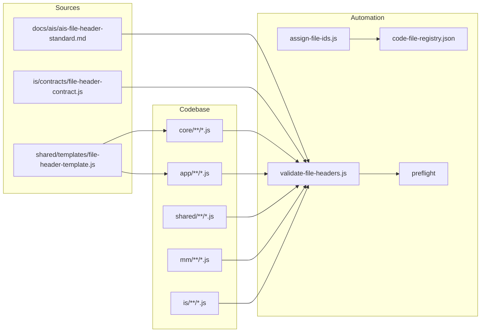

<!-- Важно: оставлять пустую строку перед "---" ! -->

# AIS: Стандарт шапки комментариев кодовых файлов (File Header Standard)

<!-- Спецификации (AIS) пишутся на русском языке и служат макро-документацией. Микро-правила вынесены в английские скиллы. Скрыто в preview. -->

## Идентификация и жизненный цикл

- `id: ais-f7e2a1` — устойчивый идентификатор для ссылок из скиллов, планов и кода.
- `status: draft` → `incomplete` после внедрения гейта и реестра код-файлов; `complete` после покрытия всех целевых файлов.
- Связанные артефакты: `process-code-anchors`, `process-code-documentation`, `process-language-policy`, `path-contracts`; AIS документации и архитектуры.

## Концепция (High-Level Concept)

Единый структурированный шаблон шапки комментариев в каждом кодовом файле даёт ИИ-агентам и разработчикам: **понимание** (что за файл и зачем), **осознанность** (какие скиллы и казуальности к нему относятся), **связанность** (ссылки на SSOT, контракты, гейты), **семантичность** (однозначные теги и порядок полей), **адаптивность** (поиск файла по хэшу при смене пути), **гибкость** (пополняемый набор опциональных слотов), **скорость** (меньше перечитывания, копирование шаблона из SSOT).

Ключевые принципы:

- **Файловый идентификатор** — каждый файл помечается хэшем вида `#<EXT>-<short_hash>`, где EXT — тип (JS, TS, CSS, HTML и т.д.), hash — детерминированный короткий хэш от канонического относительного пути (алгоритм: djb2 от пути с нормализованными слэшами, затем Base58, длина 8 символов). Документация и скиллы ссылаются на файл по этому id. При переименовании или перемещении файла путь меняется — id пересчитывается; после запуска `assign-file-ids.js` реестр и шапку в файле нужно обновить.
- **Единый порядок слотов** — обязательные и опциональные поля в фиксированной последовательности: file id → описание → @description → @skill → @skill-anchor → @causality → @ssot → @gate → @contract → @see → свободные блоки (см. список секций ниже).
- **Пополняемость** — новые теги (например @protocol, @spec) вносятся в контракт и скилл; гейт проверяет только обязательные поля и разрешённый список тегов.
- **Язык** — все комментарии в коде только на английском (SSOT: process-language-policy); гейт `validate-code-comments-english` уже обеспечивает это.

## Инфраструктура и Потоки данных (Infrastructure & Data Flow)

- Агент или разработчик при создании/правке файла берёт шаблон из `shared/templates/file-header-template.js` и заполняет слоты; file id берётся из реестра (после запуска `assign-file-ids.js`) или подставляется вручную по тому же алгоритму.
- Скрипт `assign-file-ids.js` обходит целевые директории (`SCAN_DIRS`: core, app, shared, mm, is), для каждого .js/.ts вычисляет file id от канонического относительного пути (djb2 + Base58, 8 символов) и **только обновляет реестр** `code-file-registry.json`; содержимое файлов скрипт не меняет. Режим `--dry-run` — вывод без записи. Вставка `#<EXT>-<hash>` в шапки — вручную или будущим режимом (если появится).
- Гейт `validate-file-headers.js` выполняет **полную проверку** по контракту: (1) при наличии file id в шапке обязан быть @description; (2) file id в шапке должен совпадать с ожидаемым для пути файла (getExpectedFileId). Режим `--fix`: при несовпадении id гейт подставляет в файле правильный id и сохраняет файл. Запуск: `npm run file-headers:check` или в составе preflight; `npm run file-headers:fix` — обновить реестр и автоматически исправить id в шапках.
- Реестр `is/contracts/docs/code-file-registry.json` хранит соответствие `#JS-xxxx` → относительный путь; при добавлении/переименовании/перемещении файла запустить `npm run file-headers:fix` (или assign-file-ids + validate --fix).

## Локальные Политики (Module Policies)

- Все новые и затрагиваемые при рефакторинге кодовые файлы в `core`, `app`, `shared`, `mm`, `is` (кроме исключений из контракта) должны иметь шапку по данному стандарту.
- Ссылки на кодовый файл в скиллах, AIS и планах — по file id (`#JS-xxxx`), а не по пути; путь — в реестре.
- Шапка должна быть в начале файла (первые строки); для блоковых комментариев — один блок `/** ... */`, для построчных — последовательность `//` с тем же порядком слотов.
- Язык шапки — только английский (проверяется существующим гейтом `validate-code-comments-english`).
- **Единый вид (no visual clutter):** без декоративных баннеров (`====...====`), без дублирования: если есть `@skill`, отдельная строка «Skill: …» не дублируется. Списки в формате `PRINCIPLES:` / `USAGE:` / `REFERENCES:` с маркерами `-` сохраняются; один короткий блок PURPOSE при необходимости, без повтора смысла из @description.
- **Актуальность шапки:** при проверке шапка должна приводиться в соответствие с реальным кодом. Ложная или устаревшая информация — либо исправляется, либо удаляется. Гейт автоматически правит только несовпадение file id с путём (`--fix`); смысловое соответствие @description и секций коду обеспечивается процессом (запуск проверки после изменений, правка агентом/разработчиком).

**Расширяемый список секций** (использовать по необходимости; полный перечень — в `shared/templates/file-header-template.js`): PURPOSE, PRINCIPLES, USAGE, REFERENCES, PROBLEM, SOLUTION, HOW, FEATURES, STRUCTURE, TTL, STRATEGIES, LAYERS, CACHE, EXAMPLE, HOW TO ADD, CHANGE HISTORY, ENDPOINTS, ROUTES, FIELDS, SECURITY и др. Секции не догма — можно добавлять новые; оформление: заголовок секции, затем пункты с маркером `-`.

## Процедуры (Processes)

| Ситуация | Действия |
|----------|----------|
| **Новый кодовый файл** | 1) Создать файл в одной из SCAN_DIRS. 2) Запустить `npm run file-headers:assign` (или `node is/scripts/architecture/assign-file-ids.js`) — реестр обновится. 3) Открыть `code-file-registry.json`, найти путь нового файла и соответствующий file id. 4) Вставить шапку из шаблона в начало файла, подставить file id и @description (и при необходимости остальные слоты). 5) Запустить `npm run file-headers:check` или preflight. |
| **Переименование или перемещение файла** | 1) Переименовать/переместить файл. 2) Запустить `assign-file-ids.js` — реестр пересчитается (у старого пути пропадёт id, у нового появится новый id). 3) В самом файле заменить старый file id в шапке на новый (из обновлённого реестра по новому пути). 4) В документации/скиллах заменить ссылки на старый file id на новый (или оставить старый, если ссылка по смыслу на «удалённый» артефакт). |
| **Проверка соответствия стандарту** | `npm run file-headers:check` — полная проверка (id совпадает с путём, есть @description). `npm run file-headers:fix` — обновить реестр и автоматически исправить неверный file id в шапках. Полная проверка инфраструктуры: `npm run preflight`. |
| **Сразу после изменений в коде** | Шапка должна перепроверяться полностью после любых правок в файле. Запускать `npm run file-headers:fix` (или как минимум `file-headers:check`) перед коммитом; в CI — preflight. Ложная или устаревшая информация в шапке подлежит исправлению или удалению (агент/разработчик). |

## Нюансы по типам файлов (File-type nuances)

- **Скрипты (is/scripts/**.js)**: допускается shebang на первой строке (`#!/usr/bin/env node`); шапка идёт сразу после. Первая строка блока комментария — file id (` * #JS-xxx`), затем @description и остальные слоты. Семантика из старой шапки (SSOT, gate, plan) сохраняется в сжатом виде в тегах @ssot или в свободном тексте.
- **Контракты (is/contracts/**.js)**: один блок `/** ... */` в начале; file id на первой строке содержимого; @skill может быть именем (process-skill-governance) или id (например id:sk-f7e2a1). Блоки вида AGENT OBLIGATION не удаляются — остаются под тегами.
- **Шаблоны (shared/templates/*.js)**: тот же формат блока; file id шаблона — собственный id файла (из реестра). Ниже блока допускается пояснительный комментарий `// FILE HEADER TEMPLATE — ...` без дублирования file id.
- **Паттерн file id в гейте**: в контракте FILE_ID_PATTERN ищет вхождение `#<EXT>-<hash>` в любом месте текста шапки (не только в начале строки), чтобы корректно учитывать формат ` * #JS-xxx` внутри блока.

## Компоненты и Контракты (Components & Contracts)

| Артефакт | Назначение |
|----------|------------|
| `shared/templates/file-header-template.js` | SSOT шаблона шапки; копировать при создании/обновлении файла. |
| `docs/ais/ais-file-header-standard.md` | Данная спецификация (макро-правила, политики, диаграмма). |
| `docs/plans/file-header-rollout.md` | План внедрения: фазы, чек-листы, порядок обхода. |
| `is/contracts/file-header-contract.js` | Разрешённые теги, обязательные поля, формат file id. |
| `is/skills/process-file-header-standard.md` | Скилл для агентов: правила заполнения, примеры, связь с causality. |
| `is/scripts/architecture/validate-file-headers.js` | Гейт полной проверки: file id должен совпадать с путём (getExpectedFileId), при наличии id — @description обязателен. Режим `--fix`: запись в файл правильного id при несовпадении. Вызов: preflight, `npm run file-headers:check`, `npm run file-headers:fix`. |
| `is/scripts/architecture/assign-file-ids.js` | Построение и запись реестра: обход SCAN_DIRS, вычисление file id (djb2+Base58 от пути); файлы не изменяет. Вызов: `npm run file-headers:assign`. |
| `is/contracts/docs/code-file-registry.json` | Реестр: file id → относительный путь (генерируется/обновляется скриптами). |

## Контракт полной проверки и правки

- **Контракт** `file-header-contract.js`: (1) перечень разрешённых тегов и формат file id; (2) обязательность @description при наличии file id; (3) **полная проверка**: file id в шапке должен совпадать с ожидаемым для пути файла (`getExpectedFileId(relPath)` — тот же алгоритм, что в assign-file-ids). Функции: `validateHeaderFull(headerText, relPath)`, `getFileIdFromHeader(headerText)`, `getExpectedFileId(relPath)`.
- **Гейт** `validate-file-headers.js`: для каждого .js/.ts из SCAN_DIRS — извлечь шапку; при наличии file id проверить @description и совпадение id с путём. Режим `--fix`: при несовпадении id подставить в файле правильный id и сохранить. Не исправляет автоматически отсутствие @description или смысловое устаревание — только id.
- **Preflight**: после гейта «code comments English» выполняется `validate-file-headers.js` (без --fix); при падении preflight не проходит.
- **Политика:** шапка перепроверяется полностью сразу после внесения изменений в код (перед коммитом / в CI). Ложная информация в шапке исправляется или удаляется; автоматическая правка по контракту — только file id.

## Лог перепривязки путей (Path Rewrite Log)

На этапе внедрения реестра код-файлов прямые пути в документации к коду могут постепенно заменяться на file id. Таблица ведётся при необходимости в плане внедрения или в отдельном audit-файле.

| Legacy / Текущее | Риск | Новое / Примечание |
|------------------|------|--------------------|
| Ссылки на код по пути в скиллах | STALE_PATH | Заменить на #JS-xxx с записью в code-file-registry |

## Завершение / completeness

- В causality-registry присутствует хэш `#for-file-header-standard` (связь с данной AIS и гейтом).
- **Status:** после внедрения гейта и реестра — `incomplete`; после массового прохода по целевым файлам (core, app, shared, mm, is) и успешного preflight — перевести в `complete`. Текущее состояние отражено в плане id:plan-f7e2a1.
- **npm-скрипты:** `file-headers:check` — полная проверка (id + @description); `file-headers:fix` — обновить реестр и исправить неверный file id в шапках; `file-headers:audit` — то же для разовой ревизии; `file-headers:assign` — только обновление реестра.
