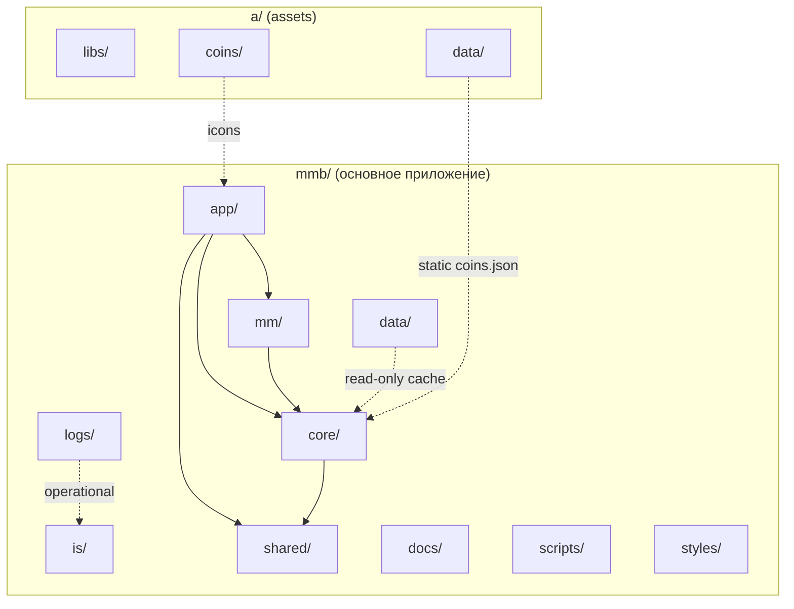

# AIS: Спецификация размещения папок (Folder Placement Specification)

> **Context**: Единый SSOT для логики расположения всех папок проекта. Агенты и разработчики обязаны сверяться с этой спецификацией при добавлении, перемещении или документировании директорий.

## Концепция (High-Level Concept)

Расположение папок подчинено трём принципам:

1. **Слои (Layers)** — вертикальная иерархия (app → core → shared; mm; is). См. id:ais-a1b2c3 (ais-layers-topology).
2. **Разделение по ответственности** — каждая папка имеет чёткую зону ответственности; смешивание runtime и статики запрещено.
3. **Workspace-контекст** — mmb и a — два репозитория в одном workspace; статика и либы в a/, приложение в mmb/.

Данная спецификация дополняет id:sk-c62fb6 (arch-layout-governance) и id:ais-a1b2c3 (ais-layers-topology), фокусируясь на **полной карте папок** и **правилах размещения**.

## Инфраструктура и Потоки данных (Infrastructure & Data Flow)

## Корневые границы (Root Bounds)

### Основные слои (mmb)

| Папка | Слой | Ответственность | Зависимости |
|-------|------|-----------------|-------------|
| `app/` | Presentation | Vue-компоненты, шаблоны, UI-логика | → core/, shared/, mm/ |
| `core/` | Business Logic | Конфиг, кэш, API, домены, события, состояние | → shared/ (utils) |
| `is/` | Infrastructure | Cloudflare, Yandex, MCP, контракты, скрипты, deployments | → внешние системы |
| `mm/` | Metrics Models | Калькуляторы моделей (Median/AIR), model-manager | → core/ (config only) |
| `shared/` | Shared | Переиспользуемые компоненты и утилиты без бизнес-логики | leaf |
| `docs/` | Documentation | AIS, планы, backlog, runbooks, cheatsheets | — |
| `data/` | Runtime Data | Кэш, SQLite, эфемерные данные (gitignored) | — |
| `styles/` | Styles | CSS (wrappers, layout, custom) | — |
| `scripts/` | Project Scripts | PowerShell, утилиты уровня проекта (backups, encoding) | — |

### Дополнительные корневые папки (mmb)

| Папка | Назначение | Git |
|-------|------------|-----|
| `logs/` | Все логи приложения: мониторинг, MCP debug, operational | gitignored |

**Правило:** Все логи пишутся в `mmb/logs/`. Единая точка сбора. См. id:sk-92384e (arch-monitoring).

> **Migration note:** paths.js и CI могут ещё ссылаться на `is/logs/`; целевое состояние — только `logs/` (корень mmb).

### Workspace: репозиторий a/

| Папка | Назначение |
|-------|------------|
| `a/libs/` | Vendor-библиотеки (Vue, Chart.js и т.д.), структура `libs/<name>/<version>/` |
| `a/coins/` | Иконки монет |
| `a/data/` | Статические данные (coins.json и др.) |

**Разделение:** `mmb/data/` — только runtime (кэш, mcp.sqlite). Статика (coins, иконки) — в a/. См. id:ais-3732ce (ais-data-pipeline).

## Вложенная структура по слоям

### app/

| Подпапка | Назначение |
|----------|------------|
| `components/` | Vue-компоненты (cmp-*, app-*) |
| `templates/` | HTML-шаблоны (x-template) |
| `skills/` | Skills уровня Presentation |

### core/

| Подпапка | Назначение |
|----------|------------|
| `api/` | Провайдеры, rate-limiter, market-metrics, loaders |
| `cache/` | storage-layers, cache-manager, migrations, cleanup |
| `config/` | Конфигурационные модули (*-config.js, runtime-policies.js) |
| `contracts/` | Zod-схемы для данных |
| `domain/` | portfolio-engine, validation, adapters |
| `events/` | event-bus |
| `state/` | auth-state, ui-state, loading-state |
| `validation/` | schemas, validator, normalizer |
| `errors/` | error-types, error-handler |
| `logging/` | logger |
| `observability/` | fallback-monitor |
| `utils/` | draft-coin-set, favorites-manager и др. |
| `skills/` | Skills уровня Business Logic |

> **#for-ssot-migration-to-config** core/ssot/ удалён; runtime-policies перенесены в core/config/runtime-policies.js.

### is/

| Подпапка | Назначение |
|----------|------------|
| `cloudflare/` | Edge API, Workers |
| `contracts/` | SSOT: paths, naming, env, id-registry |
| `deployments/` | Снимки деплоев по целям: `<target>/YYYY-MM-DD/`. См. id:ais-8b2f1c. |
| `docker/` | Docker (backlog) |
| `google/` | Google Cloud |
| `mcp/` | MCP-серверы |
| `memory/` | MCP memory (memory.jsonl) |
| `n8n/` | n8n workflows (backlog) |
| `scripts/` | Автоматизация, preflight, миграции |
| `secrets/` | Зашифрованные архивы |
| `skills/` | Skills уровня Infrastructure |
| `yandex/` | Yandex Cloud functions |

> **Примечание:** `is/logs/` — legacy; целевое состояние: все логи в корневом `logs/`.

### is/scripts/

| Подпапка | Назначение |
|----------|------------|
| `architecture/` | validate-*, update-reasoning-checksums |
| `infrastructure/` | health-check, collect-monitoring-snapshot |
| `secrets/` | Скрипты работы с секретами |
| `tests/` | Тестовые утилиты |

В корне `is/scripts/`: только README.md, preflight.js, одноразовые миграции. См. scripts-layout.mdc.

### data/

| Содержимое | Назначение |
|------------|------------|
| `cache/` | SQLite для рыночных данных |
| `mcp.sqlite` | MCP runtime (events, dependency_graph) |

Всё в data/ — gitignored. MCP memory — в `is/memory/`.

### docs/

| Подпапка | Назначение |
|----------|------------|
| `ais/` | AIS-спецификации |
| `plans/` | Планы |
| `backlog/` | Backlog |
| `runbooks/` | Runbooks |
| `cheatsheets/` | Шпаргалки |
| `done/` | Завершённые задачи |
| `audits/` | Аудиты |

## Логи: единая точка (logs/)

**Правило:** Все логи приложения пишутся в `mmb/logs/`.

| Файл/паттерн | Назначение |
|--------------|------------|
| `logs/monitoring-health.jsonl` | Health-check snapshots |
| `logs/skills-health-trend.jsonl` | Skills health metrics |
| `logs/mcp-debug.log` | MCP debug |
| `logs/active-writer-switch.jsonl` | Switch-active-writer evidence |

**Контракты:** paths.js должен экспортировать `logs: getAbsolutePath('logs')`; CI upload — `path: logs/monitoring-health.jsonl`.

## Инварианты

1. Нижний слой не импортирует из верхнего.
2. `is/` не зависит от `app/` и `core/` в runtime.
3. Все логи — в `logs/` (корень mmb).
4. Статика (coins, иконки) — в a/; mmb/data/ — только runtime.
5. Новые корневые папки добавляются в REQUIRED_READMES (#JS-VF3AHARR) и в id:sk-c62fb6.
6. README Subdirectories должны включать все реально существующие подпапки.

## Связи с другими спецификациями

| Спецификация | Связь |
|--------------|-------|
| id:ais-a1b2c3 (ais-layers-topology) | Топология слоёв и сегментов; данный AIS — детализация папок |
| id:ais-bfd150 (ais-architecture-foundation) | Фундаментальные принципы |
| id:ais-8b2f1c (ais-infrastructure-snapshots) | Размещение is/deployments/ |
| id:ais-7f8e9d (ais-ssot-contract-plane) | Контрактная плоскость, paths, runtime-policies |
| id:sk-c62fb6 (arch-layout-governance) | README governance, Root Bounds |
| id:sk-d763e7 (process-skill-governance) | Размещение skills по слоям |
