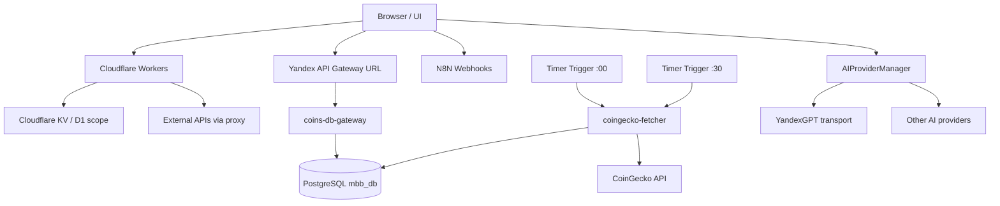

# AIS: Инфраструктура и Внешние Интеграции (Cloudflare, Yandex Cloud, AI, N8N)

<!-- @causality #for-integration-legacy-remediation #for-atomic-remediation #for-docs-ids-gate #for-geo-optimization #for-endpoint-coherence #for-cloudflare-kv-proxy #for-readonly-fallbacks -->

<!-- Спецификации (AIS) пишутся на русском языке и служат макро-документацией. Микро-правила вынесены в английские скиллы. Скрыто в preview. -->

## Концепция (High-Level Concept)
Так как приложение является статичным (No-Build) и не имеет монолитного бэкенда, инфраструктурные обязанности распределены между несколькими serverless-подсистемами, каждая из которых обслуживает свой домен и свой транспортный контракт:

1. **Cloudflare Workers** — auth, workspace/settings transport, edge proxy и CORS-boundary.
2. **Yandex Cloud** — server-side ingest/read транспорт для рыночных данных и Yandex-specific integrations.
3. **N8N** — внешние webhook-driven автоматизации.
4. **AI providers** — провайдеры, скрытые за фасадом `AIProviderManager`.

Ключевой принцип: Cloudflare и Yandex Cloud здесь не являются взаимозаменяемыми платформами. Каждая обслуживает свой bounded context и свой набор контрактов.

## Инфраструктура и Потоки данных (Infrastructure & Data Flow)

### Верхнеуровневая схема

### Доменные зоны и владельцы

| Домен | Primary transport | Storage system | Owner cloud |
|---|---|---|---|
| Auth / session bootstrap | Cloudflare Workers | KV / JWT-scoped context | Cloudflare |
| Workspace / settings | Cloudflare Workers `/api/settings` | `SETTINGS` KV | Cloudflare |
| Market cache / cycle history | `coins-db-gateway` + Yandex API Gateway | PostgreSQL `mbb_db` | Yandex Cloud |
| Market ingest | `coingecko-fetcher` + timer triggers | PostgreSQL `mbb_db` | Yandex Cloud |
| External API proxy (CORS bypass) | Cloudflare Worker proxy routes | Edge cache / KV | Cloudflare |
| Automation | Webhooks | External workflow storage | N8N |

### Стратегия интеграции по платформам

#### Cloudflare

Cloudflare обслуживает те use-case'ы, где браузеру нужен edge transport:

- auth и OAuth-bound взаимодействие;
- user-scoped settings/workspace;
- CORS bypass для внешних API;
- edge cache и policy enforcement на boundary браузера.

Cloudflare не является каноничным transport для server-side market cache. Этот домен закреплён за Yandex Cloud.

#### Yandex Cloud

Yandex Cloud обслуживает рыночные данные как отдельный домен:

- `coingecko-fetcher` пишет top-lists в PostgreSQL;
- `coins-db-gateway` отдает данные из PostgreSQL через HTTP transport;
- цикл ingest/read отделён от browser fallback и от Cloudflare settings flow.

Подробная спецификация этого контура — id:ais-e41384 (docs/ais/ais-yandex-cloud.md) и id:ais-f6b9e2 (docs/ais/ais-integration-strategy-yandex.md).

#### N8N

N8N используется как внешняя automation-подсистема для задач, которые не должны жить внутри UI runtime или рядом с latency-sensitive HTTP transport.

#### AI providers

AI-провайдеры подключаются через provider abstraction. Их transport может проходить через Yandex-specific integrations, но они не должны смешиваться с transport-контрактами workspace или market cache.

## Локальные Политики (Module Policies)

- **CORS Centralization:** CORS должен централизованно обслуживаться на транспортной границе Worker'а, а не размазываться по случайным модулям UI.
- **Endpoint Coherence:** stateful auth/settings/workspace flows обязаны читать, писать и читать обратно через один и тот же backend domain contract. Нельзя смешивать auth через один origin, а workspace через другой, если это не описано отдельным migration-контрактом.
- **Cloud Domain Separation:** workspace/settings и market cache обслуживаются разными transport-доменами. Cloudflare `app-api` и Yandex `coins-db-gateway` не должны описываться как взаимозаменяемые backend endpoints.
- **Read-Only Fallbacks:** browser fallback допустим только для локального UX. Он не должен писать server-side данные обратно в Yandex PostgreSQL ingest/read контур.
- **Запрет на мутацию схемы D1 в рантайме:** Cloudflare D1 schema управляется через миграции (`wrangler d1 migrations`), а не через runtime `CREATE TABLE`.

## Компоненты и Контракты (Components & Contracts)

### Cloudflare слой

- `core/api/cloudflare/*` — клиенты transport-слоя для Cloudflare Workers.
- `core/api/cloudflare/cloud-workspace-client.js` — user-scoped workspace transport через `/api/settings`.
- `is/cloudflare/edge-api/src/settings.js` — нормализация и user-scoped запись настроек/`workspace` в KV.

### Yandex Cloud слой

- `is/yandex/functions/api-gateway/index.js` — HTTP transport к PostgreSQL для market cache и server-side CRUD.
- `is/yandex/functions/market-fetcher/index.js` — server-side ingest top-250 данных CoinGecko.
- id:ais-e41384 — норматив по ingest/read контуру монет.

### AI и automation слой

- `#JS-MW2TvCHg` (`ai-provider-manager.js`) — фасад AI-провайдеров.
- N8N webhooks — внешняя automation boundary.

## Инварианты интеграции

1. Workspace и auth должны жить на одном transport-домене Cloudflare.
2. Рыночные данные и история ingest-циклов должны жить на одном transport-домене Yandex Cloud.
3. Browser fallback не должен мутировать server-side SSOT.
4. Документация не должна описывать `app-api` и `coins-db-gateway` как одинаковые endpoints для одной и той же stateful функции.

## Технический долг, устранённый этой спецификацией

- Уточнено, что Cloudflare — не universal backend для всех доменов приложения.
- Уточнено, что Yandex Cloud market-data контур имеет отдельный транспорт и отдельный SSOT.
- Добавлена Mermaid-схема, обязательная для AIS.
- Убрана двусмысленность между Cloudflare Worker `app-api` и Yandex function `coins-db-gateway`.

## Лог перепривязки путей (Path Rewrite Log)

| Legacy path | Атомарный шаг | Риск | Статус | Новый путь / rationale |
|------------|--------------|------|--------|---------------------------|
| `integrations-cloudflare-core` (legacy donor) | `LIR-002.A1` | Legacy описание вне target структуры | `MAPPED` | `id:ais-775420` |
| `integrations-cloudflare-plan` (legacy donor) | `LIR-002.A2` | Legacy плановой секции нет в текущей структуре | `MAPPED` | `id:ais-775420` |
| `integrations-cloudflare-testing` (legacy donor) | `LIR-002.A3` | Legacy тестовый plan неактуален для активной инфраструктуры | `MAPPED` | `id:ais-775420` |
