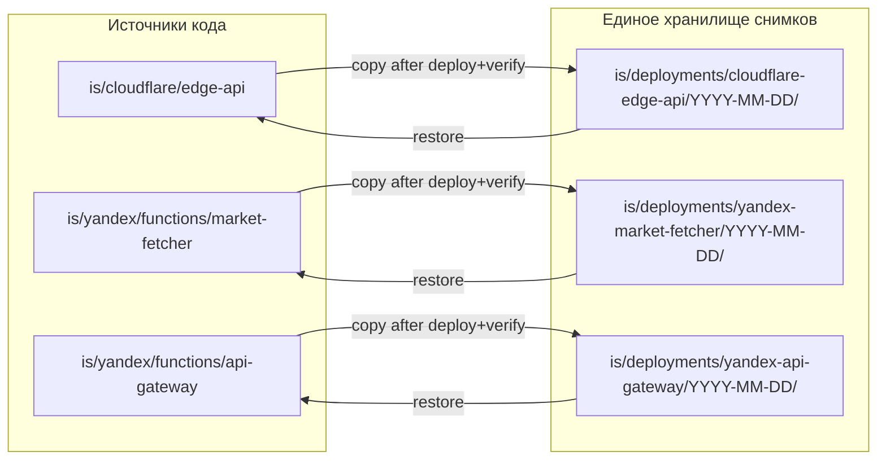

<!-- Важно: оставлять пустую строку перед "---" ! -->

# AIS: Инфраструктурные снимки (Rollback-Safe Deployments)

<!-- Спецификации (AIS) пишутся на русском языке и служат макро-документацией. Микро-правила вынесены в английские скиллы. -->

## Концепция (High-Level Concept)

Все деплоируемые артефакты (Cloudflare Worker, Yandex Cloud Functions, конфиги API Gateway, триггеры, любые внешние сервисы и облака) должны иметь **версионируемые снимки** (см. docs/glossary.md: Снимок — зафиксированное состояние в момент времени) для отката к стабильной конфигурации. Снимки создаются по одному **унифицированному** формату для всех источников. Соответствует доменной карте id:ais-775420 (docs/ais/ais-infrastructure-integrations.md): Cloudflare (auth, settings, proxy), Yandex Cloud (market ingest/read), N8N — для каждого деплоируемого артефакта этих и любых будущих платформ создаются снимки по единому контракту. Каждый снимок обязан быть связан со скиллами и казуальностями (docs/glossary.md): какие скиллы задействованы, по каким причинам были изменения (#for-X), на какие цели заточена функциональность деплоя. Цели AIS: задать единую модель хранения, обязательные провязки с архитектурой и облегчить откат; строгие правила — в id:sk-e8f2a1 (arch-infrastructure-snapshots).

## Инфраструктура и Потоки данных



**Единообразие:** для каждого целевого артефакта (target) структура снимка одна и та же: папка с датой `YYYY-MM-DD/`, внутри — копия кода/конфигов и обязательный `README.md` с датой, env (имена), шагами восстановления, **задействованными скиллами**, **казуальностями** (причины изменений) и **целями функциональности**. Обязательно хранятся **значения несекретных настроек** — всё то, что агент или пользователь может менять в консоли **любого** сервиса или облака (Cloudflare, Yandex Cloud, N8N, внешние датасеты и т.д.): memory, timeout, runtime, расписание триггеров, флаги доступа, bindings (имена и типы) и т.п., чтобы откат восстанавливал полную конфигурацию, а не только код.

## Размещение снимков: рекомендация

**Рекомендуемый путь:** `is/deployments/` с подпапками по целям (`cloudflare-edge-api/`, `yandex-market-fetcher/`, `yandex-api-gateway/`). Для каждой цели — датированные подпапки `YYYY-MM-DD/`.

**Почему не `data/deployments/`:** каталог `data/` в проекте зарезервирован под локальные и эфемерные данные (кэши, SQLite, MCP runtime); содержимое не коммитится в репо (см. data/README.md). Снимки деплоев — долгоживущие артефакты для отката и должны быть в версионном контроле. Размещение в `is/deployments/` согласовано с уже существующей инфраструктурной зоной (`is/cloudflare/`, `is/yandex/`) и не смешивает снимки с runtime-данными.

**Если всё же использовать `data/deployments/`:** нужно явно исключить `data/deployments/` из gitignore (сейчас в .gitignore перечислены конкретные подпапки data/, не весь data/) и обновить data/README.md: указать, что `data/deployments/` — исключение, версионируется для rollback.

## Унифицированная структура снимка (все цели)

Для **любого** целевого артефакта (любой сервис или облако, в т.ч. Cloudflare, Yandex, будущие):

```
is/deployments/<target>/YYYY-MM-DD/
├── src/          # или копия корня кода (без node_modules)
├── *.toml        # wrangler.toml / конфиги, если есть
├── *.yaml        # spec.yaml и т.д., если есть
├── package.json  # при наличии
└── README.md     # обязателен: дата, Version ID, env (имена), настройки сервиса (значения), restore, skills, causalities, цели
```

- **target** — один идентификатор цели: `cloudflare-edge-api`, `yandex-market-fetcher`, `yandex-api-gateway`. Соответствует путям кода: is/cloudflare/edge-api, is/yandex/functions/market-fetcher, is/yandex/functions/api-gateway (id:ais-e41384). При появлении новых деплоев добавляются новые target-подпапки с тем же форматом.
- **Схема БД:** для артефактов, работающих с внешней БД (например Yandex Functions → PostgreSQL mbb_db), описание или миграции схемы на момент стабильной версии — в README снимка или отдельный schema-файл при изменении.
- **README.md** обязателен и должен содержать: дату снимка; Version ID (если применимо); список env (только имена, не значения секретов); **значения настроек сервиса/облака** (не секреты) — memory, timeout, runtime, триггеры (cron), флаги доступа, bindings по именам и типам и т.д., всё, что задаётся в консоли **любого** сервиса или облака и может быть изменено агентом; краткие шаги восстановления; **задействованные скиллы** (идентификаторы вида `sk-...` из id-registry.json); **казуальности** (#for-X, причины изменений); **цели функциональности** (на что заточен деплой). `README.md` и `changes-vs-previous.md` считаются обычными markdown-артефактами проекта и поэтому обязаны иметь детерминированный frontmatter (`id`, `status`, `last_updated`), а не генерироваться как безымянные заметки.

## Локальные политики

- Снимок создаётся **автоматически** в явном шаге конвейера деплоя сразу после успешного деплоя и минимальной верификации; неудачные попытки не должны оказываться в `is/deployments/`.
- Если деплой или проверка падают после создания рабочего снимка, конвейер обязан **автоматически удалить** этот снимок и зафиксировать причину дефекта (ссылка на задачу/коммит + краткое описание) через operational note в id:doc-f1a4d3 (docs/project-evolution.md) или иной журнал, согласованный с id:sk-6eeb9a.
- Секреты и значения env (пароли, API-ключи) в снимки не попадают; только имена env и контракт (обязательный/опциональный). **Значения несекретных настроек** (memory, timeout, триггеры, runtime, флаги и т.д. — всё, что задаётся в консоли любого сервиса или облака) обязательны к хранению в README или в отдельном файле снимка, чтобы откат восстанавливал полную конфигурацию.
- Валидный снимок должен содержать три обязательных блока: (1) полный перечень доступных настроек/параметров (где есть доступ через CLI/консоль), (2) diff относительно предыдущего стабильного состояния, включая изменения в настройках, (3) зафиксированные изменения казуальностей деплой-изменений (добавление/обновление `#for-` хэшей в id:sk-3b1519).
- Авто-архивирование считается завершённым только после успешного прохождения этих трёх проверок; иначе деплой считается незавершённым на уровне документационного контракта.
- Reference implementation: deploy wrappers запускают `verify-deployment-target.js`, и только после успешной target-specific проверки вызывают `archive-deployment-snapshot.js`.
- Связь с откатом: id:sk-6eeb9a, id:runbook-b188b8. Восстановление при откате — копирование из выбранного `YYYY-MM-DD/` обратно в рабочий каталог артефакта и повторный deploy.

## Компоненты и контракты

- id:sk-e8f2a1 (is/skills/arch-infrastructure-snapshots.md) — скилл: строгие правила, reasoning, Core Rules.
- Исторический план внедрения контракта удалён после дистилляции; факт удаления зафиксирован в id:doc-del-log (docs/deletion-log.md).
- id:ais-775420 — карта доменов и владельцев (Cloudflare, Yandex, N8N); снимки покрывают деплоируемые артефакты этих доменов.
- id:ais-e41384 (docs/ais/ais-yandex-cloud.md) — спецификация Yandex-контура (market-fetcher, coins-db-gateway, mbb_db).
- id:runbook-b188b8 (docs/runbooks/rollback-protocol.md) — протокол отката; восстановление из снимков — при откате External Integrations и Backend/Transport.
- Пути и именование заданы в данном AIS и дублируются в скилле для единообразия.
