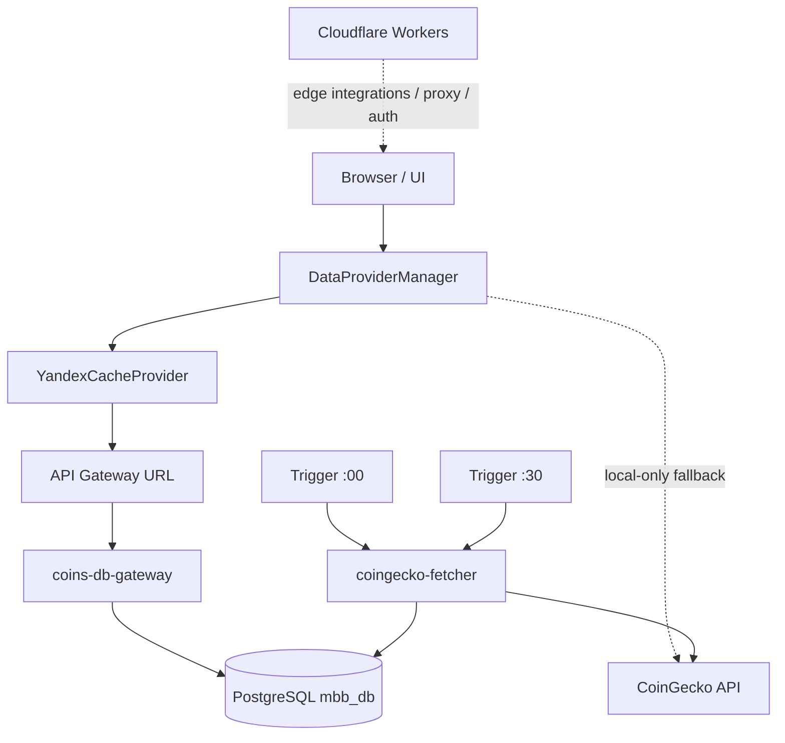

<!-- Важно: оставлять пустую строку перед "---" ! -->

# AIS: Стратегия интеграций для Yandex Cloud и API Gateway

<!-- @causality #for-docs-ids-gate #for-causality-harvesting #for-integration-legacy-remediation #for-atomic-remediation #for-readonly-fallbacks #for-cloud-env-readback #for-no-empty-cloud-env #for-serverless-short-runs #for-transport-shape-verification #for-trigger-minute-routing -->

## Концепция (High-Level Concept)

Этот AIS фиксирует не просто наличие Yandex Cloud в проекте, а **стратегию интеграции** между четырьмя разными средами:

1. **Браузер / UI** — инициирует чтение данных и может локально пережить деградацию источников.
2. **Cloudflare Edge** — обслуживает CORS-прокси, auth и часть edge-интеграций.
3. **Yandex Cloud Functions + API Gateway** — серверный транспорт к PostgreSQL и серверный ingest рыночных данных.
4. **PostgreSQL (`mbb_db`)** — operational SSOT для серверного кэша монет и истории ingest-циклов.

Цель интеграционной стратегии — разделить:

- **быстрое чтение** пользовательских запросов,
- **серверную запись** в кэш,
- **локальный fallback** браузера,
- **операционный deploy-контракт** cloud-функций.

Это нужно для того, чтобы fallback не разрушал SSOT, cron-статистика не смешивалась с UI-запросами, а redeploy не уводил production на устаревшую базу.

## Инфраструктура и Потоки данных (Infrastructure & Data Flow)

### Верхнеуровневая схема

### Стратегия разграничения ответственности

| Зона | Ответственность | Что запрещено |
|------|-----------------|---------------|
| Browser / UI | Чтение, локальная агрегация, визуализация, деградация UX | Прямая запись в `coin_market_cache` / `coin_market_cache_history` |
| `coins-db-gateway` | HTTP transport к PostgreSQL, CORS, path/method normalization, read/write API для серверных use-case'ов | Смешивать transport-логику с browser fallback-логикой |
| `coingecko-fetcher` | Единственный серверный ingest top-lists из CoinGecko в PostgreSQL | Долгие sleep-цепочки внутри одного serverless запуска |
| PostgreSQL `mbb_db` | SSOT серверного кэша и истории ingest | Принимать browser fallback как каноничную запись |

### Почему интеграция разбита именно так

#### 1. Read и Ingest разделены на разные serverless-модули

- `coins-db-gateway` оптимизирован под короткие HTTP-вызовы и чтение из PostgreSQL.
- `coingecko-fetcher` оптимизирован под периодический ingest и обновление server-side cache.

Эта декомпозиция предотвращает смешивание пользовательского latency-path и cron-path в одном handler.

#### 2. Browser fallback оставлен только локальным

`DataProviderManager` и dual-channel logic в #JS-2436XKxE могут локально добирать недостающие монеты из CoinGecko, если PostgreSQL не дал полный набор. Но этот fallback:

- нужен для UX и устойчивости чтения,
- не является authoritative источником для серверной истории,
- не должен создавать новые `cycle_id`,
- не должен писать в `coin_market_cache_history`.

Именно поэтому `POST /api/coins/market-cache` в #JS-HS3kQFDc теперь возвращает `403`.

#### 3. Cron-логика вынесена в два timer-trigger'а

Изначальная модель с несколькими чанками и паузами внутри одного запуска делала serverless job слишком длинной и хрупкой по timeout/runtime. Текущая стратегия:

- `coingecko-fetcher-cron-cap` в `:00`,
- `coingecko-fetcher-cron-vol` в `:30`,
- один top-250 запрос на запуск,
- короткий deterministic runtime.

Это делает ingest прозрачным для логов, retry и сопровождения.

#### 4. Один function package обслуживает два режима ingest

Текущая функция `coingecko-fetcher` не получает явный `order` через payload trigger'а. Поэтому тип выборки кодируется временем старта:

- `minute < 15` -> `market_cap`
- `minute >= 15` -> `volume`

Это уменьшает дублирование serverless-кода и позволяет держать один deploy-artifact для двух timer-сценариев.

## Текущее Production-состояние

### Фактические runtime-компоненты

| Компонент | Production name | Роль |
|-----------|------------------|------|
| Cloud Function | `coins-db-gateway` | PostgreSQL gateway / HTTP transport |
| Cloud Function | `coingecko-fetcher` | Timer-driven ingest top-250 lists |
| Timer Trigger | `coingecko-fetcher-cron-cap` | Запуск ingest по `market_cap` в `:00` |
| Timer Trigger | `coingecko-fetcher-cron-vol` | Запуск ingest по `volume` в `:30` |
| Database | `mbb_db` | Operational SSOT для server-side coin cache |
| API Base URL | `https://d5dl2ia43kck6aqb1el5.k1mxzkh0.apigw.yandexcloud.net` | Реальный HTTP transport до `coins-db-gateway` |

### Production truth vs legacy defaults

Существенная operational особенность: production truth в этом контуре определяется **не локальными примерами**, а env-контрактом активной версии cloud function.

Следствия:

- `app_db` / `app_admin` в legacy-примерах не считаются production SSOT.
- Перед redeploy нужно читать live env active version.
- Локальные default-константы в коде допускаются только как fallback для dev/legacy, но не как authoritative источник при production deploy.

## Компоненты и Контракты (Components & Contracts)

### `coins-db-gateway` как транспортный фасад

#JS-HS3kQFDc реализует transport-layer adapter между API Gateway event shape и SQL-операциями:

- нормализует `method` из разных веток event payload;
- нормализует `path` из `path`, `rawPath`, `requestContext`, `params.proxy`, `pathParameters.proxy`;
- обслуживает CORS (`OPTIONS -> 204`);
- открывает PostgreSQL connection на один HTTP-вызов;
- возвращает структурированные JSON-ответы с едиными заголовками.

Это не просто “API function”, а **transport boundary**, где несовместимости event-shape скрываются от остального приложения.

### `coingecko-fetcher` как единственный writer server-side cache

#JS-3w3f6pz7:

- делает `GET /coins/markets` в CoinGecko,
- пишет строки в `coin_market_cache_history`,
- обновляет `coin_market_cache`,
- поддерживает `sort_market_cap` и `sort_volume`,
- выполняет rotation старых cycles,
- применяет time window gate `06:00–24:00 MSK`.

Ключевая идея: только этот writer создает нормальные ingest-cycle артефакты, пригодные для интерпретации в UI и runbook'ах.

### Клиентская интеграция с Yandex Cloud

Browser не знает SQL и не получает DB credentials. Он интегрируется через:

- #JS-qz3WnWnA (`yandex-cache-provider.js`) — PostgreSQL read provider,
- #JS-2436XKxE (`data-provider-manager.js`) — orchestration/fallback,
- API Gateway URL — transport-level access point.

Таким образом, интеграционный контракт для UI — это HTTP + normalized provider interface, а не облачная реализация сама по себе.

## Казуальности, критичные для понимания текущей реализации

### `#for-readonly-fallbacks`

Browser fallback не должен писать в серверный SSOT, потому что тогда:

- статистика cron-циклов становится ложной,
- история `coin_market_cache_history` больше не отражает только server-side ingest,
- UI-запросы начинают выглядеть как “запуски крона”,
- исчезает доверие к debugging-артефактам.

### `#for-serverless-short-runs`

Serverless ingest должен быть коротким и детерминированным. Длинные sleep-цепочки внутри одного invoke:

- конфликтуют с timeout budget,
- усложняют retries,
- ухудшают observability,
- затрудняют postmortem.

Поэтому логика разбита на два timer-trigger'а, а не на один длинный “комбайн”.

### `#for-trigger-minute-routing`

Когда один function artifact обслуживает несколько timer-trigger'ов без явного payload-контракта, выбор режима работы должен выводиться из стабильного внешнего признака. В текущей реализации таким признаком является minute запуска.

Это позволяет:

- не дублировать код функций,
- не плодить несколько almost-identical deploy packages,
- сохранить простой operational deploy path.

### `#for-cloud-env-readback`

При redeploy cloud function локальные defaults и старые README могут расходиться с живой production-конфигурацией. Единственный надёжный способ не увести production в неверную БД — читать env активной версии функции перед публикацией новой.

### `#for-no-empty-cloud-env`

Yandex Cloud deploy API может отклонять пустые optional env values. Поэтому пустой `COINGECKO_API_KEY` должен не передаваться вовсе, а не сериализоваться как пустая строка в `--environment`.

### `#for-transport-shape-verification`

Прямой `yc serverless function invoke` не всегда эквивалентен реальному HTTP-вызову через API Gateway, потому что event-shape отличается. Поэтому transport-поведение (`path`, `method`, `CORS`, `403`) нужно проверять по real base URL, а не только через direct invoke.

## Deployment & Verification Protocol

### Перед redeploy

1. Прочитать активную версию функции.
2. Зафиксировать env-контракт active version.
3. Проверить, не является ли локальная база/учётка legacy-артефактом.
4. Не передавать пустые optional env в deploy command.

### После redeploy `coingecko-fetcher`

1. Выполнить manual invoke.
2. Проверить, что ответ содержит `coins_fetched: 250`.
3. Проверить `order_fetched`.
4. Проверить `GET /api/coins/market-cache?count_only=true` на свежий `fetched_at`.

### После redeploy `coins-db-gateway`

1. Проверить чтение через реальный API Gateway URL.
2. Проверить, что `POST /api/coins/market-cache` возвращает `403`.
3. Проверить `/health`.

## Границы документа и перекрёстные ссылки

- Детальная спецификация ingest/read data contour: id:ais-e41384 (docs/ais/ais-yandex-cloud.md)
- Детали dual-channel pipeline на стороне клиента: id:ais-3732ce (docs/ais/ais-data-pipeline.md)
- Техническая сводка функции gateway: id:readme-9e335c (is/yandex/functions/api-gateway/README.md)
- Техническая сводка ingest-функции: id:readme-7c67c3 (is/yandex/functions/market-fetcher/README.md)

## Контракты документации и гейтов

- Legacy paths в donor-материалах должны заменяться только фактическими target-файлами.
- Перед следующей эволюцией документа проверять:
  - #JS-Hx2xaHE8 (`validate-docs-ids.js`)
  - #JS-69pjw66d (`validate-causality.js`)
  - #JS-QxwSQxtt (`validate-skill-anchors.js`)
