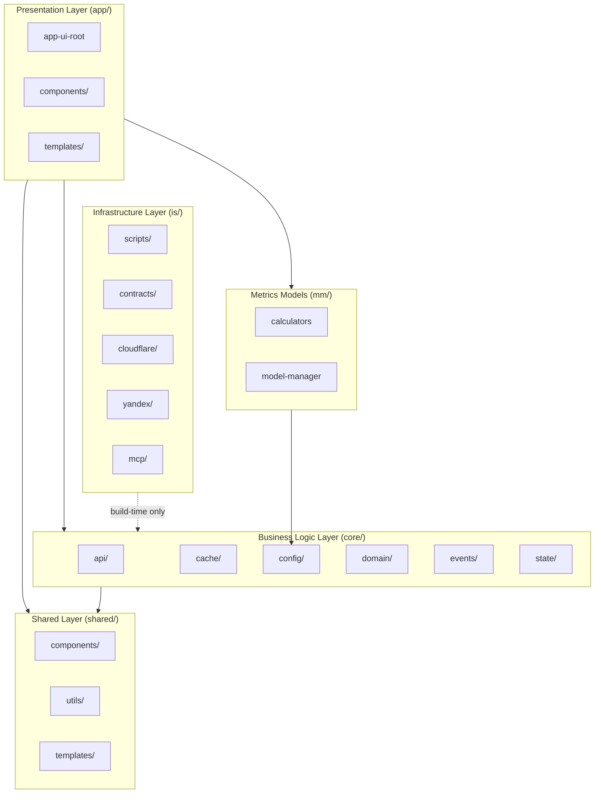

# AIS: Топология слоёв, сегментов, границ и пространств имён (Layers, Segments, Boundaries, Namespaces)

## Концепция (High-Level Concept)

Приложение организовано как **вертикальная иерархия слоёв** (Layers) с однонаправленной зависимостью сверху вниз. Каждый слой делится на **сегменты** (Segments) — горизонтальные области ответственности. Взаимодействие между слоями и сегментами допускается только через **границы** (Boundaries), определённые контрактами. Для предотвращения коллизий глобальных имён действуют конвенции **пространств имён** (Namespaces).

Эта спецификация является SSOT для структурной топологии проекта — как расположены физические каталоги, какие правила направления зависимостей действуют, и как именуются глобальные объекты.

## Инфраструктура и Потоки данных (Infrastructure & Data Flow)

### Слои (Layers)

| Слой | Каталог | Ответственность | Направление зависимостей |
|------|---------|-----------------|--------------------------|
| **Presentation** | `app/` | Vue-компоненты, шаблоны, UI-логика, `app-ui-root` | → core/, shared/, mm/ |
| **Shared** | `shared/` | Переиспользуемые компоненты и утилиты без бизнес-логики | → (ничего, leaf-слой) |
| **Business Logic** | `core/` | Конфигурация, кэш, API-клиенты, домены, события, состояние | → shared/ (только utils) |
| **Metrics Models** | `mm/` | Калькуляторы моделей (Median/AIR), model-manager | → core/ (только config) |
| **Infrastructure** | `is/` | Cloudflare Workers, Yandex Functions, MCP, контракты, скрипты | → (внешние системы) |
| **Data** | `data/` | Runtime: кэш, SQLite (gitignored). Статика (coins, иконки) — в a/. См. id:ais-b3c4d5. | → (ничего, read-only) |

### Инвариант направления зависимостей

```
app/ ──→ core/ ──→ shared/
 │         │
 ├──→ shared/    mm/ ──→ core/ (config only)
 │
 └──→ mm/

is/ ──→ (external systems, не зависит от app/core/shared runtime)
```

**Жёсткое правило:** нижний слой **никогда** не импортирует из верхнего. `core/` не знает о `app/`. `shared/` не знает ни о `core/`, ни о `app/`. Нарушение — архитектурный дефект.

### Сегменты (Segments)

Горизонтальное разделение внутри одного слоя:

**core/ сегменты:**

| Сегмент | Путь | Назначение |
|---------|------|-----------|
| API | `core/api/` | Провайдеры, rate-limiter, market-metrics, loaders |
| Cache | `core/cache/` | storage-layers, cache-manager, migrations, cleanup |
| Config | `core/config/` | Все `*-config.js` — конфигурационные модули |
| Domain | `core/domain/` | portfolio-engine, validation, adapters |
| Events | `core/events/` | event-bus |
| State | `core/state/` | auth-state, ui-state, loading-state |
| Validation | `core/validation/` | schemas, validator, normalizer |
| Errors | `core/errors/` | error-types, error-handler |
| Runtime policies | `core/config/` | runtime-policies.js (TTL, intervals) |
| Logging | `core/logging/` | logger |
| Observability | `core/observability/` | fallback-monitor, portfolio-observability |
| Utils | `core/utils/` | draft-coin-set, ban-coin-set, favorites-manager, и др. |

**app/ сегменты:**

| Сегмент | Путь | Назначение |
|---------|------|-----------|
| Components | `app/components/` | Vue-компоненты (`cmp*`, modal bodies) |
| Templates | `app/templates/` | HTML-шаблоны компонентов |
| Root | `app/app-ui-root.js` | Корневой Vue-инстанс (~5k LOC) |
| Skills | `app/skills/` | Навыки уровня presentation |

**is/ сегменты:**

| Сегмент | Путь | Назначение |
|---------|------|-----------|
| Scripts | `is/scripts/` | Гейты, генераторы, миграции, инфраструктурные проверки |
| Contracts | `is/contracts/` | Контрактная плоскость (пути, id, hashes, правила) |
| Cloudflare | `is/cloudflare/` | Edge API Worker, D1 миграции |
| Yandex | `is/yandex/` | Serverless functions |
| MCP | `is/mcp/` | Model Context Protocol сервер |
| Deployments | `is/deployments/` | Снимки развёртываний |
| Skills | `is/skills/` | Архитектурные и процессные навыки |

### Границы (Boundaries)

Граница — чёткий предел ответственности. Взаимодействие через границу только через контракты.

| Граница | Стороны | Контрактный механизм |
|---------|---------|---------------------|
| Presentation ↔ Business | `app/` ↔ `core/` | `window.*` globals, EventBus events |
| Business ↔ External API | `core/api/` ↔ CoinGecko/Yandex | HTTP fetch, rate-limiter, провайдер-контракт |
| Browser ↔ Cloudflare | `app/` ↔ `is/cloudflare/` | REST API через Worker proxy |
| Runtime ↔ Infrastructure | `core/` ↔ `is/scripts/` | Нет runtime-связи; `is/` работает build-time |
| Agent ↔ Codebase | AI agent ↔ `is/mcp/` | MCP stdio protocol, JSON-RPC |

### Пространства имён (Namespaces)

Все runtime-модули регистрируются на `window.*` с конвенцией префиксов:

| Префикс/Паттерн | Область | Примеры |
|------------------|---------|---------|
| `cmp*` | Shared UI components | `cmpButton`, `cmpDropdown`, `cmpModal` |
| `*Config` | Configuration modules | `appConfig`, `cloudflareConfig`, `cacheConfig` |
| `*Client` | Cloudflare API clients | `authClient`, `portfoliosClient`, `coinSetsClient` |
| `*Provider` | Data/AI providers | `CoinGeckoProvider`, `YandexCacheProvider` |
| `*Manager` | Facade/Orchestrator | `dataProviderManager`, `aiProviderManager`, `modelManager` |
| `*State` | State modules | `authState`, `uiState`, `loadingState` |
| `*Store` | Data stores | `messagesStore`, `sessionLogStore` |
| (без префикса) | Singletons/utils | `eventBus`, `validator`, `logger`, `errorHandler` |

**Инвариант:** один `window.*` на один модуль. Дублирование имени = коллизия, блокируемая гейтом id:sk-c62fb6.



## Локальные Политики (Module Policies)

1. **No upward imports:** `core/` never references `app/`; `shared/` never references `core/` or `app/`. Enforced by id:sk-c62fb6 layout governance.
2. **Segment isolation within layer:** `core/cache/` does not directly import `core/domain/` — communication via `window.*` globals and EventBus.
3. **Template-logic separation:** Vue templates live in `*/templates/`, component logic in `*/components/`. `#for-template-logic-separation`.
4. **Infrastructure is build-time-only:** `is/scripts/` runs in Node.js at preflight/CI, never loaded by browser runtime.
5. **Namespace uniqueness:** each `window.*` global must map to exactly one source file; enforced by code-file-registry and module-loader dedup.
6. **Portfolio runtime singularity:** в active module graph допускается только один primary portfolio UI path. Legacy portfolio CRUD modules могут оставаться в repo как donors, но не должны одновременно загружаться рядом с `app-ui-root` portfolio flow. См. id:ais-6f2b1d.

## Компоненты и Контракты (Components & Contracts)

- #JS-os34Gxk3 (modules-config.js) — SSOT for module dependency graph and load order
- #JS-xj43kftu (module-loader.js) — topological sort loader respecting layer boundaries
- id:sk-c62fb6 (arch-layout-governance) — rules for directory placement and dependency direction
- id:sk-483943 (arch-foundation) — foundational architecture principles
- `is/contracts/paths/paths.js` — canonical path constants

## Контракты и гейты

- #JS-Hx2xaHE8 (validate-docs-ids.js) — id and cross-reference validation
- Preflight gate (`is/scripts/preflight.js`) — runs all structural validators

## Завершение / completeness

- `@causality #for-layer-separation` — all layer boundary violations must be flagged.
- Status: `incomplete` — pending automated gate for upward-import detection in browser JS.
