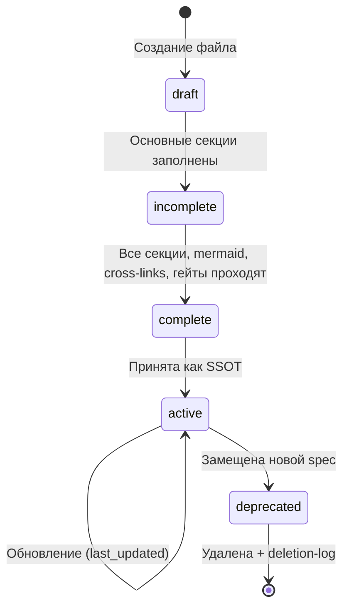
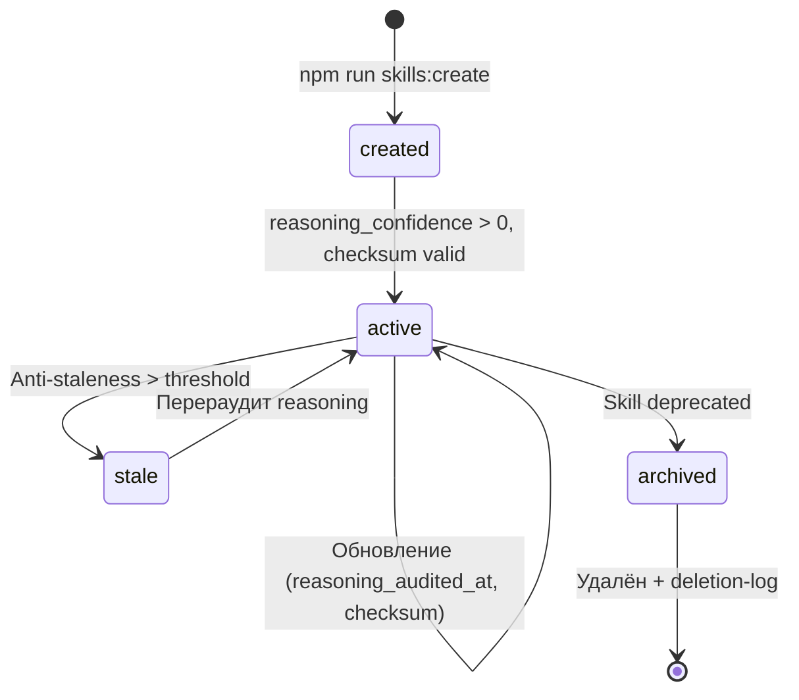
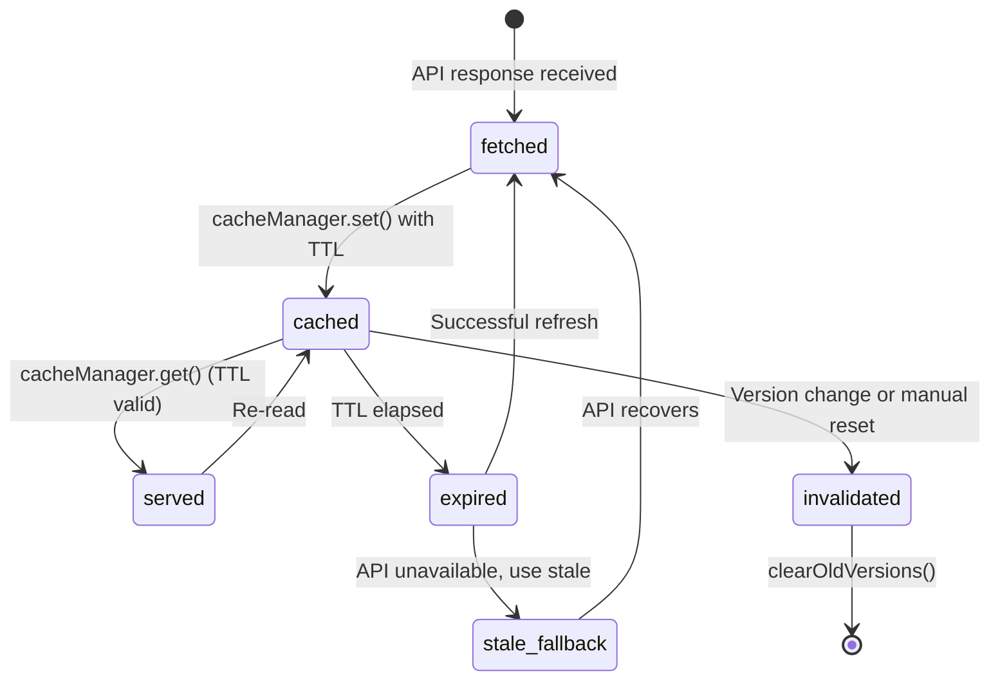
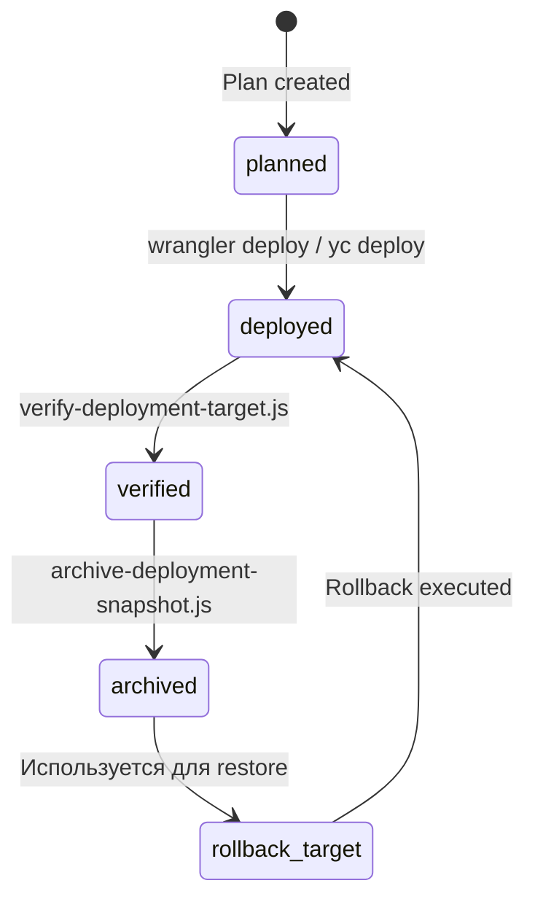

# AIS: Жизненные циклы сущностей (Entity Lifecycles)

## Концепция (High-Level Concept)

**Жизненный цикл (Lifecycle)** — последовательность состояний, которые проходит сущность от создания до уничтожения или архивации. В проекте определены lifecycles для нескольких классов сущностей: документация, навыки, данные, деплойменты и runtime-модули.

Фиксация lifecycles предотвращает: использование незавершённых артефактов как SSOT, забытые промежуточные состояния, silent data staleness.

## Инфраструктура и Потоки данных (Infrastructure & Data Flow)

### 1. Lifecycle AIS-спецификации



| Статус | Критерий перехода | Гейт |
|--------|------------------|------|
| `draft` | Файл создан, frontmatter заполнен, минимум 1 секция | — |
| `incomplete` | Концепция + Data Flow + хотя бы 1 mermaid | #JS-Hx2xaHE8 |
| `complete` | Все обязательные секции заполнены, cross-links резолвятся, related_skills/ais заполнены | Полный preflight |
| `active` | = `complete` + принят в index-ais.md | Auto-index |
| `deprecated` | Замещён новым AIS; помечен в deletion-log | `docs:deletion:validate` |

### 2. Lifecycle Skill



| Статус | Критерий | Проверка |
|--------|---------|---------|
| `created` | Файл есть, frontmatter минимален | `skills:check` |
| `active` | `reasoning_confidence` ≥ 0.5, `reasoning_checksum` верифицирован | `skills:reasoning:check` |
| `stale` | Anti-staleness detector пометил как устаревший (id:ais-9f4e2d) | `skills:anchors:check` |
| `archived` | Записан в `docs/deletion-log.md` | `docs:deletion:validate` |

### 3. Lifecycle кэшированных данных



| Переход | Триггер | Ответственный модуль |
|---------|---------|---------------------|
| fetched → cached | Успешный API-ответ | Provider → cacheManager |
| cached → expired | `Date.now() > expiresAt` | cacheManager TTL check |
| expired → stale_fallback | API 429/500, кэш всё ещё читаем | Provider catch-блок |
| cached → invalidated | `appConfig.version` изменился | `clearOldVersions()` at startup |

### 4. Lifecycle деплоймента



Управляется через id:sk-e8f2a1 (arch-infrastructure-snapshots) и id:sk-6eeb9a (arch-rollback).

`@causality #for-deploy-snapshot-diff` — каждый деплой фиксирует diff для возможности rollback.
`@causality #for-post-deploy-auto-archive` — после деплоя автоматический архив снимка.

### 5. Lifecycle runtime-модуля

```mermaid
stateDiagram-v2
    [*] --> registered: Declared in modules-config.js
    registered --> condition_check: module-loader evaluates condition
    condition_check --> skipped: condition() === false
    condition_check --> loading: condition() === true or no condition
    loading --> loaded: script.onload fires
    loading --> failed: script.onerror fires
    loaded --> initialized: IIFE executes, window.* registered
    initialized --> active: Used by dependents
    failed --> error_reported: Critical = abort; non-critical = skip
```

Управляется #JS-xj43kftu (module-loader.js). Критические модули (Vue, templates) при failure абортируют весь bootstrap.

## Локальные Политики (Module Policies)

1. **No use before lifecycle stage:** AIS в статусе `draft` не может быть referenced как SSOT другими спецификациями. Skill в статусе `created` без reasoning — informational only.
2. **Stale data warning:** данные из stale_fallback **обязаны** сопровождаться warn-логом для visibility.
3. **Deletion requires log:** удаление любого артефакта (AIS, skill, plan) **обязано** быть записано в `docs/deletion-log.md` с причиной и датой.
4. **Verify before archive:** деплой считается завершённым только после `verify-deployment-target.js` и последующего `archive-deployment-snapshot.js`; архив без verification запрещён (`#for-post-deploy-auto-archive`).

## Компоненты и Контракты (Components & Contracts)

- id:sk-0e193a (process-docs-lifecycle) — lifecycle документации
- id:sk-683b3c (process-evolution-logging) — логирование эволюции
- id:sk-d763e7 (process-skill-governance) — governance навыков
- id:sk-e8f2a1 (arch-infrastructure-snapshots) — lifecycle деплойментов
- id:sk-6eeb9a (arch-rollback) — rollback protocol
- id:ais-9f4e2d (ais-anti-staleness) — anti-staleness detector
- id:ais-8982e7 (ais-docs-governance) — governance модель документации

## Контракты и гейты

- #JS-Hx2xaHE8 (validate-docs-ids.js) — проверка id и статусов
- `docs:deletion:validate` — валидация deletion-log integrity

## Завершение / completeness

- `@causality #for-deploy-snapshot-diff` — lifecycle деплоя обязывает snapshot.
- `@causality #for-post-deploy-auto-archive` — автоархивация после deploy.
- `@causality #for-stable-ids` — id сущностей не меняются в течение lifecycle.
- Status: `incomplete` — pending формализация lifecycle для runtime-данных (Vue component instance).
