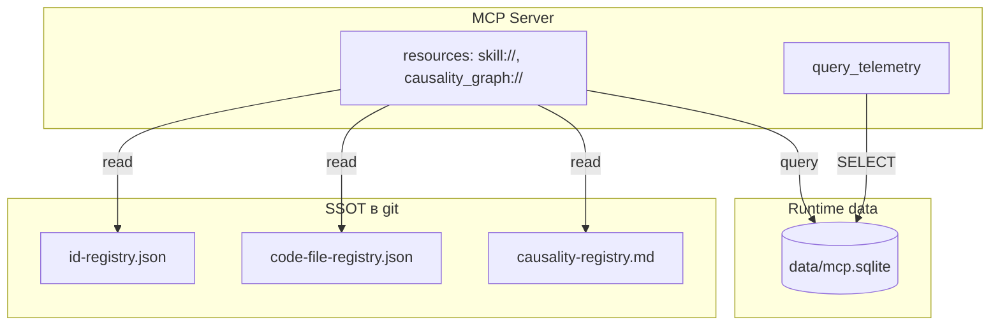

<!-- Важно: оставлять пустую строку перед "---" ! -->

# AIS: Поток данных MCP (MCP Data Flow)

## Идентификация и цель

- id: `ais-8d3c2a` — спецификация размещения и чтения данных MCP-экосистемой.
- Цель: единый поток данных (Data Flow) без дублирования — SSOT в JSON/MD, runtime-данные в SQLite; MCP читает напрямую, без кэша между слоями.
- Принцип: один источник на домен; рассинхрон исключён за счёт отказа от копирования реестров в SQLite.

## Разделение по слоям

### SSOT (JSON/MD) — читаются MCP напрямую

| Источник | Назначение |
|----------|------------|
| is/contracts/docs/id-registry.json | id → path для markdown (skills, AIS, docs) |
| is/contracts/docs/code-file-registry.json | file id (#JS-xxx) → path |
| id:sk-3b1519 (is/skills/causality-registry.md) | хэши #for-X / #not-Y и формулировки |

MCP tools/resources читают эти файлы по запросу. Нет кэша в SQLite — данные всегда актуальны.

### Runtime (data/mcp.sqlite) — только генерируемые данные

| Таблица | Назначение |
|---------|------------|
| `events` | телеметрия вызовов MCP tools |
| `fragility_stats` | счётчики сбоев preflight по файлам |
| `raw_causalities` | backlog харвеста необработанных @causality |
| `dependency_graph` | source_hash → target_file (из #JS-eG4BUXaS is/scripts/architecture/validate-causality-invariant.js) |
| `confidence_audits` | история аудита confidence скиллов |

Эти данные создаются скриптами и MCP; в git не коммитятся (data/*.sqlite в .gitignore).

## Архитектурный поток

## Правила чтения

1. **Реестры (id, code-file, causality)**: MCP читает JSON/MD при каждом запросе. Нет таблиц registry_cache в SQLite.
2. **Runtime**: MCP читает только из `data/mcp.sqlite`. Путь к DB — `data/mcp.sqlite` (не telemetry.sqlite).
3. **Инвариант**: Скрипты (#JS-NrBeANnz is/scripts/preflight.js, #JS-eG4BUXaS is/scripts/architecture/validate-causality-invariant.js) пишут в JSON/MD и в DB по своим доменам. MCP только читает.

## Контракты компонентов

### `is/mcp/db.js`

- Экспортирует подключение к `data/mcp.sqlite`.
- WAL journal mode для одновременного чтения MCP и записи preflight.
- Схема: events, fragility_stats, raw_causalities, dependency_graph, confidence_audits.

### `is/mcp/resources.js`

- `skill://` — читает markdown с диска, дополняет dependency_graph из DB.
- `causality_graph://` — читает dependency_graph из DB.
- `causality_backlog://` — читает raw_causalities из DB.

### Будущие tools (опционально)

- `resolve_entity(id)` — читает id-registry.json, возвращает path.
- `resolve_code_hash(hash)` — читает code-file-registry.json.
- Все — read-only от SSOT, без кэша.

## Выгоды для ИИ-агентов

- **Fresh data**: после preflight агент сразу видит обновлённые пути.
- **No sync bugs**: агент не получает устаревшие данные из рассинхронённого кэша.
- **Единый интерфейс**: один вызов tool может агрегировать данные из нескольких источников.

## Матрица поведения

| Сценарий | Источник | Действие |
|----------|----------|----------|
| Resolve sk-xxx → path | id-registry.json | MCP readFile |
| Resolve #JS-xxx → path | code-file-registry.json | MCP readFile |
| Causality hash formulation | causality-registry.md | MCP readFile/parse |
| Dependency graph для #for-X | mcp.sqlite dependency_graph | MCP SELECT |
| Telemetry events | mcp.sqlite events | query_telemetry |
| Harvest backlog | mcp.sqlite raw_causalities | causality_backlog:// |

## Критичные инварианты

1. `data/mcp.sqlite` не синхронируется в git; остаётся локальным.
2. Реестры (id, code-file) — SSOT; preflight/generate-id-registry — единственные писатели.
3. dependency_graph заполняется #JS-eG4BUXaS (validate-causality-invariant.js); MCP только читает.
4. Переименование telemetry.sqlite → mcp.sqlite зафиксировано в коде и спеках.

## Ссылки

- #JS-YD283xUP (db.js)
- #JS-HU3hEyDe (resources.js)
- id:sk-3225b2 (is/skills/arch-mcp-ecosystem.md)
