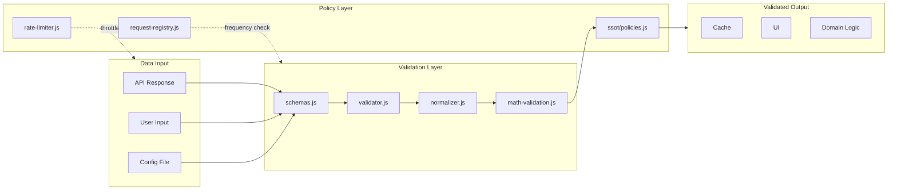

# AIS: Политики и схемы валидации (Policies & Schemas)

## Концепция (High-Level Concept)

**Политика (Policy)** — набор правил и ограничений, описывающих допустимое поведение системы или разработчика. Политики могут быть runtime (проверяются в коде) или build-time (проверяются гейтами).

**Схема (Schema)** — формальное описание структуры данных, используемое для валидации на входе и выходе. Схема гарантирует, что данные соответствуют контракту.

Политики отвечают на вопрос «что разрешено?», схемы — на вопрос «какой формы должны быть данные?». Вместе они формируют defensive layer приложения.

## Инфраструктура и Потоки данных (Infrastructure & Data Flow)

### Классификация политик

| Тип | Место проверки | Примеры | Enforcement |
|-----|---------------|---------|-------------|
| **Архитектурные** | Build-time (preflight) | Layer separation, naming conventions, prefix registry | Гейты в `is/scripts/` |
| **Runtime SSOT** | Runtime | Cache TTL, request frequency, provider priority | `core/ssot/policies.js` |
| **Документационные** | Build-time | AIS completeness, skill frontmatter, causality integrity | Validate-* scripts |
| **Агентские** | Chat-time | Terminology strictness, comment rewrite, anti-calque | `.cursorrules`, `.cursor/rules/` |
| **Security** | Runtime + Deploy | OAuth origin validation, secrets hygiene, env sync | `authConfig`, env gates |

### Runtime политики (`core/ssot/policies.js`)

Файл `core/ssot/policies.js` → `window.ssot` — единственный источник правды для runtime-политик:

- **Cache policies:** TTL по типам данных (market data: 5 min, stablecoins: 24h, icons: 7d), стратегия invalidation.
- **Request policies:** минимальный интервал между запросами к одному endpoint (requestRegistry enforces 24h для stablecoins).
- **Provider policies:** порядок fallback (Yandex → CoinGecko), поведение при 429/500.

### Классификация схем

| Уровень | Инструмент | Местоположение | Назначение |
|---------|-----------|----------------|-----------|
| **Domain validation** | JavaScript checks | `core/validation/schemas.js` | Структура рыночных данных, портфелей |
| **Config contracts** | Convention-based | `core/config/*-config.js` | Формат конфигурационных объектов |
| **API contracts** | JSON-based | `core/contracts/market-contracts.js` | Формат ответов API |
| **UI contracts** | Convention-based | `core/contracts/ui-contracts.js` | Формат UI-данных |
| **Doc contracts** | JSON Schema | `is/contracts/docs/id-registry.json` | Структура реестров |
| **Infrastructure** | SQL DDL | `is/cloudflare/edge-api/migrations/*.sql` | D1 database schema |

### Валидационный конвейер

### Взаимодействие Policy ↔ Gate

Политика описывает правило; гейт (Gate) — механизм enforcement. Одна политика может проверяться несколькими гейтами:

| Политика | Гейт(ы) | Уровень |
|----------|---------|---------|
| All markdown files must have `id:` | #JS-V63juXRG (validate-global-md-ids.js) | Build-time |
| related_skills/related_ais resolve | #JS-Hx2xaHE8 (validate-docs-ids.js) | Build-time |
| Skill anchors reference existing hashes | #JS-QxwSQxtt (validate-skill-anchors.js) | Build-time |
| Causality hashes exist in registry | #JS-69pjw66d (validate-causality.js) | Build-time |
| No hardcoded magic numbers in UI | lint-frontend-hardcode-ast | Build-time |
| Skill prefix from registry only | `is/contracts/prefixes.js` gate | Build-time |
| API request within rate limit | `rateLimiter.waitForToken()` | Runtime |
| Request not duplicate within 24h | `requestRegistry.isAllowed()` | Runtime |

## Локальные Политики (Module Policies)

1. **Schema-first validation:** данные из внешнего мира (API, localStorage) проходят через `validator.validate()` **до** использования в бизнес-логике.
2. **Fail-fast for invalid schema:** если данные не соответствуют схеме, модуль возвращает `[]` или `null` — без silent corruption (`#for-fail-fast`).
3. **Policy immutability:** runtime-политики в `core/ssot/policies.js` — read-only. Изменение политик требует пересмотра в docs и обновления SSOT.
4. **Gate ≠ Policy:** гейт проверяет, но не определяет правило. Правило живёт в документации/SSOT; гейт — executable enforcement.

## Компоненты и Контракты (Components & Contracts)

- `core/ssot/policies.js` — runtime SSOT политик
- `core/validation/schemas.js` — схемы валидации данных
- `core/validation/validator.js` — движок валидации
- `core/validation/normalizer.js` — нормализация после валидации
- `core/validation/math-validation.js` — математические инварианты
- `core/contracts/market-contracts.js` — контракты рыночных данных
- `core/contracts/ui-contracts.js` — контракты UI
- id:sk-02d3ea (config-contracts) — контракты конфигураций
- id:sk-471974 (async-contracts) — контракты асинхронных операций
- `is/contracts/prefixes.js` — реестр допустимых префиксов
- `is/contracts/path-contracts.js` — контракты путей

## Контракты и гейты

- #JS-Hx2xaHE8 — валидация doc ids и cross-refs
- #JS-QxwSQxtt — валидация skill anchors
- #JS-69pjw66d — валидация causality hashes
- #JS-eG4BUXaS (validate-causality-invariant.js) — invariant gate

## Завершение / completeness

- `@causality #for-fail-fast` — невалидные данные отбрасываются немедленно.
- `@causality #for-zod-ui-validation` — планируется миграция на Zod для типизированной валидации.
- `@causality #for-gate-enforcement` — политики обязаны иметь executable enforcement.
- Status: `incomplete` — pending миграция schema-валидации на Zod (сейчас ручные проверки).
