# AIS: Портфельная система, локальные области хранения и Cloudflare sync-flow

## Концепция (High-Level Concept)

Портфельная система является не одним UI-компонентом, а сквозным доменом: выбор монет в главной таблице, формирование канонического `portfolio`, локальное хранение, auth-scoped cloud replica и восстановление после login/reload.

Канонический портфель живёт на клиенте. `workspace` хранит только transient UI-state, связанный с выбором строк и key-metric в таблице. Cloudflare D1 не является live SSOT портфеля; это auth-scoped replica и источник восстановления для авторизованной сессии.

## Инфраструктура и Потоки данных (Infrastructure & Data Flow)

```mermaid
flowchart LR
    mainTable[MainCoinTable]
    workspaceState[WorkspaceTransientState]
    formModal[PortfolioFormModal]
    canonicalPortfolio[CanonicalPortfolio]
    localGuest[GuestLocalStore]
    localAuth[AuthScopedLocalStore]
    adapter[PortfolioAdapters]
    cloudReplica[CloudflareD1Replica]
    viewModal[PortfolioViewModal]

    mainTable -->|"selectedCoinIds + selectedCoinKeyMetrics"| workspaceState
    workspaceState -->|"preselected assets + keyMetric"| formModal
    formModal -->|save| canonicalPortfolio
    canonicalPortfolio -->|guest scope| localGuest
    canonicalPortfolio -->|auth scope| localAuth
    canonicalPortfolio -->|toCloudflarePayload| adapter
    adapter -->|write/read| cloudReplica
    cloudReplica -->|fromCloudflareRecord| localAuth
    localGuest -->|guest session| viewModal
    localAuth -->|authenticated session| viewModal
```

### Primary runtime path

- Presentation owner: `#JS-yx22mAv8 (app-ui-root.js)`.
- Entry points: header dropdown in `#JS-vK2JcZrV (app-header-template.js)` and modal shells in `index.html`.
- Primary body components:
  - `#JS-Ah6d2Adu (portfolio-segment-table.js)`
  - `#JS-dc3EKYZn (portfolio-form-modal-body.js)`
  - `#JS-9oNFE9kB (portfolio-view-modal-body.js)`
- Secondary operational flow: settings menu export handlers in `#JS-yx22mAv8 (app-ui-root.js)` and import modal `#JS-Ri3c3bMt (portfolios-import-modal-body.js)` mutate the current local scope, but do not become a second CRUD owner.
- Historical note: legacy CRUD donor path removed from repo after migration; active runtime now keeps only the header dropdown plus form/view modal flows.

### Module boundaries

- Domain/facade: `#JS-aNzHSaKo (portfolio-config.js)`
- Pure domain math: `#JS-rrLtero9 (portfolio-engine.js)`
- Draft validation: `#JS-hG34MvdS (portfolio-validation.js)`
- External payload adaptation: `#JS-fJ68ZfEu (portfolio-adapters.js)`
- Cloudflare transport: `#JS-TnWsDTjK (portfolios-client.js)`
- Optional observability hooks: `#JS-Vw45KZS7 (portfolio-observability.js)`
- Transient table state: `#JS-fW2M5Jbg (workspace-config.js)`

## Канонический контракт портфеля

### Top-level entity

Канонический `portfolio` обязан сохранять:

- `id` — локальный канонический идентификатор портфеля.
- `name`
- `description`
- `createdAt`
- `updatedAt`
- `schemaVersion >= 2`
- `cloudflareId?` — внешний идентификатор auth-scoped replica.
- `syncState` — `local-only | synced | error | stale | conflict`
- `cloudSyncMode` — `auto | explicit`
- `cloudUpdatedAt?` — последний подтверждённый `updated_at` auth-scoped replica.
- `conflictMeta?` — след локального conflict-fork (`detectedAt`, `localUpdatedAt`, `remoteUpdatedAt`, `originPortfolioId`, `originCloudflareId`, `strategy`).
- `coins[]`
- `snapshots`
- `settings`
- `modelMix`
- `modelVersion`
- `marketMetrics`
- `marketAnalysis`

### Asset contract

Каждый `portfolio.coins[*]` обязан сохранять:

- `coinId`
- `ticker`
- `name`
- `currentPrice`
- `pvs`
- `metrics`
- `portfolioPercent`
- `isLocked`
- `isDisabledInRebalance`
- `delegatedBy: { modelId, modelName, agrAtDelegation, timestamp }`
- `keyMetric?: { field, label }`

### Snapshot contract

- `snapshots.assets[*].keyMetric` и `keyBuyer` обязаны переживать roundtrip.
- `snapshots.metrics[*].keyMetricField` и `keyBuyer` обязаны переживать roundtrip.
- `normalizePortfolio(...)` обязан достраивать `snapshots.assets` и `snapshots.metrics`, если cloud transport вернул только market-level snapshot meta.

## Локальные области хранения и auth scope

### Storage scopes

- Guest scope: `localStorage['app-portfolios']`
- Auth scope: `localStorage['app-portfolios::<user-email>']`

Инварианты:

1. Guest и authenticated portfolio contexts не должны делить один и тот же localStorage key.
2. Auth-scoped local storage нужен не только для cloud-copies, но и для локально изменённых `error`/pending auth-портфелей, которые ещё не ушли в Cloudflare.
3. При первом входе в auth scope допускается bootstrap guest list -> auth-scoped local storage, если auth scope локально пуст.

### Coupling with auth lifecycle

- После успешного login `authState` уже обновлён, затем `app-ui-root` переключает portfolio local scope на auth user.
- После этого выполняются:
  - `_loadCloudWorkspace()`
  - `hydratePortfoliosFromCloud()`
- На logout Presentation Layer возвращается к guest portfolio scope и к guest workspace snapshot.

## Sync policy и hydrate policy

### Local-first save

Любой save/update/delete портфеля идёт в таком порядке:

1. Обновление `userPortfolios` в памяти.
2. Немедленная запись в текущую local scope через `portfolioConfig.saveLocalPortfolios(...)`.
3. Для уже связанного `cloudflareId` сначала читается текущая remote revision, чтобы stale device не работал в blind last-writer-wins mode.
4. Попытка записи в Cloudflare через `syncPortfolioToCloudflare(...)`.
5. Обновление `syncState` и `cloudUpdatedAt`.

Cloudflare является единственной активной remote readback plane для портфелей. Optional `window.postgresSyncManager` compatibility hooks остаются dormant и не входят в active runtime contract.

### Local import/export operations

- `portfolioConfig.exportPortfolios('light' | 'full')` сериализует только текущую local scope копию портфелей.
- `#JS-Ri3c3bMt (portfolios-import-modal-body.js)` использует `portfolioConfig.importPortfolios(payload, { mode })`, пишет только в текущую local scope и затем сообщает о результате через `portfolios-imported` с payload `{ count, mode, scope, explicitCloudSyncRequired }`.
- Import сбрасывает старую remote binding meta (`cloudflareId`) и переводит архивный объект в `syncState='local-only'` + `cloudSyncMode='explicit'`.
- Import не запускает implicit Cloudflare/Postgres sync. Remote replica обновляется только через явный save/update flow портфеля, который переводит `cloudSyncMode` обратно в `auto`.

### Cloudflare payload contract

`toCloudflarePayload(...)` обязан переносить:

- канонический локальный `portfolio.id` в description envelope как `portfolioId`;
- `schemaVersion`;
- `settings`;
- `modelVersion`;
- `marketMetrics`;
- `marketAnalysis`;
- `modelMix`;
- market-level snapshot meta;
- recoverable asset state (`keyMetric`, rebalance flags, recoverable metrics/pvs/currentPrice).

### Hydrate merge order

`hydratePortfoliosFromCloud()` применяет merge policy в следующем порядке:

1. Exact match по `cloudflareId` + remote revision не новее локального `cloudUpdatedAt`:
   локальный auth-scoped объект остаётся без изменений.
2. Exact match по `cloudflareId` + remote revision новее локального `cloudUpdatedAt`, но локальных pending-изменений нет:
   remote canonical copy заменяет локальную bound-версию и восстанавливает `syncState='synced'`.
3. Exact match по `cloudflareId` + remote revision новее локального `cloudUpdatedAt`, и локальные pending-изменения есть:
   remote canonical copy остаётся основной bound-записью, а локальная divergent-версия fork-ится в новый detached portfolio с `syncState='conflict'` + `cloudSyncMode='explicit'`.
4. Match по каноническому локальному `portfolio.id`:
   если локальный объект найден, но у него ещё нет `cloudflareId`, hydrate привязывает `cloudflareId` к существующему local object и не создаёт duplicate.
5. Локальный explicit-import с тем же canonical `portfolio.id`:
   если local object имеет `cloudSyncMode='explicit'` и всё ещё не имеет `cloudflareId`, hydrate не должен silently rebinding его к облачной записи; такой local import временно перекрывает remote copy до явного save/update.
6. Missing cloud record for linked local object:
   локальный объект не удаляется, а помечается `syncState='stale'`.
7. Cloud-only record:
   адаптируется в канонический `portfolio`, получает `syncState='synced'` и добавляется в auth-scoped local store.

Инвариант: destructive overwrite локального портфеля облачной версией запрещён без отдельной migration policy.

### Multi-device conflict resolution

- Conflict condition: remote `updated_at` новее локального `cloudUpdatedAt`, и локальный объект уже успел уйти вперёд относительно последней подтверждённой cloud revision.
- Resolution strategy: `remote-kept + local-fork`.
- Remote-kept:
  cloud-bound canonical запись остаётся привязанной к `cloudflareId` и принимает свежую cloud revision.
- Local-fork:
  текущие локальные изменения не теряются, а превращаются в новую detached копию с новым локальным `id`, `syncState='conflict'`, `cloudSyncMode='explicit'` и `conflictMeta`.
- Consequence:
  пользователь видит обе версии и может осознанно решить, какую из них потом публиковать в облако.

### Optional observability hooks

- `#JS-Vw45KZS7 (portfolio-observability.js)` публикует non-blocking событие `portfolio-observed`.
- Typed envelope содержит `source`, `action`, `stage`, `status`, `timestamp`, optional `portfolioId`, `cloudflareId`, `syncState`, `cloudSyncMode`, `scope`, `mode`, `reason`, `details` и typed `counts`.
- Разрешённые `action`: `save | delete | import | sync | hydrate`.
- Разрешённые `stage`: `local | cloud`.
- Разрешённые `status`: `succeeded | failed | skipped`.
- Typed `counts` может включать `total`, `imported`, `detached`, `hydrated`, `rebound`, `stale`, `shadowed`, `conflicted`, `refreshed`, `forked`.
- Эти hooks являются observability-plane, а не business contract: отсутствие подписчиков не должно менять primary portfolio flow.

## UI runtime contracts

- Выбор metric-cell в главной таблице создаёт transient map `workspace.mainTable.selectedCoinKeyMetrics`.
- При формировании портфеля эта transient map копируется в канонический `coin.keyMetric`.
- Пока строка выбрана, `keyMetric` не может быть silently переопределён другим столбцом; требуется explicit uncheck.
- Key metric cell в таблице использует blue overlay поверх базового selected-row gray layer, а не второй серый background.
- Список портфелей обязан визуально различать `synced` и non-synced состояния через `syncState`; для `syncState='conflict'` требуется явный warning-marker с поясняющим tooltip, а modal view должен повторять этот marker возле title конфликтной копии.
- `portfolio-form-modal-body` обслуживает и создание, и ребалансировку; modal shell обязан явно отражать режим через title, description и help-text (`Формирование портфеля` vs `Ребалансировка портфеля`), чтобы support/debug flows не путали эти сценарии при общем body component.
- Segment tables inside `portfolio-form-modal-body` и `portfolio-view-modal-body` должны собираться на общей shell-основе `#JS-Ah6d2Adu`, чтобы header/footer/scroll/layout не расходились между modal flows; shell также держит тонкую полупрозрачную рамку в цвет сегмента, shrink-fit колонку действий/checkbox, равномерное распределение остальных колонок, центрированный контент ячеек и default typography для ячеек `keyMetric`.

## Локальные Политики (Module Policies)

1. `workspace` не хранит канонический портфель; он хранит только transient selection/state для UI.
2. `portfolio-config` является фасадом и storage boundary; UI не должен писать в localStorage напрямую.
3. `portfolio-adapters` обязаны сохранять enough meta для canonical roundtrip, а не только веса.
4. В active module graph допускается только один primary portfolio UI path.
5. Historical legacy references могут оставаться только в docs/comments; повторное появление отдельного runtime CRUD path требует явной migration policy.

## Компоненты и Контракты (Components & Contracts)

- `#JS-yx22mAv8 (app-ui-root.js)` — portfolio orchestration, auth coupling, hydrate/save/delete.
- `#JS-aNzHSaKo (portfolio-config.js)` — canonical schema, scope-aware local storage, facade over domain logic.
- `#JS-fJ68ZfEu (portfolio-adapters.js)` — Cloudflare payload adaptation и dormant Postgres export adapter.
- `#JS-TnWsDTjK (portfolios-client.js)` — auth-scoped Cloudflare CRUD transport.
- `#JS-Ri3c3bMt (portfolios-import-modal-body.js)` — local-only import flow for portfolio archives.
- `#JS-Vw45KZS7 (portfolio-observability.js)` — typed optional observability envelope for save/import/sync/hydrate diagnostics.
- `#JS-Ah6d2Adu (portfolio-segment-table.js)` — shared segment table shell for portfolio modal flows.
- `#JS-dc3EKYZn (portfolio-form-modal-body.js)` — create/edit/rebalance form body.
- `#JS-9oNFE9kB (portfolio-view-modal-body.js)` — read-only portfolio view body.
- `#JS-fW2M5Jbg (workspace-config.js)` — transient table state used by portfolio formation.

## Контракты и гейты

- `#JS-Hx2xaHE8 (validate-docs-ids.js)` — новый AIS обязан быть зарегистрирован в global id registry.
- `#JS-69pjw66d (validate-causality.js)` — новые causality links обязаны быть зарегистрированы.
- `#JS-os34Gxk3 (modules-config.js)` — primary runtime path определяется module graph, а не только наличием файлов в repo.
- Frontend RRG gate подтверждает, что remediation не нарушила reactive runtime.

## Завершение / completeness

- Этот AIS является primary SSOT для portfolio system.
- `id:ais-3f4e5c` остаётся рядом как historical/legacy-oriented companion doc, а не как primary portfolio spec.
- Status: `complete` — import explicit-sync policy, typed observability envelope и multi-device conflict resolution входят в active runtime contract.
