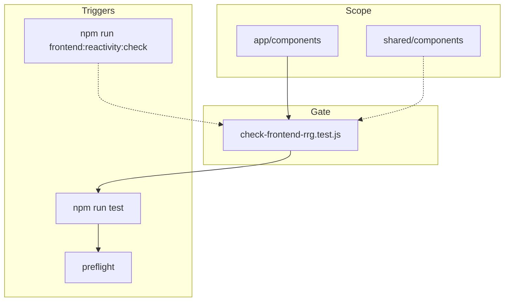

<!-- Важно: оставлять пустую строку перед "---" ! -->

# AIS: Контур Reactive Reliability Gate (RRG)

<!-- Спецификации (AIS) пишутся на русском языке. Микро-правила — в скилле id:sk-318305 (app/skills/ui-architecture.md). -->

## Идентификация и жизненный цикл

- id:ais-c4e9b2 — устойчивый идентификатор для ссылок из скиллов, планов и гейтов.
- status: incomplete (фазы 0–5 плана выполнены: гейт, скрипт, preflight, cursor-правило, causality #for-rrg-contour, index-ais).
- Связанные артефакты: скилл id:sk-318305, id:sk-a17d41 (core/skills/state-events.md), id:ais-c6c35b (docs/ais/ais-frontend-ui.md). План модернизации RRG выполнен и дистиллирован в настоящий AIS; лог удаления: id:doc-del-log (docs/deletion-log.md).

## Концепция (High-Level Concept)

**Reactive Reliability Gate (RRG)** — контракт надёжности реактивного слоя фронтенда: единый источник состояния, дисциплина мутаций через store, запрет прямой мутации `window` и небезопасной работы с DOM в компонентах. Цель — предсказуемый порядок рендера и отсутствие «тихих» нарушений реактивности при изменениях кода или при правках ИИ-агентами.

Ключевые принципы контура:

1. **Single State Source** — состояние в Vue-реактивности (`appStore`, core/state, messages store); не дублировать в нескольких местах.
2. **Mutation Discipline** — мутации только через явные сеттеры стора; не синхронизировать вручную две переменные вместо `computed`.
3. **No direct window mutation in components** — в коде компонентов запрещена прямая запись в `window.*` (кроме явно разрешённых паттернов регистрации).
4. **No unsafe DOM mutation in components** — присвоение `innerHTML` в компонентах запрещено (XSS и обход реактивности).
5. **Async contracts** — у fetch/debounce явные переходы loading/error.

Архитектура no-build и загрузка через #JS-xj43kftu (`core/module-loader.js`) предполагают **разовую регистрацию** компонентов и утилит на `window` при загрузке скрипта — это не считается нарушением RRG, если оформлено как `window.X = { ... }` или `window.X = function ...`.

## Инфраструктура и потоки данных (Infrastructure & Data Flow)

- **Область проверки (актуально):** app/components и shared/components (файлы *.js, *.mjs). Не сканируются app/templates и shared/templates (innerHTML в #JS-ZP2M2QVZ postgres-settings-template.js — регистрация Vue-шаблона).
- **Триггеры:** `npm run frontend:reactivity:check` (отдельная команда); `npm run test` (premerge/CI); preflight — шаг 6, вызов `npm run frontend:reactivity:check` (при падении exit(1)).
- **Скрипт:** В package.json зарегистрирован `frontend:reactivity:check` → `node --test` #JS-Yn27TZUx (check-frontend-rrg.test.js).

## Правила гейта (текущая реализация)

Гейт: #JS-Yn27TZUx. Константа RRG_SCAN_DIRS: app/components, shared/components; app/templates и shared/templates не входят (innerHTML в #JS-ZP2M2QVZ postgres-settings-template.js — регистрация Vue-шаблона).

| Правило | Проверка | Исключения |
|--------|----------|------------|
| **RRG-1** | Нет прямой мутации `window.*` в компонентах | Регистрация: `window.X = { ... }`, `window.X = function ...`, `window.X = X` (одинаковый идентификатор слева и справа); строка содержит `window.consoleInterceptor` или `window.location`. |
| **RRG-2** | Нет присвоения `innerHTML` в компонентах | Нет (любое `.innerHTML =` — нарушение). |

Проверка построчная, без AST. Вложенные мутации и косвенные присвоения не детектируются. Исключение `window.X = X` (одинаковый идентификатор слева и справа) покрывает регистрацию в #JS-su4917p5 system-message.js и #JS-Gn38YPCx system-messages.js (shared/components/).

## Локальные политики (Module Policies)

- Все новые и затрагиваемые при рефакторинге файлы в `app/components` и (после расширения) в `shared/components` не должны вводить нарушений RRG-1 и RRG-2.
- Единственное допустимое присвоение `window` в компонентном коде — разовая регистрация в конце файла в виде `window.ComponentName = { ... }` или `window.utilName = function ...`. Остальные мутации `window` (примитивы, переменные) — нарушение.
- Файлы вне области проверки (например #JS-yx22mAv8 `app/app-ui-root.js`, `app/templates/*.js`, `core/`, `is/`) формально не проходят RRG-тест. При расширении скана на app/templates или shared/templates потребуются точечные исключения: #JS-EsMQyEpA file-header-template.js — `window.FILE_HEADER_TEMPLATE_REF`; #JS-ZP2M2QVZ postgres-settings-template.js — innerHTML для вставки Vue-шаблона (либо рефакторинг регистрации без innerHTML).

## Инвентарь мест с «кастомной» реактивностью

### 1. Регистрация компонентов и утилит на `window` (разрешённый паттерн)

Присвоение в конце файла вида `window.X = { ... }` или `window.X = function ...` — явное исключение в тесте.

**app/components/** (регистрация Vue-компонентов приложения):

| ID | Файл | Идентификатор на window |
|------|------|-------------------------|
| #JS-Cu2wz595 | app-header.js | window.appHeader |
| #JS-zB467gvM | app-footer.js | window.appFooter |
| #JS-Jd4ASwEo | auth-button.js | window.authButton |
| #JS-u72ZSLqH | ai-api-settings.js | window.aiApiSettings |
| #JS-xNN9FxKB | postgres-settings.js | window.postgresSettings |
| #JS-8j2Hez4u | portfolios-manager.js | window.portfoliosManager |
| #JS-uD33Z1qP | modal-example-body.js | window.modalExampleBody |
| #JS-nr238Xj2 | timezone-modal-body.js | window.timezoneModalBody |
| #JS-BX21fe7h | portfolio-modal-body.js | window.portfolioModalBody |
| #JS-dc3EKYZn | portfolio-form-modal-body.js | window.portfolioFormModalBody |
| #JS-9oNFE9kB | portfolio-view-modal-body.js | window.portfolioViewModalBody |
| #JS-Vz2p3xSA | storage-reset-modal-body.js | window.storageResetModalBody |
| #JS-WK5L8WFt | icon-manager-modal-body.js | window.cmpIconManagerModalBody |
| #JS-W23K9iSC | coin-set-load-modal-body.js | window.coinSetLoadModalBody |
| #JS-YR467bUb | coin-set-save-modal-body.js | window.coinSetSaveModalBody |
| #JS-Ri3c3bMt | portfolios-import-modal-body.js | window.portfoliosImportModalBody |
| #JS-VNDFUVK2 | session-log-modal-body.js | window.sessionLogModalBody |
| #JS-pZ2DyWkj | auth-modal-body.js | window.authModalBody |
| #JS-AjyFAjvh | coingecko-cron-history-modal-body.js | window.coingeckoCronHistoryModalBody |
| #JS-Nz32oDKA | missing-coins-modal-body.js | window.missingCoinsModalBody |

**shared/components/** (общие Vue-компоненты):

| ID | Файл | Идентификатор на window |
|------|------|-------------------------|
| #JS-5n33791x | button.js | window.cmpButton |
| #JS-Y3asmXzP | dropdown.js | window.cmpDropdown |
| #JS-Tm2EL8Pw | dropdown-menu-item.js | window.cmpDropdownMenuItem |
| #JS-Na3ZaWJk | button-group.js | window.cmpButtonGroup |
| #JS-hf3mDcdq | combobox.js | window.cmpCombobox |
| #JS-HF48eDDR | modal.js | window.cmpModal |
| #JS-r8Uair5H | modal-buttons.js | window.cmpModalButtons |
| #JS-X32EmWyq | timezone-selector.js | window.cmpTimezoneSelector |
| #JS-su4917p5 | system-message.js | window.cmpSystemMessage |
| #JS-Gn38YPCx | system-messages.js | window.cmpSystemMessages |
| #JS-ed2z5Mao | cell-num.js | window.cmpCellNum |
| #JS-L22cnWGC | sortable-header.js | window.cmpSortableHeader |
| #JS-2d36obxo | coin-block.js | window.cmpCoinBlock |

**shared/utils/** (утилиты, загружаемые до Vue):

| ID | Файл | Идентификатор на window |
|------|------|-------------------------|
| #JS-9m2N115w | hash-generator.js | window.hashGenerator |
| #JS-1oAiR1jy | auto-markup.js | window.autoMarkup |
| #JS-mczTXmZo | pluralize.js | window.pluralize |
| #JS-492QR3zK | class-manager.js | window.classManager |
| #JS-Vn377WRx | column-visibility-mixin.js | window.columnVisibilityMixin |
| #JS-pw26xFm7 | layout-sync.js | window.layoutSync |
| #JS-1Ccp719R | messages-store.js | window.AppMessages, window.messagesStore |

**core / app (вне текущей области теста):**

| ID | Файл | Идентификатор на window | Примечание |
|------|------|-------------------------|------------|
| #JS-os34Gxk3 | core/modules-config.js | window.modulesConfig | Конфиг загрузчика |
| #JS-yx22mAv8 | app/app-ui-root.js | window.appRoot, window.appInit | Инициализация приложения (не сканируется тестом) |
| #JS-EsMQyEpA | shared/templates/file-header-template.js | window.FILE_HEADER_TEMPLATE_REF = true | Примитив — при расширении теста потребуется исключение |

### 2. Чтение с `window` (не мутация, RRG не запрещает)

Компоненты и утилиты обращаются к: `window.Vue`, `window.bootstrap`, `window.classManager`, `window.hashGenerator`, `window.tooltipsConfig`, `window.modalsConfig`, `window.layoutSync`, `window.AppMessages`, `window.messagesTranslator`, `window.messagesConfig`, `window.appConfig`, `window.matchMedia`, прочим зарегистрированным объектам. Это допустимо.

### 3. Реактивное состояние (store / state)

| ID | Расположение | Назначение |
|------|--------------|------------|
| #JS-RX2UHzMh | core/state/ui-state.js | Флаги загрузки, язык тултипов, метаданные кэша |
| #JS-id3oaqeo | core/state/auth-state.js | OAuth-сессия, токен, статус входа |
| #JS-gH2qNvcT | core/state/loading-state.js | Индикаторы загрузки по операциям |
| #JS-1Ccp719R | shared/utils/messages-store.js | Реактивный store сообщений (Vue.reactive или fallback), API: push, dismiss, clear |
| #JS-yx22mAv8 | app/app-ui-root.js | Корневой компонент, глобальные флаги темы/языка |

Мутации только через сеттеры соответствующих модулей; компоненты не мутируют состояние напрямую.

### 4. Использование innerHTML

| ID | Файл | Контекст | В зоне RRG-теста? |
|------|------|----------|--------------------|
| #JS-ZP2M2QVZ | app/templates/postgres-settings-template.js | Вставка `<script type="text/x-template">` для Vue | Нет (область теста: app/components и shared/components; app/templates не входит) |
| #JS-oi2C6djt | is/cloudflare/edge-api/src/auth.js | Страницы колбэка OAuth (не Vue) | Нет |
| #JS-ry3942o9 | is/V2_logic.js | Legacy UI, не компоненты Vue | Нет |

При расширении области проверки на `app/templates/` для #JS-ZP2M2QVZ postgres-settings-template.js потребуется исключение (шаблонная регистрация) или замена способа регистрации шаблона.

### 5. Исключения в коде теста

- Строки с `window.consoleInterceptor` и `window.location` не считаются нарушением RRG-1 (специальные случаи окружения/навигации).

## Компоненты и контракты (Components & Contracts)

| Компонент | Путь | Назначение |
|-----------|------|------------|
| RRG-тест | #JS-Yn27TZUx | RRG-1 и RRG-2; RRG_SCAN_DIRS: app/components, shared/components |
| Скилл UI Architecture | id:sk-318305 | Правила RRG, scope, enforcement commands |
| Скилл State & Events | id:sk-a17d41 | Дисциплина мутаций, связь с RRG |
| Preflight | #JS-NrBeANnz (is/scripts/preflight.js) | Шаг 6: вызов frontend:reactivity:check |
| Cursor rule | .cursor/rules/global-rules/rrg-frontend.mdc | RRG при правках app/, shared/components/; globs: app/**/*.js, shared/components/**/*.js |
| Causality registry | id:sk-3b1519 (is/skills/causality-registry.md) | Хеш #for-rrg-contour для @causality/@skill-anchor при ссылке на контур RRG |
| Index AIS | id:docidx-3022eb (docs/index-ais.md) | Генерируется в preflight (generate-index-ais.js) из docs/ais/; id:ais-c4e9b2 входит в индекс |
| Module loader | #JS-xj43kftu (module-loader.js) | Порядок загрузки, window.modulesConfig |
| Modules config | #JS-os34Gxk3 (modules-config.js) | Зависимости и порядок скриптов |

## Ссылки

- Скилл: id:sk-318305
- Скилл State: id:sk-a17d41
- Causality registry: id:sk-3b1519 — хеш #for-rrg-contour
- Индекс AIS: id:docidx-3022eb (содержит id:ais-c4e9b2)
- Тест: #JS-Yn27TZUx
- План модернизации RRG выполнен и дистиллирован в настоящий AIS; лог удаления: id:doc-del-log

