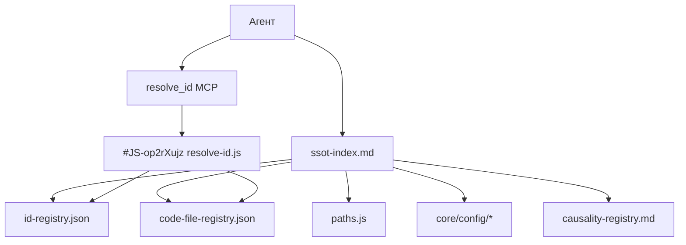

<!-- Важно: оставлять пустую строку перед "---" ! -->
<!-- План внедрения: id:plan-7f8e9d (docs/plans/ssot-contract-plane-rollout.md) -->

# AIS: Плоскость контрактов SSOT (SSOT Contract Plane)

<!-- Спецификации (AIS) пишутся на русском языке. -->

## Терминология

**Плоскость (Plane)** — по id:docs-glossary: логическое пространство с единой ответственностью. SSOT Contract Plane — плоскость, где живут все канонические реестры и контракты. Не слой (вертикальная иерархия), не контур (замкнутый цикл данных), а cross-cutting логическое пространство.

## Разграничение: Contract Plane vs Runtime SSOT

| Тип | Где | Пример |
|-----|-----|--------|
| **Contract Plane SSOT** | `is/contracts/`, реестры, core/config | paths.js, id-registry.json, causality-registry.md |
| **Runtime SSOT** | domain-specific, браузерный runtime | #JS-iH2gWJeT (policies.js) — TTL, intervals для cache/request-registry |

Contract Plane — статические контракты, версионируемые в git. Runtime SSOT — политики, загружаемые в `window.ssot` при старте приложения. Данный AIS описывает только Contract Plane.

## Концепция (High-Level Concept)

ИИ-агенты и разработчики должны быстро находить, где лежит правда по любому домену: пути, конфигурация, идентификаторы документов, хеши кода, казуальность. Сейчас SSOT разбросан по skills, config-contracts, комментариям. Нет единого индекса; команда `ЕИП` не формализована в скрипт; Mixed Reference Mode требует явного resolve.

**Цель:** Сделать работу с SSOT прозрачной, простой и быстрой: один индекс → один resolve → один гейт.

## Инфраструктура и Потоки данных (Infrastructure & Data Flow)

**Реализовано (2026-03-08):** ssot-index.md (id:ssotidx-7f8e9d) создан; validate-ssot (#JS-gs3VQRd3) вызывается в preflight (шаг 2.5); mixed-reference-mode и memory-protocol обновлены; config-contracts ссылается на ssot-index. Preflight проходит.

## Локальные Политики (Module Policies)

- **Один индекс:** Агент ищет SSOT только через `is/contracts/docs/ssot-index.md`. id:sk-02d3ea (config-contracts) остаётся специализированным для `core/config/` и ссылается на ssot-index для полного индекса.
- **Resolve обязателен:** Bare `id:` → id-registry.json; bare `#JS-xxx` → code-file-registry.json. MCP `resolve_id` или прямое чтение реестров.
- **Memory MCP ≠ SSOT:** см. раздел ниже.
- **ЕИП scope:** Текущие проверки (paths↔env, docs≠skills, секреты, заголовки skills). Hardcoded paths scan **пока не включаем** — много false positives, требует настройки исключений.

## Memory MCP ≠ SSOT

**Аргументы:**
- Memory хранит ArchDecision, MigrationState, AgentAgreement — решения и договорённости. SSOT — канонические реестры (пути, id, хеши, конфиги).
- Memory — граф в отдельном хранилище; SSOT — файлы в `is/contracts/`, JSON, markdown.
- Memory обновляется при решениях; SSOT — при изменении путей, конфигов, реестров.
- Доступ: Memory — `search_nodes`, `read_graph`; SSOT — `resolve_id`, чтение файлов.

**Результат разделения:**
- Предсказуемость: агент знает, куда идти за SSOT (ssot-index, resolve_id).
- Надёжность: SSOT не зависит от Memory; при сбое Memory пути и id остаются в файлах.
- Меньше галлюцинаций: агент не «придумывает» SSOT из Memory.

**Правило для memory-protocol:** SSOT — в `is/contracts/` и реестрах. Агент не ищет SSOT через search_nodes. Для SSOT: ssot-index + resolve_id.

## Компоненты и Контракты (Components & Contracts)

### Текущие (as-is)

| Домен | SSOT | Путь |
|------|------|------|
| Пути | paths.js | is/contracts/paths/paths.js |
| Path validation | path-contracts.js | is/contracts/path-contracts.js |
| Префиксы | prefixes.js | is/contracts/prefixes.js |
| Doc ids | id-registry.json | is/contracts/docs/id-registry.json |
| Code hashes | code-file-registry.json | is/contracts/docs/code-file-registry.json |
| Resolve | resolve-id.js | is/contracts/docs/resolve-id.js |
| Казуальность | causality-registry.md | is/skills/causality-registry.md |
| Конфигурация | core/config/* | core/config/ |
| Env | .env.example | .env.example |
| Runtime policies | core/ssot/policies.js | core/ssot/ (вне Contract Plane) |

### Реализованные артефакты

| Артефакт | Назначение |
|----------|------------|
| ssot-index.md (id:ssotidx-7f8e9d) | Единый индекс: домен → SSOT-файл → описание |
| validate-ssot.js | paths↔env, docs≠skills, секреты, заголовки; вызов в preflight шаг 2.5 |
| process-plan-execution (id:sk-8f9e0d) | Протокол выполнения планов: verify → update AIS → fix bugs |

### config-contracts vs ssot-index

- **config-contracts** (id:sk-02d3ea): специализирован для `core/config/` — структура, правила, Zod. Ссылка в начале: «Полный индекс SSOT: is/contracts/docs/ssot-index.md (id:ais-7f8e9d)».
- **ssot-index**: единый индекс всех SSOT; config-contracts не дублирует полную таблицу.

## Связи с архитектурой

| Артефакт | Связь |
|----------|-------|
| id:ais-8982e7 (docs-governance) | id-registry, path-contracts; mixed reference mode |
| id:ais-8d3c2a (mcp-data-flow) | id-registry, code-file-registry, causality-registry — MCP читает напрямую |
| id:ais-9f4e2d (anti-staleness) | validate-skills, validate-causality; preflight chain |
| id:sk-02d3ea (config-contracts) | core/config/ governance; добавить ссылку на ssot-index |
| id:sk-87700e (commands) | ЕИП — контракт проверок; формализация в validate-ssot |
| is/contracts/README.md | Точка входа: ssot-index |
| preflight.js | validate-ssot вызывается на шаге 2.5 (после env, до skills) |

## Контракты и гейты

- #JS-gs3VQRd3 (validate-ssot.js) — текущие проверки; расширить под ЕИП; включить в preflight.
- #JS-op2rXujz (resolve-id.js) — SSOT resolver для id: и #hash.
- MCP `resolve_id` (#JS-v1JRkux7) — использует resolve-id.js.

## Лог перепривязки путей (Path Rewrite Log)

| Legacy path | Риск | New path / rationale |
|-------------|------|----------------------|
| — | — | Нет legacy-путей |
