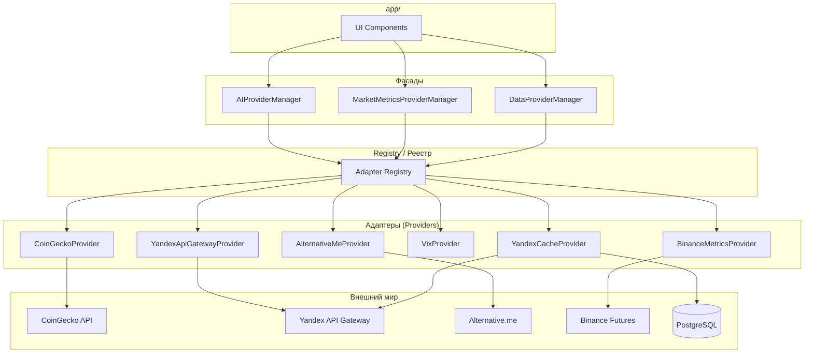

# AIS: Единая система адаптеров (Unified Adapter System)

<!-- Черновик. Требует обсуждения. Спецификации (AIS) пишутся на русском языке. -->

## Идентификация и жизненный цикл

```yml
id: ais-d8e7f6
status: draft
last_updated: "2026-03-11"
related_skills:
  - sk-224210
  - sk-bb7c8e
  - sk-3c832d
related_ais:
  - ais-71a8b9
  - ais-3732ce
  - ais-e41384
```

**Статус:** `incomplete` — план id:plan-a9b2c4 утверждён и выполняется; спецификация обновляется по шагам реализации.

## Концепция (High-Level Concept)

Единая система адаптеров объединяет все интеграции с внешним миром (API, БД) под общими принципами:

1. **Adapter (Provider)** — инкапсулирует transport + нормализацию форматов к внутренним контрактам (docs/glossary.md).
2. **Registry** — центральная точка разрешения провайдера по домену/ключу.
3. **Connection-слой** — опциональная инъекция для тестирования (Test Double).
4. **Failover Policy** — переключение при деградации primary; circuit breaker per provider.

Существующие фасады (`DataProviderManager`, `AIProviderManager`) уже реализуют часть паттерна. Спецификация формализует расширение на домены market-metrics, Yandex API Gateway, N8N, PostgreSQL.

## Инфраструктура и Потоки данных (Infrastructure & Data Flow)



### Домены адаптеров

| Домен | Фасад | Провайдеры | Статус |
|-------|-------|------------|--------|
| Coin data | DataProviderManager | CoinGecko, YandexCache | Реализовано |
| Market metrics | MarketMetricsProviderManager | AlternativeMe, YahooVix, StooqVix, AlphaVantageVix, Binance, CoinGecko (BTC dom) | **Этап 1 реализован** |
| Yandex API Gateway | YandexApiGatewayProvider | cycles, trigger | **Этап 2 реализован** |
| AI | AIProviderManager | Yandex, OpenRouter, Groq, … | Реализовано |
| N8N | — | webhooks | **Требует N8nProvider** |
| PostgreSQL | PostgresAdapter | Yandex Functions (`api-gateway`, `market-fetcher`) | **Этап 4 реализован** |

## Локальные Политики (Module Policies)

1. **No direct fetch in components** — UI не вызывает `fetch` напрямую для рыночных данных. Все запросы через фасад (id:sk-224210).
2. **Normalization in adapter** — все провайдеры нормализуют ответы к внутренним схемам; inline-парсинг в сервисах запрещён.
3. **Connection injection** — провайдеры принимают опциональный `connection` (fetch-подобная функция) в конструкторе для тестов.
4. **Circuit breaker per provider** — сбой одного провайдера не влияет на health-статус других.
5. **Registry policies** — rate limit, timeout, allowlist хранятся в конфиге реестра, не в коде провайдера.
6. **Adapter mandatory for new integrations** — каждая новая интеграция с внешней системой (API, БД) MUST иметь выделенный адаптер. Прямой `fetch`/`client.query` в сервисах или компонентах запрещён. `@causality #for-adapter-mandatory`
7. **Fallback stays in facade** — multi-source fallback (пример: VIX через Yahoo/Stooq/Alpha Vantage) оркестрируется `MarketMetricsProviderManager`, а не скрывается внутри одного провайдера.

## Компоненты и Контракты (Components & Contracts)

| Компонент | Путь | Ответственность |
|-----------|------|-----------------|
| DataProviderManager | core/api/data-provider-manager.js | Фасад coin data |
| BaseDataProvider | core/api/data-providers/base-provider.js | Базовый контракт coin data |
| BaseMarketMetricsProvider | core/api/market-metrics-providers/base-provider.js | Базовый контракт market metrics |
| MarketMetricsProviderManager | core/api/market-metrics-provider-manager.js | Фасад market metrics, fallback, cache, request registry |
| AlternativeMeProvider | core/api/market-metrics-providers/alternative-me-provider.js | FGI adapter |
| YahooVixProvider | core/api/market-metrics-providers/yahoo-vix-provider.js | Primary VIX adapter |
| StooqVixProvider | core/api/market-metrics-providers/stooq-vix-provider.js | Secondary VIX adapter |
| AlphaVantageVixProvider | core/api/market-metrics-providers/alpha-vantage-vix-provider.js | Tertiary VIX adapter |
| BinanceMetricsProvider | core/api/market-metrics-providers/binance-metrics-provider.js | OI / FR / LSR adapter |
| CoinGeckoBtcDomProvider | core/api/market-metrics-providers/coingecko-btc-dom-provider.js | BTC dominance adapter |
| YandexApiGatewayProvider | core/api/yandex-api-gateway-provider.js | cycles history + manual trigger adapter |
| PostgresAdapter | is/yandex/functions/shared/postgres-adapter.js | Shared pg.Client adapter for Yandex Functions |
| market-metrics.js | core/api/market-metrics.js | Совместимый browser facade над `MarketMetricsProviderManager` |
| market-metrics-providers-config.js | core/config/market-metrics-providers-config.js | SSOT для metric routing, timeout и endpoint order |
| causality-registry | is/skills/causality-registry.md | #for-data-provider-interface, #for-dual-channel-fallback |

## Казуальности (Causality Links)

| Hash | Применение |
|------|------------|
| `#for-data-provider-interface` | Единый интерфейс провайдеров |
| `#for-dual-channel-fallback` | Primary + fallback |
| `#for-readonly-fallbacks` | Fallback не пишет в SSOT |
| `#for-fail-fast` | Валидация на границе |
| `#for-rate-limiting` | Throttling в провайдерах |
| `#for-validation-at-edge` | Схема перед расчётами |
| `#for-partial-failure-tolerance` | Частичный успех при сбоях |
| `#for-composition-root` | Сборка в app-ui-root |
| `#for-adapter-mandatory` | Каждая новая внешняя интеграция — свой адаптер |
| `#for-local-runtime-disposable` | `data/mcp.sqlite*` не блокирует unrelated implementation work |

## Контракты и гейты

- #JS-Hx2xaHE8 (validate-docs-ids.js) — валидация id и связей
- #JS-QxwSQxtt (validate-skill-anchors.js) — при добавлении @skill-anchor в новые провайдеры

## Уточняющие вопросы (из плана)

См. id:plan-a9b2c4 § Уточняющие вопросы. Q1–Q5 приняты; политика #for-adapter-mandatory зафиксирована.

## Завершение / completeness

- Этапы 1, 2 и 4 реализованы; далее остаются N8N/GitHub-адаптеры и доведение cross-domain registry/health-policy до полного unified state.
- После полной реализации: status `complete`, дистилляция в skills.
