# AIS: Единая система адаптеров (Unified Adapter System)

## Идентификация и жизненный цикл

```yml
id: ais-d8e7f6
status: complete
last_updated: "2026-03-11"
related_skills:
  - sk-224210
  - sk-bb7c8e
  - sk-3c832d
  - sk-7b4ee5
  - sk-7cf3f7
  - sk-8f9e0d
related_ais:
  - ais-71a8b9
  - ais-3732ce
  - ais-e41384
  - ais-775420
```

**Статус:** `complete` — единая система адаптеров реализована и дистиллирована в код, skills и causality-registry; исторический план удалён по протоколу и зафиксирован в id:doc-del-log (docs/deletion-log.md).

## Концепция

Единая система адаптеров нормализует все внешние интеграции к одной архитектурной модели:

1. **Provider / Adapter** инкапсулирует transport и нормализацию ответа к внутреннему контракту.
2. **Facade / Client** предоставляет одному домену стабильный интерфейс и держит orchestration-логику.
3. **Registry** хранит доменные allowlist/order/health-policy правила и не допускает расхождения между фасадами.
4. **Health tracking** фиксирует success/failure/latency per provider и позволяет фасадам понижать деградировавшие адаптеры без скрытой магии в самих провайдерах.

Система покрывает активный браузерный слой `app/`, инфраструктурный слой `is/` и legacy IS-артефакты, оставленные для обратной совместимости.

Эта `AIS` задаёт target state для unified adapter architecture и не обязана повторять текущую реализацию 1:1. Если rollout ещё не завершён, разрыв между этой стратегией и текущим Arch-Scan обязан быть помечен прямо в спецификации и рядом с временной веткой кода.

## Инфраструктура и Потоки данных

```mermaid
flowchart TD
    subgraph Presentation["Presentation Layer"]
        APP[app/ components]
        LEGACY[IS.html + V2_logic.js]
        AUTO[Automation scripts]
    end

    subgraph Facades["Facades / Clients"]
        DPM[DataProviderManager]
        MMPM[MarketMetricsProviderManager]
        AIPM[AIProviderManager]
        CWC[CloudWorkspaceClient]
        CSC[CoinSetsClient]
        V2[V2ApiClient + N8nApiClient]
        GHR[GitHubReleasesProvider]
        YAG[YandexApiGatewayProvider]
        PG[PostgresAdapter]
    end

    subgraph Registry["Registry + Health"]
        ARC[adapter-registry-config.js]
        AR[adapter-registry.js]
        AHT[adapter-health-tracker.js]
    end

    subgraph Providers["Providers / Adapters"]
        YC[YandexCacheProvider]
        CG[CoinGeckoProvider]
        ALT[AlternativeMeProvider]
        YV[YahooVixProvider]
        SV[StooqVixProvider]
        AV[AlphaVantageVixProvider]
        BM[BinanceMetricsProvider]
        CBD[CoinGeckoBtcDomProvider]
        YP[YandexProvider]
    end

    subgraph External["External Systems"]
        YAPIGW[Yandex API Gateway]
        CFGW[Cloudflare Workers API]
        GHAPI[GitHub API]
        N8N[n8n webhooks]
        CGAPI[CoinGecko / Yahoo / Stooq / Binance / Alternative.me]
        PGDB[(PostgreSQL)]
        LOCAL[Local app API]
    end

    APP --> DPM
    APP --> MMPM
    APP --> AIPM
    APP --> CWC
    APP --> CSC
    APP --> YAG
    LEGACY --> V2
    AUTO --> GHR

    DPM --> AR
    MMPM --> AR
    AIPM --> AR
    CWC --> AR
    CSC --> AR
    YAG --> AR
    AR --> ARC
    AR --> AHT

    DPM --> YC
    DPM --> CG
    MMPM --> ALT
    MMPM --> YV
    MMPM --> SV
    MMPM --> AV
    MMPM --> BM
    MMPM --> CBD
    AIPM --> YP
    CWC --> CFGW
    CSC --> CFGW
    YAG --> YAPIGW
    V2 --> N8N
    V2 --> LOCAL
    GHR --> GHAPI
    YC --> YAPIGW
    YC --> PGDB
    PG --> PGDB
    CG --> CGAPI
    ALT --> CGAPI
    YV --> CGAPI
    SV --> CGAPI
    AV --> CGAPI
    BM --> CGAPI
    CBD --> CGAPI
```



## Домены адаптеров

| Домен | Фасад / Client | Провайдеры / Backends | Статус |
|-------|----------------|------------------------|--------|
| Coin data | `DataProviderManager` | `YandexCacheProvider`, `CoinGeckoProvider` | Реализовано |
| Market metrics | `MarketMetricsProviderManager` | `AlternativeMeProvider`, `YahooVixProvider`, `StooqVixProvider`, `AlphaVantageVixProvider`, `BinanceMetricsProvider`, `CoinGeckoBtcDomProvider` | Реализовано |
| AI | `AIProviderManager` | `YandexProvider`; Cloudflare only restores settings/keys and не является вторым AI provider | Реализовано |
| Stateful Cloudflare APIs | `CloudWorkspaceClient`, `CoinSetsClient` | Cloudflare Workers `/api/settings`, `/api/coin-sets` | Реализовано |
| Yandex API Gateway | `YandexApiGatewayProvider` | `cycles`, `market-cache/trigger` endpoints | Реализовано |
| Legacy IS | `V2ApiClient`, `N8nApiClient` | local `/api/*`, n8n webhooks | Реализовано |
| Automation / backlog | `GitHubReleasesProvider` | GitHub Releases API + tag fallback | Реализовано |
| PostgreSQL serverless | `PostgresAdapter` | `pg.Client` inside Yandex Functions | Реализовано |
| Cross-domain policy | `AdapterRegistry` | policy config + health tracker | Реализовано |

Примечание по rollout-gap (`#for-ais-rollout-gap-marking`): домен `Coin data` уже использует `AdapterRegistry` как shared policy/health plane, но provider ordering в `DataProviderManager` пока частично удерживается локально через `preferYandexFirst` / `allowCoinGeckoFallback` ради обратной совместимости startup-path на `file://`. Это не отменяет стратегию AIS; это явно отмечённый переходный зазор до полного выноса order policy в registry.

Примечание по rollout-gap (`#for-ais-rollout-gap-marking`): часть presentation-layer admin/settings flows всё ещё держит прямой transport в компонентах вместо вынесенного facade/client слоя. Это касается Cloudflare settings sync, icon-management proxy/GitHub upload и chunk push в market-cache. Для этой временной совместимости target-state policy `No direct transport in components` не отменяется; отклоняющиеся ветки обязаны быть помечены inline-комментариями в коде до завершения выноса transport в adapters/facades.

## Политики модуля

1. **No direct transport in components** — UI-компоненты и orchestration-скрипты не держат raw `fetch`/`client.query` для внешнего мира.
2. **Normalization in adapter** — преобразование внешнего payload в внутренний контракт выполняется в адаптере/провайдере, не в компоненте и не в фасаде.
3. **Fallback stays in facade** — multi-source fallback и downgrade-order принадлежат фасаду (`DataProviderManager`, `MarketMetricsProviderManager`, `V2ApiClient`), не отдельному провайдеру.
4. **Registry policies are SSOT** — order, allowlist и health thresholds живут в `core/config/adapter-registry-config.js`, а не рассеиваются по отдельным модулям.
5. **Provider health is shared state** — success/failure/latency считаются в `core/observability/adapter-health-tracker.js`; сами провайдеры остаются fail-fast и stateless.
6. **Endpoint coherence for stateful APIs** — `CloudWorkspaceClient` и `CoinSetsClient` обязаны читать/писать в тот же origin contract, что и auth flow.
7. **Connection injection for tests** — провайдеры принимают fetch/client injection там, где это снижает стоимость тестирования без build-time DI.
8. **Legacy coverage is explicit** — legacy `IS.html` не является активным Presentation Layer, но его transport-слой всё равно должен соответствовать adapter policy, чтобы не плодить второй стандарт.
9. **Browser host APIs must keep receiver semantics** — если адаптер кэширует `fetch`, он обязан bind/wrap browser implementation; raw assignment создаёт browser-only `Illegal invocation`.
10. **Browser runtime smoke is a handoff gate** — после изменений transport/adapters в браузерном слое требуется реальный smoke в `file://` runtime с live refresh representative path.

## Компоненты и Контракты

| Компонент | Путь | Ответственность |
|-----------|------|-----------------|
| `AdapterRegistryConfig` | `core/config/adapter-registry-config.js` | SSOT для domain order, allowlist и health thresholds |
| `AdapterHealthTracker` | `core/observability/adapter-health-tracker.js` | Shared success/failure/latency state |
| `AdapterRegistry` | `core/api/adapter-registry.js` | Unified ordering facade over config + health |
| `DataProviderManager` | `core/api/data-provider-manager.js` | Coin-data facade, dual-channel fallback, request registry |
| `MarketMetricsProviderManager` | `core/api/market-metrics-provider-manager.js` | Multi-provider metrics facade, cache, fallback, request registry |
| `AIProviderManager` | `core/api/ai-provider-manager.js` | AI facade, provider selection, settings restore integration |
| `YandexApiGatewayProvider` | `core/api/yandex-api-gateway-provider.js` | Cycles history + manual trigger adapter |
| `CloudWorkspaceClient` | `core/api/cloudflare/cloud-workspace-client.js` | Stateful workspace gateway to Cloudflare Workers |
| `CoinSetsClient` | `core/api/cloudflare/coin-sets-client.js` | Stateful coin-set gateway to Cloudflare Workers |
| `V2ApiClient` / `N8nApiClient` | `is/v2-api-client.js` | Legacy IS facade over local API and n8n webhook layer |
| `GitHubReleasesProvider` | `is/scripts/infrastructure/github-releases-provider.js` | GitHub release/tag adapter for backlog automation |
| `PostgresAdapter` | `is/yandex/functions/shared/postgres-adapter.js` | Shared `pg.Client` adapter for Yandex Functions |
| `market-metrics-providers-config.js` | `core/config/market-metrics-providers-config.js` | Metric-specific routing, timeout and registry keys |

## Казуальности

| Hash | Применение |
|------|------------|
| `#for-adapter-mandatory` | Каждая внешняя интеграция получает свой adapter/provider |
| `#for-adapter-registry` | Cross-domain registry держит allowlist/order/policy SSOT |
| `#for-provider-health-tracking` | Health tracking живёт в orchestration plane |
| `#for-dual-channel-fallback` | Primary + fallback orchestration |
| `#for-endpoint-coherence` | Stateful read/write/readback не смешивает origin contracts |
| `#for-validation-at-edge` | Адаптер валидирует payload до бизнес-логики |
| `#for-partial-failure-tolerance` | Частичный успех допустим для multi-metric flows |
| `#for-bound-browser-fetch` | Browser transport injection сохраняет receiver semantics у `fetch` |
| `#for-browser-runtime-smoke` | Browser/file:// smoke обязателен после transport refactor |
| `#for-local-runtime-disposable` | Локальные runtime artifacts не блокируют unrelated work |

## Контракты и гейты

- `core/config/adapter-registry-config.js` — contract SSOT для cross-domain adapter policies.
- `is/skills/causality-registry.md` — все `@causality` и reasoning hashes для этой AIS обязаны быть зарегистрированы.
- #JS-Hx2xaHE8 (`validate-docs-ids.js`) — проверяет ids и cross-reference между планом, AIS и skills.
- #JS-QxwSQxtt (`validate-skill-anchors.js`) — проверяет `@skill-anchor` для новых/изменённых adapter-модулей.
- #JS-ww2hRLt7 (`is/scripts/architecture/validate-mixed-reference-mode.js`) — удерживает mixed-reference contract для AIS и skills.

## Завершение

- Все этапы внедрения закрыты; historical execution artifact removed after distillation and logged in id:doc-del-log.
- Архитектурный разрыв между активным `app/` и legacy `IS.html` устранён: оба пути теперь используют adapter/facade pattern.
- Семантический разрыв между proxy-only и direct-first transport формализован в skills: proxy обязателен на `file://`, direct-first допускается только после transport smoke и только для safe public read-only endpoints.
- Дополнительная эксплуатационная политика из практики внедрения: browser transport injection должен сохранять receiver semantics у host API, а handoff по transport-refactor считается завершённым только после реального browser/file runtime smoke.
