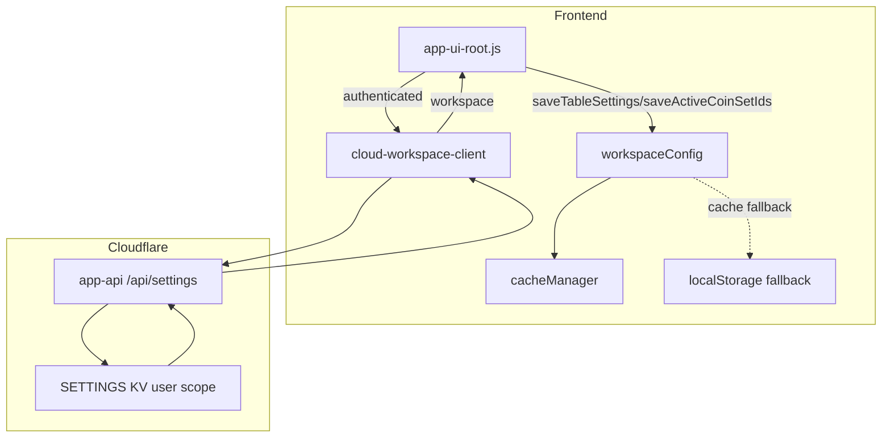

<!-- Важно: оставлять пустую строку перед "---" ! -->

# AIS: Система хранения workspace-настроек (auth/non-auth)

<!-- @causality #for-endpoint-coherence #for-client-ssot-with-cloud-sync -->

## Идентификация и цель

- id: `ais-91b7f4` — спецификация системы хранения (Storage System) и восстановления UI/workspace-настроек.
- Цель: единый, предсказуемый контракт хранения состояния интерфейса в двух режимах:
  1) неавторизованный пользователь (локальный режим),
  2) авторизованный пользователь (облачный режим с привязкой к аккаунту).
- Принцип: live SSOT остаётся на уровне клиента через `workspaceConfig`, а Cloudflare используется как auth-scoped replica и источник восстановления для авторизованной сессии.

## Что входит в workspace

Контракт workspace задается в #JS-fW2M5Jbg (workspace-config.js):

- `activeModelId`
- `activeCoinSetIds`
- `mainTable`:
  - `selectedCoinIds`
  - `selectedCoinKeyMetrics` — map `coinId -> { field, label }` for metric-cell based portfolio selection; сохраняется только для выбранных строк и только для поддерживаемых visible metric fields.
  - `sortBy`
  - `sortOrder`
  - `coinSortType`
  - `showPriceColumn`
- `metrics`:
  - `horizonDays`
  - `mdnHours`
  - `activeTabId`
  - `agrMethod` (поддерживается merge-логикой)

Важно: именно этот объект считается рабочим состоянием экрана и должен быть консистентен между режимами.
Важно: канонический `portfolio` в `workspace` не хранится; portfolio domain и его auth-scoped local/cloud storage описаны в id:ais-6f2b1d.

## Режимы хранения

### 1) Неавторизованный режим (локальный)

Источник данных:

- `workspaceConfig` -> `cacheManager` (primary)
- fallback -> `localStorage['workspaceConfig']`

Сценарии:

- При открытии страницы workspace загружается локально.
- Если `activeCoinSetIds` пустой, таблица грузится в дефолтном режиме (`top`/50).
- Все изменения UI сохраняются через `workspaceConfig.saveWorkspace(...)`.

### 2) Авторизованный режим (облачный)

Источник данных:

- Cloudflare Worker API:
  - `GET /api/settings` (получение `data.workspace`)
  - `PUT /api/settings/workspace` (сохранение workspace)
- KV key scope: user-scoped (через JWT user context в worker).

Сценарии:

- После успешной авторизации:
  - делается snapshot локального pre-auth workspace;
  - выполняется попытка загрузки cloud workspace;
  - если cloud workspace найден — применяется к UI;
  - если cloud workspace отсутствует — локальный snapshot инициализирует облако.
- Во время авторизованной работы:
  - изменения workspace пишутся локально + debounce-синхронизация в облако.

Важно: этот облачный транспорт относится к домену Cloudflare `app-api` и **не** должен путаться с Yandex `coins-db-gateway`, который обслуживает рыночные данные и PostgreSQL transport.

## Архитектурный поток (SSOT + sync)

## Контракты компонентов и модулей

### `core/config/workspace-config.js`

- Локальный SSOT для структуры workspace.
- Частичные обновления через merge без потери остальных полей.
- Fallback-поведение при ошибках cacheManager.
- `localStorage` используется как resilience fallback, а не как параллельный обязательный primary path на каждом сохранении.
- `selectedCoinKeyMetrics` нормализуется вместе с `selectedCoinIds`: если строка снята с выбора или активная модель больше не поддерживает этот field, запись должна быть удалена до сохранения workspace.

### `core/api/cloudflare/cloud-workspace-client.js`

- Транспорт workspace в Cloudflare.
- Важно: для workspace используется workers base URL (`app-api`) как primary endpoint.
- `cloud-workspace-client` должен оставаться в том же transport-домене, что и auth/settings.
- Замена этого транспорта на `coins-db-gateway` без migration-контракта нарушит endpoint coherence.
- API:
  - `load(): Promise<Object|null>`
  - `save(workspaceObj): Promise<boolean>`

### `is/cloudflare/edge-api/src/settings.js`

- Белый список `normalizeSettings(...)` включает `workspace`.
- Поддержаны:
  - `GET /api/settings`
  - `PUT /api/settings/:key` (для `workspace`)

### `app/app-ui-root.js`

- Login flow:
  - snapshot pre-auth workspace;
  - `_loadCloudWorkspace()`;
  - apply cloud workspace в `workspaceConfig` и UI.
- Logout flow:
  - восстановление pre-auth workspace (локального состояния ПК до логина).
- Startup flow:
  - проверка auth status;
  - если сессия авторизована на старте, подгрузка cloud workspace.
- Debounce save:
  - `workspaceConfig` остаётся источником чтения;
  - `cloudWorkspaceClient.save(...)` получает уже нормализованный workspace из `workspaceConfig`, а не сырой UI state.

### `app/components/auth-modal-body.js`

- Успешный login/logout callback обрабатывается await-цепочкой (без гонки callback->apply).

## Матрица поведения

| Сценарий | Ожидаемое поведение |
|---|---|
| Гость, первый вход | Локальный workspace из cacheManager/localStorage |
| Гость меняет UI | Сохранение только локально |
| Login, cloud пуст | Локальный snapshot инициализирует cloud workspace |
| Login, cloud заполнен | Cloud workspace применяется сразу в таблицу |
| Авторизован, меняет UI | Локально + debounce save в cloud |
| F5 в авторизованной сессии | Восстановление cloud workspace |
| Logout | Возврат к pre-auth локальному workspace |
| Login после logout на том же ПК | Возврат cloud workspace пользователя |

## Критичные нюансы и инварианты

1. Нельзя использовать разные origins для auth-flow и workspace settings без явного контракта миграции.
2. `workspace` должен быть в allowlist backend-normalizer, иначе данные silently теряются.
3. `app-ui-root` должен явно зависеть от `cloud-workspace-client` в module graph.
4. Применение cloud workspace и восстановление pre-auth workspace должны быть idempotent.
5. Локальный SSOT не отключается: cloud — это источник восстановления для auth-режима, но клиент продолжает жить через `workspaceConfig`.
6. `workspace` относится к Cloudflare transport domain; `coins-db-gateway` не является корректным backend для этого feature.

## Наблюдаемость и диагностика

Минимальные признаки корректной работы:

- после login таблица отражает `activeCoinSetIds` из cloud workspace;
- после F5 в авторизованной сессии состав монет сохраняется;
- после logout таблица возвращается к pre-auth локальному набору;
- при следующем login cloud-набор снова применяется.

## Ограничения текущей реализации

- Синхронизация cloud workspace привязана к debounce и event-path в UI, не транзакционна.
- При недоступности API пользователь продолжает работать локально (degraded mode).
- Конфликт-резолвинг между несколькими устройствами — last-write-wins на стороне KV.
- При logout/login консистентность зависит от корректного восстановления pre-auth snapshot и endpoint coherence между auth и settings transport.

## Почему реализация устроена именно так

### `#for-client-ssot-with-cloud-sync`

`workspace` влияет на живое состояние экрана, должно переживать degraded mode и должно корректно возвращаться после logout. Поэтому live SSOT остаётся в `workspaceConfig`, а облако играет роль:

- auth-scoped replica,
- recovery source,
- transport для multi-session continuity.

Если бы cloud storage стал единственным live SSOT, UI получил бы лишнюю зависимость от network/auth availability для базовых локальных действий.

### `#for-endpoint-coherence`

Auth и workspace обязаны разделять один transport domain. В текущей реализации это Cloudflare Worker `app-api`.

Причина:

- JWT/user context резолвится в том же backend-домене;
- read/write/readback workspace должен видеть один и тот же user scope;
- перенос workspace на `coins-db-gateway` без явной migration policy создаст ложную успешность записей и расхождение readback.

## Рекомендации по эволюции

1. Добавить версионирование workspace (`updatedAt`, `sourceDevice`) для диагностики multi-device конфликтов.
2. Добавить endpoint для атомарного compare-and-set при желании строгой консистентности.
3. Ввести e2e smoke-check:
   - login -> mutate workspace -> F5 -> logout -> login -> assert states.
4. При расширении multi-device сценариев не смешивать workspace conflict-policy с portfolio conflict-policy: для портфелей нормативом остаётся id:ais-6f2b1d, для workspace — этот AIS.

## Ссылки

- Репозиторий (контекст кода): [vscode.dev/github/aoponomarev/mmb/blob/master](https://vscode.dev/github/aoponomarev/mmb/blob/master)
- `core/config/workspace-config.js`
- `core/api/cloudflare/cloud-workspace-client.js`
- `app/app-ui-root.js`
- `app/components/auth-modal-body.js`
- `is/cloudflare/edge-api/src/settings.js`
- id:ais-775420 (docs/ais/ais-infrastructure-integrations.md)
- id:ais-f6b9e2 (docs/ais/ais-integration-strategy-yandex.md)
