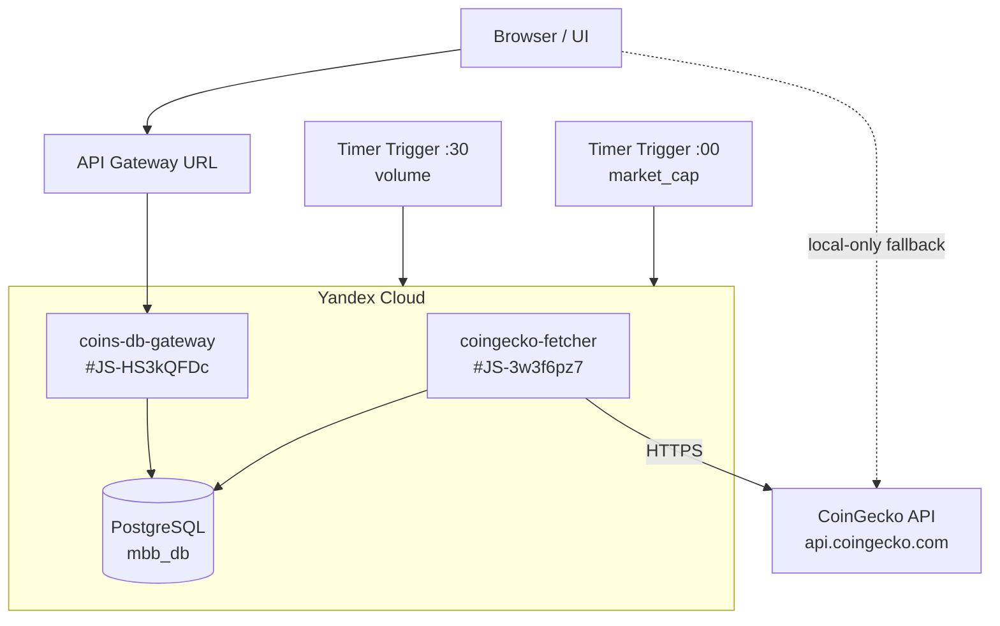

# AIS: Yandex Cloud — Ingest и Read контуры данных монет

<!-- Спецификации (AIS) пишутся на русском языке и служат макро-документацией. Микро-правила вынесены в английские скиллы. Скрыто в preview. -->

## Концепция (High-Level Concept)

Yandex Cloud обеспечивает два контура работы с рыночными данными криптовалют:

1. **Ingest-контур (запись):** Серверные timer-trigger'ы запускают `coingecko-fetcher`, который опрашивает CoinGecko API и записывает результаты в PostgreSQL.
2. **Read-контур (чтение):** Пользователь запрашивает данные через API Gateway / веб-интерфейс; данные читаются из PostgreSQL-кэша через функцию `coins-db-gateway`.
3. **Fallback-политика:** браузерный fallback допускается только для локального чтения/отрисовки. Он не имеет права записывать данные обратно в серверный SSOT.

Это устраняет давление rate-limit на CoinGecko для типичного случая (~350 кэшированных монет) и обеспечивает быструю отдачу для пользователей из РФ/СНГ.

## Инфраструктура и Потоки данных (Infrastructure & Data Flow)

### Верхнеуровневая схема

### Ingest-контур (market-fetcher)

| Этап | Компонент | Описание |
|------|-----------|----------|
| 1 | Yandex Cloud Triggers | `coingecko-fetcher-cron-cap` (`0 * * * ? *`) и `coingecko-fetcher-cron-vol` (`30 * * * ? *`) |
| 2 | #JS-3w3f6pz7 (is/yandex/functions/market-fetcher/index.js) | Один запуск = один запрос top-250: либо `market_cap`, либо `volume` |
| 3 | PostgreSQL (`mbb_db`) | Запись в `coin_market_cache_history` с уникальным `cycle_id`, обновление `coin_market_cache` |

### Read-контур (api-gateway)

| Этап | Компонент | Описание |
|------|-----------|----------|
| 1 | Пользователь / браузер | Запрос через `YandexCacheProvider` |
| 2 | Cloudflare (опционально) | Защита / кэширование |
| 3 | #JS-HS3kQFDc (is/yandex/functions/api-gateway/index.js) | Функция `coins-db-gateway`: чтение из PostgreSQL через `GET /api/coins/market-cache` |
| 4 | PostgreSQL (`mbb_db`) | Выборка из `coin_market_cache` |

## Локальные Политики (Module Policies)

### Дневное окно (Time Window Gate)

Фетчер работает **только с 06:00 до 24:00 по Москве** (Europe/Moscow, UTC+3).  
Вне окна функция возвращает `200 OK` с `status: SKIPPED`.  
Код в `market-fetcher` — это gate на уровне приложения; cron в Yandex Cloud остаётся без изменений.

### Ротация циклов

- Каждый запуск создаёт уникальный `cycle_id = YYYYMMDDHHMMSS`.
- Так как `market_cap` и `volume` теперь собираются разными trigger'ами, в истории хранятся **4 последних** цикла, чтобы сохранялась короткая видимость по двум последним парам запусков.

### Секреты

- Секреты не хранятся в репозитории.
- Фактические значения — вне репозитория (локальное хранилище или переменные окружения Yandex Cloud).

### Граница production-базы данных

- Для данного контура operational SSOT на стороне Yandex Cloud — PostgreSQL база `mbb_db`, доступ к которой функции получают через env-переменные активной версии cloud function.
- Локальные legacy-значения вида `app_db` / `app_admin` в старых примерах, README или default-константах не являются authoritative для production и не должны использоваться для redeploy без явной миграции.
- Перед redeploy любой Yandex Cloud function нужно читать env текущей активной версии и сохранять её контракт, если migration не заявлена отдельно.

## Компоненты и Контракты (Components & Contracts)

### market-fetcher (CoinGecko → PostgreSQL)

| Параметр | Значение |
|----------|----------|
| Runtime | nodejs18 |
| Memory | 256 MB |
| Timeout | 600s (10 мин) |
| Trigger model | 2 независимых timer-trigger'а: `:00` для `market_cap`, `:30` для `volume` |
| Chunk | 250 монет × 1 страница = 250 |
| Задержка внутри запуска | отсутствует |

**Переменные окружения:**
- `DB_HOST`, `DB_PORT`, `DB_NAME`, `DB_USER`, `DB_PASSWORD`
- `COINGECKO_API_KEY` (опционально)

**Operational notes:**
- Пустой optional env не должен передаваться в `yc serverless function version create`; если ключ не заполнен, его нужно omit, а не передавать как пустую строку.
- Верификация функции после deploy делается либо через `yc serverless function invoke` для non-HTTP handler shape, либо через downstream API-проверку по реальному transport.

### api-gateway (PostgreSQL → HTTP)

| Параметр | Значение |
|----------|----------|
| Runtime | nodejs18 |
| Timeout | 30s |
| Memory | 256 MB |

**Эндпоинты:**
- `GET /health` — проверка доступности БД
- `GET /api/coins/market-cache` — кэш монет (params: `ids`, `sort`, `limit`, `include_prev`)
- `GET /api/coins/cycles` — метаданные циклов
- `POST /api/coins/market-cache` — запрещён для браузера (`403`), потому что browser fallback не должен записывать в центральный SSOT

### Схема таблиц

| Таблица | Назначение |
|---------|------------|
| `coin_market_cache` | Текущий снимок (latest view) |
| `coin_market_cache_history` | История циклов (с `cycle_id`, `sort_type`, `sort_rank`) |

Ключевые поля `coin_market_cache_history`: `cycle_id`, `coin_id`, `symbol`, `name`, `image`, `current_price`, `market_cap`, `market_cap_rank`, `total_volume`, `pv_1h`..`pv_200d`, `sort_type`, `sort_rank`, `fetched_at`.

## API Contract (Base URL)

`https://d5dl2ia43kck6aqb1el5.k1mxzkh0.apigw.yandexcloud.net`

### GET /api/coins/market-cache

| Param | Type | Default | Description |
|-------|------|---------|-------------|
| `ids` | string | — | Comma-separated coin IDs |
| `sort` | string | `market_cap` | `market_cap` или `volume` |
| `limit` | number | 250 | Max 500 |
| `include_prev` | string | `false` | Если `true`, включает данные предыдущего цикла |

### GET /api/coins/cycles

Возвращает метаданные сохранённых циклов (`cycle_id`, `row_count`, `coin_count`, `started_at`, `finished_at`).

## Deployment & Verification Policy

1. Redeploy `coins-db-gateway` и `coingecko-fetcher` должен сохранять env-контракт активной production-версии, если migration базы не задокументирована отдельно.
2. Для HTTP-gateway функций прямой `yc serverless function invoke` не является полным эквивалентом API Gateway traffic; проверка чтения/запрета записи должна выполняться через реальный base URL.
3. После deploy ingest-контура нужно проверить:
   - ручной invoke `coingecko-fetcher` возвращает `coins_fetched: 250`;
   - `GET /api/coins/market-cache?count_only=true` показывает свежий `fetched_at`;
   - `POST /api/coins/market-cache` возвращает `403`.

## Интеграция с клиентом

- #JS-qz3WnWnA (yandex-cache-provider.js) — провайдер для DataProviderManager.
- `getCoinDataDualChannel()` — сначала PG, затем CoinGecko для недостающих монет.

---

*См. также: id:ais-3732ce (docs/ais/ais-data-pipeline.md), id:runbook-ce96aa (docs/runbooks/data-pipeline-troubleshooting.md).*
