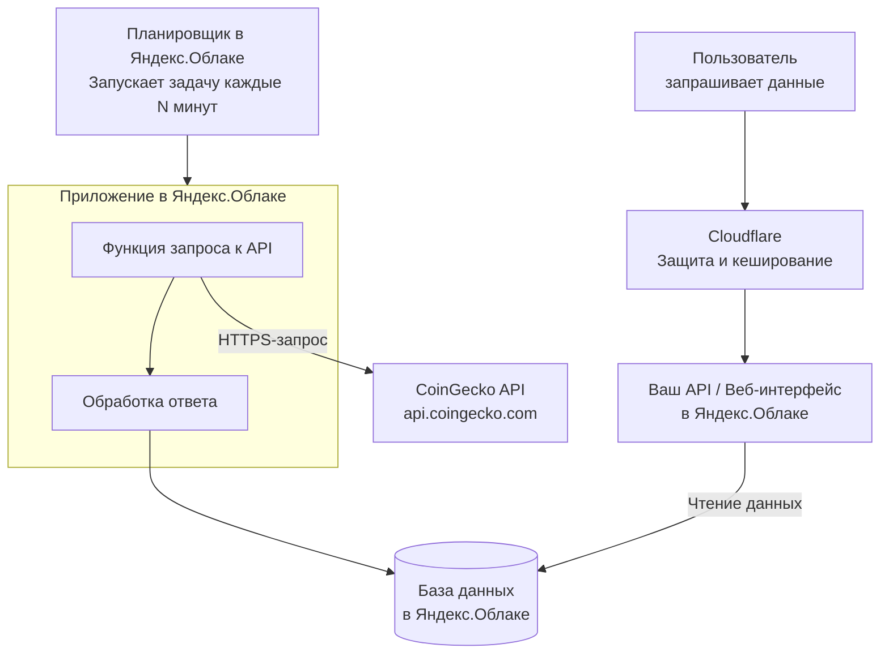

# AIS: Yandex Cloud — Ingest и Read контуры данных монет

> **Спецификации (AIS)** пишутся на **русском языке** и служат макро-документацией. Микро-правила вынесены в английские скиллы.

## 1. Концепция (High-Level Concept)

Yandex Cloud обеспечивает два контура работы с рыночными данными криптовалют:

1. **Ingest-контур (запись):** Серверный cron-планировщик запускает функцию, которая опрашивает CoinGecko API и записывает результаты в PostgreSQL.
2. **Read-контур (чтение):** Пользователь запрашивает данные через API Gateway / веб-интерфейс; данные читаются из PostgreSQL-кэша.

Это устраняет давление rate-limit на CoinGecko для типичного случая (~350 кэшированных монет) и обеспечивает быструю отдачу для пользователей из РФ/СНГ.

## 2. Инфраструктура и Потоки данных (Infrastructure & Data Flow)

### 2.1 Верхнеуровневая схема

### 2.2 Ingest-контур (market-fetcher)

| Этап | Компонент | Описание |
|------|-----------|----------|
| 1 | Yandex Cloud Triggers | Cron `0/15 * * * ? *` — каждые 15 минут |
| 2 | `is/yandex/functions/market-fetcher/index.js` | Функция запрашивает CoinGecko API (топ-250 по market_cap + топ-250 по volume) |
| 3 | PostgreSQL | Запись в `coin_market_cache_history` с уникальным `cycle_id`, обновление `coin_market_cache` |

### 2.3 Read-контур (api-gateway)

| Этап | Компонент | Описание |
|------|-----------|----------|
| 1 | Пользователь / браузер | Запрос через `YandexCacheProvider` |
| 2 | Cloudflare (опционально) | Защита / кэширование |
| 3 | `is/yandex/functions/api-gateway/index.js` | Чтение из PostgreSQL через `GET /api/coins/market-cache` |
| 4 | PostgreSQL | Выборка из `coin_market_cache` |

## 3. Локальные Политики (Module Policies)

### 3.1 Дневное окно (Time Window Gate)

Фетчер работает **только с 06:00 до 24:00 по Москве** (Europe/Moscow, UTC+3).  
Вне окна функция возвращает `200 OK` с `status: SKIPPED`.  
Код в `market-fetcher` — это gate на уровне приложения; cron в Yandex Cloud остаётся без изменений.

### 3.2 Ротация циклов

- Каждый полный цикл (market_cap + volume) создаёт уникальный `cycle_id = YYYYMMDDHHMMSS`.
- В истории хранятся **только 2 последних** цикла.

### 3.3 Секреты

- Секреты не хранятся в репозитории.
- Фактические значения — в `do-overs/Secrets/` или переменных окружения Yandex Cloud.

## 4. Компоненты и Контракты (Components & Contracts)

### 4.1 market-fetcher (CoinGecko → PostgreSQL)

| Параметр | Значение |
|----------|----------|
| Runtime | nodejs18 |
| Memory | 256 MB |
| Timeout | 600s (10 мин) |
| Cron | `0/15 * * * ? *` |
| Chunk | 50 монет × 5 страниц = 250 |
| Задержка | 21s между страницами (публичный API), 2.5s с Demo/Pro ключом |

**Переменные окружения:**
- `DB_HOST`, `DB_PORT`, `DB_NAME`, `DB_USER`, `DB_PASSWORD`
- `COINGECKO_API_KEY` (опционально)

### 4.2 api-gateway (PostgreSQL → HTTP)

| Параметр | Значение |
|----------|----------|
| Runtime | Node.js 22 |
| Timeout | 10s |
| Memory | 128 MB |

**Эндпоинты:**
- `GET /health` — проверка доступности БД
- `GET /api/coins/market-cache` — кэш монет (params: `ids`, `sort`, `limit`, `include_prev`)
- `GET /api/coins/cycles` — метаданные циклов
- `POST /api/coins/market-cache` — upsert из браузера (CoinGecko fallback)

### 4.3 Схема таблиц

| Таблица | Назначение |
|---------|------------|
| `coin_market_cache` | Текущий снимок (latest view) |
| `coin_market_cache_history` | История циклов (с `cycle_id`, `sort_type`, `sort_rank`) |

Ключевые поля `coin_market_cache_history`: `cycle_id`, `coin_id`, `symbol`, `name`, `image`, `current_price`, `market_cap`, `market_cap_rank`, `total_volume`, `pv_1h`..`pv_200d`, `sort_type`, `sort_rank`, `fetched_at`.

## 5. API Contract (Base URL)

`https://d5dl2ia43kck6aqb1el5.k1mxzkh0.apigw.yandexcloud.net`

### GET /api/coins/market-cache

| Param | Type | Default | Description |
|-------|------|---------|-------------|
| `ids` | string | — | Comma-separated coin IDs |
| `sort` | string | `market_cap` | `market_cap` или `volume` |
| `limit` | number | 250 | Max 500 |
| `include_prev` | string | `false` | Если `true`, включает данные предыдущего цикла |

### GET /api/coins/cycles

Возвращает метаданные сохранённых циклов (`cycle_id`, `row_count`, `coin_count`, `started_at`, `finished_at`).

## 6. Интеграция с клиентом

- `core/api/data-providers/yandex-cache-provider.js` — провайдер для `DataProviderManager`.
- `getCoinDataDualChannel()` — сначала PG, затем CoinGecko для недостающих монет.

---

*См. также: `docs/ais/ais-data-pipeline.md`, `docs/runbooks/data-contour-troubleshooting.md`.*
